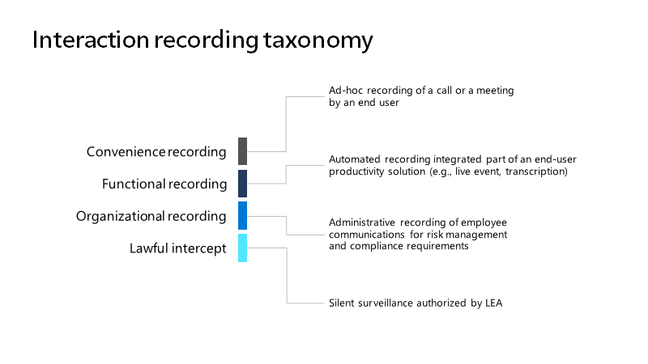

# <a name="introduction-to-teams-policy-based-recording-for-callings--meetings"></a>Présentation de l Teams’enregistrement basé sur une stratégie pour les appels et & réunions

L’enregistrement basé sur une stratégie permet aux organisations qui adoptent des Microsoft Teams pour les appels et les réunions d’être en cours, à l’aide d’une stratégie d’administration, lorsque les appels et les réunions en ligne doivent être enregistrés et capturés automatiquement pour un traitement et une rétention ultérieurs, comme requis par la stratégie d’entreprise ou réglementaires pertinente.

Teams a été amélioré pour prendre en charge l’intégration de solutions d’enregistrement tierces, notamment les fonctionnalités de plateforme, les expériences utilisateur et les interfaces d’administration nécessaires pour fournir une solution de bout en bout pour la configuration, la gestion, l’enregistrement, le stockage et l’analyse des communications Teams. Les améliorations ont été apportées aux API de plateforme de communication et aux événements pour l’enregistrement, qui offrent les possibilités suivantes :

- Capture transparente et de haute qualité des médias sur tous les appareils et tous les points de terminaison pris en charge pour l’audio, la vidéo, le partage d’écran et la conversation.

- Prise en charge de la capture d’interaction entre Teams utilisateurs et points de terminaison d’appel pris en charge (Teams, Teams Mobile, Skype Entreprise, PSTN)

- Nouvelles stratégies d’administration pour l’enregistrement de la conformité, notamment l’intégration avec les stratégies et Teams d’appel d’administration et de réunion existants

L’enregistrement de conformité peut être activé pour les Microsoft 365 A3/A5/E3/E5/Business Premium et les utilisateurs Office 365 A3/A5/E3/E5. 

Les fonctionnalités d’intégration de la solution d’enregistrement de la conformité ont également été examinées dans Ignite 2019 dans la [session Compliance Recording and Microsoft Teams session](https://myignite.microsoft.com/archives/IG19-VCE40).

## <a name="teams-interaction-recording-overview"></a>Teams vue d’ensemble de l’enregistrement de l’interaction

Les cas d’utilisation des enregistrements d’interaction peuvent être séparés en quatre catégories principales de fonctionnalités d’enregistrement : Commodité, Fonctionnel, Organisationnel et Origine légitime, comme illustré dans l’image :

> [!div class="mx-imgBorder"]
> 

Chacune de ces catégories implique des exigences différentes en matière de procédure d’enregistrement, d’enregistrement, de stock des enregistrements, d’notification, de contrôle de l’accès et de gestion de la rétention.

| Type                   | Convenience (Regular Teams Recording) | Organisation - régulée (enregistrement de conformité) |
| ---------------------- | ------------------ | --------------- |
| Initiator              | Utilisateur               | Administrateur (système)  |
| Target (Cible)                 | Par appel/réunion | Par utilisateur        |
| Stockage propriétaire          | Utilisateur               | Conformité      |
| Notification requise ? | Oui                | Oui             |
| Propriétaire d’Access           | Utilisateur               | Conformité      |
| Stratégie de rétention ?      | Facultatif           | Oui             |

Teams offre différentes fonctionnalités [pour l’enregistrement](./cloud-recording.md) pratique et fonctionnel de réunions et d’événements en direct. L’enregistrement organisationnel signifie permettre aux organisations qui adoptent des Teams d’appels et de réunions d’être en cours, par le moyen d’une stratégie administrative, lorsque les appels et les réunions en ligne doivent être enregistrés et capturés automatiquement à des fins de traitement et de rétention ultérieurs, comme requis par la stratégie d’entreprise ou réglementaires pertinente. Les utilisateurs dans le cadre de cette stratégie se rendront compte que leurs interactions numériques avec Teams sont enregistrées, mais ne pourront pas désactiver l’enregistrement et n’auront pas accès à l’enregistrement une fois l’interaction terminée. L’enregistrement devient partie intégrante de l’archive organisationnelle mise à la disposition du personnel juridique et de conformité pour la découverte électronique, la conservation légale et d’autres utilisations de la rétention d’entreprise.

## <a name="example-user-needs"></a>Exemples de besoins des utilisateurs

<table>
<thead>
<tr class="header">
<th>Personnage</th>
<th>Besoins</th>
</tr>
</thead>
<tbody>
<tr class="odd">
<td>Utilisateurs enregistrés</td>
<td><ul>
<li><p>Soyez averti lorsque l’enregistrement est en cours.</p></li>
<li><p>Soyez informé lorsque l’erreur de stratégie et/ou d’enregistreur entraîne des modifications du comportement des appels.</p></li>
</ul></td>
</tr>
<tr class="even">
<td>Administrateur des communications</td>
<td><ul>
<li><p>Comprendre pourquoi et comment appliquer/ appliquer des stratégies d’enregistrement à Teams utilisateurs/points de terminaison.</p></li>
<li><p>Configurez et tenez à jour Teams d’enregistrement pour l’organisation.</p></li>
<li><p>Surveillez et dépannage des problèmes liés à l’enregistrement des appels Teams réunions.</p></li>
<li><p>Responsable de la conformité interne au niveau de l’analyse opérationnelle de l’utilisation, de la qualité et de la fiabilité.</p></li>
</ul></td>
</tr>
<tr class="odd">
<td>Responsable de la conformité</td>
<td><ul>
<li><p>Recueillez toutes Teams communications de la manière requise pour respecter les obligations en matière de conformité dans les limites régionales appropriées.</p></li>
<li><p>Recherchez des interactions basées sur des métadonnées ou du contenu d’interaction liés à la communication. Voici quelques exemples courants :</p>
<ul>
<li><p><strong>Métadonnées</strong> - Participants, heure, itinéraire, numéro composé, numéro de départ, données métiers personnalisées</p></li>
<li><p><strong>Contenu</strong> – Transcription, sentiment, phonétique, interactions connexes</p></li>
</ul></li>
<li><p>Analyser et interagir avec les communications collectées, notamment la possibilité de surveiller les interactions pendant qu’elles sont collectées.</p></li>
<li><p>Assurez la sécurité des communications collectées et empêchez les falsifications à toutes les étapes.</p></li>
</ul></td>
</tr>
</tbody>
</table>

## <a name="solution-architecture-overview"></a>Vue d’ensemble de l’architecture de solution

Les solutions d’enregistrement de conformité sont intégrées avec Teams, comme illustré dans le diagramme suivant :

> [!div class="mx-imgBorder"]
> 

> [!NOTE]
> Cette solution est spécifiquement conçue pour activer l’enregistrement de conformité basé sur une stratégie avec Teams. Aucune autre utilisation de cette solution ne sera prise en charge.

## <a name="recorder"></a>Enregistreur

Le composant principal de la solution d’enregistrement de conformité est l’enregistreur.
Les enregistreurs sont conçus sous la forme de services Azure évolutifs (bots) qui utilisent la plateforme de [communication de Microsoft et s’inscrivent en tant qu’applications](/graph/cloud-communications-concept-overview) auprès de Microsoft Graph. L’enregistreur fournit une interaction directe avec les Teams et les [API de communication](/graph/api/resources/communications-api-overview) de la plateforme de réunions et fournit le point de terminaison pour l’ingestion de médias.

Un [exemple d’application enregistreur](https://github.com/microsoftgraph/microsoft-graph-comms-samples/tree/a3943bafd73ce0df780c0e1ac3428e3de13a101f/Samples/BetaSamples/LocalMediaSamples/ComplianceRecordingBot) de conformité est disponible pour vous aider à configurer le robot, à créer l’instance d’application et à attribuer les stratégies de conformité. L’exemple présente également des exemples sur l’utilisation de l’API pour enregistrer des interactions spécifiques telles que la gestion [du routage](https://github.com/microsoftgraph/microsoft-graph-comms-samples/blob/a3943bafd73ce0df780c0e1ac3428e3de13a101f/Samples/BetaSamples/LocalMediaSamples/ComplianceRecordingBot/FrontEnd/Http/Controllers/PlatformCallController.cs#L199-L244) d’appel [entrant, la](https://github.com/microsoftgraph/microsoft-graph-comms-samples/blob/a3943bafd73ce0df780c0e1ac3428e3de13a101f/Samples/BetaSamples/LocalMediaSamples/ComplianceRecordingBot/FrontEnd/Bot/CallHandler.cs#L135-L138) modification des états d’enregistrement et la suppression de l’utilisateur en [cours d’enregistrement](https://github.com/microsoftgraph/microsoft-graph-comms-samples/blob/a3943bafd73ce0df780c0e1ac3428e3de13a101f/Samples/BetaSamples/LocalMediaSamples/ComplianceRecordingBot/FrontEnd/Bot/CallHandler.cs#L121-L126).
Graph documentation sur les API spécifiques est ici pour [updateRecordingStatus](/graph/api/call-updaterecordingstatus?tabs=http) et [incomingContext](/graph/api/resources/incomingcontext).

L’implémentation exacte du service d’enregistreur variera selon le partenaire, mais doit être conçue pour prendre en charge plusieurs enregistreurs afin d’obtenir une haute disponibilité et une distribution géographique du déploiement afin de réduire la latence d’Teams à l’enregistreur. En outre, les enregistreurs eux-mêmes doivent être conçus avec une résilience et une redondance à l’esprit.

Les partenaires doivent confirmer la version de publication minimale requise des API et desK pour les communications Microsoft Graph auprès de Microsoft avant de soumettre leur solution pour certification afin de s’assurer que toutes les exigences d’intégration de l’enregistrement de conformité sont pris en charge.

Deux conditions spécifiques fondamentales pour le scénario d’enregistrement de conformité sont les suivants :

- Le robot enregistreur doit être déployé dans Azure

- Le robot enregistreur doit s’exécuter sur Windows VM dans Azure

Les exigences relatives à la gestion des VM Azure et Windows s’appliquent uniquement au composant Teams Bot, ce qui signifie qu’un partenaire peut implémenter le reste de la plateforme de son choix, à condition qu’il réponde aux exigences fonctionnelles et de performances pertinentes pour l’enregistrement de la conformité.

## <a name="compliance-recording-policy-assignment-and-provisioning"></a>Affectation et mise en service des stratégies d’enregistrement de conformité

Les administrateurs informatiques peuvent déterminer les utilisateurs à enregistrer et l’enregistreur à utiliser pour chaque utilisateur, en créant et en attribuant des stratégies d’enregistrement de conformité. Les enregistreurs sont invités automatiquement à participer à des conversations en fonction de la configuration de ces stratégies lors d’une interaction de communication. Les stratégies d’enregistrement de conformité sont gérées à l’aide de [Microsoft PowerShell](./teams-powershell-overview.md) et peuvent être appliquées au niveau du client, par utilisateur et du groupe de sécurité pour chaque organisation. Vous trouverez davantage d’informations sur les stratégies de [réunion, les](./meeting-policies-overview.md) stratégies d’appel et les [stratégies de groupe](./assign-policies-users-and-groups.md#assign-a-policy-to-a-group) de Microsoft Docs. [](./teams-calling-policy.md)

1. Créez une instance d’application dans votre client.

   ```powershell
   PS C:\> New-CsOnlineApplicationInstance -UserPrincipalName cr.instance@contoso.onmicrosoft.com -DisplayName ComplianceRecordingBotInstance -ApplicationId fcc88ff5-a42d-49cf-b3d8-f2e1f609d511

   RunspaceId        : 4c13efa6-77bc-42db-b5bf-bdd62cdfc5df
   ObjectId          : 5069aae5-c451-4983-9e57-9455ced220b7
   TenantId          : 5b943d7c-5e14-474b-8237-5022eb8e0dc9
   UserPrincipalName : cr.instance@contoso.onmicrosoft.com
   ApplicationId     : fcc88ff5-a42d-49cf-b3d8-f2e1f609d511
   DisplayName       : ComplianceRecordingBotInstance
   PhoneNumber       :
   ```

   ```powershell
   PS C:\> Sync-CsOnlineApplicationInstance -ObjectId 5069aae5-c451-4983-9e57-9455ced220b7
   ```

2. Créer une stratégie d’enregistrement de conformité.

   ```powershell
   PS C:\> New-CsTeamsComplianceRecordingPolicy -Identity TestComplianceRecordingPolicy -Enabled $true -Description "Test policy created by tenant admin"

   Identity                        : Global
   ComplianceRecordingApplications : {}
   Enabled                         : True
   WarnUserOnRemoval               : True
   Description                     : Test policy created by tenant admin
   ```

   ```powershell
   PS C:\> Set-CsTeamsComplianceRecordingPolicy -Identity TestComplianceRecordingPolicy `
   -ComplianceRecordingApplications @(New-CsTeamsComplianceRecordingApplication -Id 5069aae5-c451-4983-9e57-9455ced220b7 -Parent TestComplianceRecordingPolicy)
   ```

   Voir [Set-CsTeamsComplianceRecordingPolicy](/powershell/module/skype/set-csteamscompliancerecordingpolicy).

3. Attribuez la stratégie d’enregistrement de conformité à un utilisateur.

   ```powershell
   PS C:\> Grant-CsTeamsComplianceRecordingPolicy -Identity testuser@contoso.onmicrosoft.com -PolicyName TestComplianceRecordingPolicy
   ```

   Voir [Grant-CsTeamsComplianceRecordingPolicy](/powershell/module/skype/grant-csteamscompliancerecordingpolicy).

   ```powershell
   PS C:\> Get-CsOnlineUser testuser@contoso.onmicrosoft.com | select SipAddress, TenantId, TeamsComplianceRecordingPolicy | fl

   UserPrincipalName              : testuser@contoso.onmicrosoft.com
   TenantId                       : 5b943d7c-5e14-474b-8237-5022eb8e0dc9
   TeamsComplianceRecordingPolicy : TestComplianceRecordingPolicy
   ```

## <a name="user-experiences"></a>Expériences utilisateur

La prise en charge des notifications est activée à l’aide Teams client. Les expériences peuvent être visuelles ou audio.

**Teams clients - Remarque visuelle**
- Bureau/Web
- Mobile (iOS/Android)
- Teams téléphones portables
- Teams salles

**Autres points de terminaison - Avis sur l’audio**
- Téléphones SIP
- Skype Entreprise
- Audioconférence
- Appelants PSTN

> [!NOTE]
> L’enregistrement de conformité n’est pas pris en charge avec les files d’attente en mode conférence. Utilisez les files d’attente du mode de transfert.
> L’enregistrement de conformité ne fonctionne pas si les utilisateurs ont été en panne sur Internet et qu’ils font et reçoivent des appels PSTN à l’aide d’un enregistrement SBA.

## <a name="compliance-recording-for-teams-certification-programs"></a>Enregistrement de conformité pour les Teams certification des produits

En plus de publier des API disponibles publiquement permettant aux partenaires de développer et d’intégrer des solutions CCaaS avec Teams, nous avons développé l’enregistrement de conformité pour le programme de certification Microsoft Teams afin de fournir aux clients la garantie que la solution de chaque partenaire participant a été testée et vérifiée afin d’offrir la qualité, la compatibilité et la fiabilité qu’ils attendent des solutions Microsoft.  

Les partenaires suivants ont certifié leur solution pour Microsoft Teams.<br/><br/>

|Partenaire|Site web de la solution |
|:--|:--|
|ASC Technologies |[https://www.asctechnologies.com/english/ASC_Recording_Insights_Compliance_Recording_for_Microsoft_Teams.html](https://www.asctechnologies.com/english/ASC_Recording_Insights_Compliance_Recording_for_Microsoft_Teams.html) |
|AudioCodes |[https://online.audiocodes.com/smarttap-360-live-for-microsoft-teams](https://online.audiocodes.com/smarttap-360-live-for-microsoft-teams) |
|CallCabinet |[https://www.callcabinet.com/compliance-microsoft-teams-call-recording](https://www.callcabinet.com/compliance-microsoft-teams-call-recording ) |
|Dunker |[https://www.dubber.net/call-recording/](https://www.dubber.net/call-recording/) |
|Technologie insightful |[https://insightfultechnology.com/teams/](https://insightfultechnology.com/teams/) |
|NICE |[https://www.niceactimize.com/compliance/ms-teams-recording.html](https://www.niceactimize.com/compliance/ms-teams-recording.html) |
|Numonix |[https://numonix.cloud](https://numonix.cloud)    |
|Red Box |[https://www.redboxvoice.com/compliance-recording-for-microsoft-teams](https://www.redboxvoice.com/compliance-recording-for-microsoft-teams)  |
|Lac Ntêta |[https://thetalake.com/integrations/microsoft/](https://thetalake.com/integrations/microsoft/) |
|Verint |[https://www.verba.com/solutions/microsoft-teams-recording](https://www.verba.com/solutions/microsoft-teams-recording) |
|Innovations dans Le Monde |[https://www.oakinnovate.com/clarify](https://www.oakinnovate.com/clarify) |

<br/>
Les partenaires suivants sont en train de certifier leur solution pour Microsoft Teams.<br/><br/>

|Partenaire|Site web de la solution |
|:--|:--|
|Landis Technologies |[https://landistechnologies.com/](https://landistechnologies.com/) |
|Luware |[https://luware.com/en/solution/microsoft-teams-recording/](https://luware.com/en/solution/microsoft-teams-recording/) |


Cette liste est mise à jour à mesure que de nouveaux partenaires rejoignent et répondent aux critères de certification.

## <a name="next-steps"></a>Étapes suivantes

Si vous êtes un fournisseur désireux de participer au programme de certification, envoyez un courrier électronique à [Teamscategorypartner@microsoft.com](mailto:Teamscategorypartner@microsoft.com).
