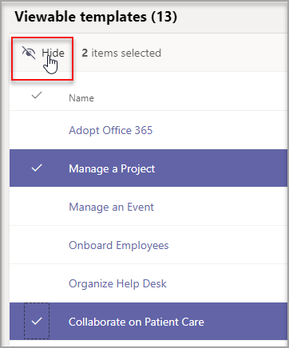

# Créer et gérer des modèles Teams dans le Centre d’administration

Gérez les modèles Teams que vos utilisateurs finaux voient en créant des stratégies de modèles dans le Centre d’administration. Dans chaque stratégie de modèle, vous pouvez désigner les modèles affichés ou masqués.
Affectez différents utilisateurs à différentes stratégies de modèle afin que vos utilisateurs ne visualisent que le sous-ensemble de modèles Teams spécifiés.

## Créer des stratégies de modèle et attribuer des modèles disponibles

1. Connectez-vous au Centre d’administration Teams.

2. Développer les  >  **stratégies des modèles** Teams.

3. Sélectionnez **Ajouter**.

    

1. Dans la section **Paramètres de stratégies de modèles,** remplissez les champs suivants :

    - Nom de la stratégie modèles

    - Brève description de la stratégie de modèles

2. Dans la table **Modèles consultables,** sélectionnez les modèles que vous voulez masquer, puis **Masquer.**

    

    Vous pouvez voir les modèles que vous avez sélectionnés pour masquer dans la table **Modèles masqués.**

1. Pour voir certains modèles, faites défiler jusqu’à la table **Modèles masqués.**

1. Sélectionnez les modèles à afficher, puis **sélectionnez Afficher.**

   

   Les modèles sélectionnés apparaissent dans votre table **de modèles consultables.**
3. Sélectionnez **Enregistrer**.

   Votre nouvelle stratégie de modèle est affichée dans la liste **Stratégies de** modèles.

## Attribuer des utilisateurs aux stratégies de modèle

Les utilisateurs affectés à une stratégie pourront uniquement afficher les modèles consultables dans cette stratégie.

1. À partir **de Stratégies de modèles,** sélectionnez une stratégie, puis **sélectionnez Gérer les utilisateurs.**

2. Tapez les utilisateurs à affecter à cette stratégie.

   

3. Sélectionnez **Appliquer.**

> [!Note]
> L’application de votre nouvelle stratégie pour les utilisateurs finaux peut prendre jusqu’à 24 heures.

## Limites de taille pour les stratégies de modèle

Vous pouvez masquer jusqu’à 100 modèles par stratégie. Le **bouton** Masquer est désactivé si la stratégie donnée a déjà 100 modèles masqués.

## Forum aux questions

**Q : Puis-je affecter par lots des utilisateurs à des stratégies de modèles d’équipe ?**
  
R : Oui, nous prise en charge l’affectation de lots pour une stratégie de modèle dans PowerShell. Le type de stratégie pour cette action est TeamsTemplatePermissionPolicy. [Pour en savoir plus](https://docs.microsoft.com/powershell/module/teams/new-csbatchpolicyassignmentoperation?view=teams-ps)

**Q : Les groupes peuvent-ils être affectés à des stratégies de modèles d’équipe ?**

R : Actuellement non. Cette fonctionnalité sera disponible ultérieurement.

**Q : Si un modèle est créé, le modèle sera-t-il inclus dans mes stratégies ?**

R : Tous les nouveaux modèles sont visibles par défaut. Vous pouvez choisir de masquer le modèle dans le Centre d’administration dans la section Stratégies de modèles.

**Q : Que se passe-t-il en cas de suppression d’un modèle ?**

R : Tous les modèles supprimés ne seront plus présents dans les stratégies de modèles.

**Q : Puis-je attribuer plusieurs utilisateurs à une stratégie de modèle dans le Centre d’administration Teams ?**

R : Oui.

1. Dans le Centre d’administration, voir **Utilisateurs.**
1. Dans la table Liste d’utilisateurs, sélectionnez les utilisateurs que vous voulez affecter à une certaine stratégie de modèles.
1. Sélectionnez Modifier les paramètres, puis modifiez le champ De stratégies Templates.
1. Sélectionnez Appliquer.
   En savoir plus [Sur l’affectation de stratégies à vos utilisateurs dans Microsoft Teams - Microsoft Teams \| Microsoft Docs.](https://docs.microsoft.com/microsoftteams/assign-policies#assign-a-policy-to-a-batch-of-users)

**Q : Comment afficher tous les utilisateurs affectés à une stratégie spécifique ?**

R : Dans le Centre d’administration :

1. Allez à la section **Utilisateurs.**
2. Sélectionnez le filtre dans la table Liste des utilisateurs et filtrez la stratégie de modèle Teams.
3. Sélectionnez **Appliquer.**

**Q : Puis-je gérer les stratégies de modèles via PowerShell ?**

R : Non, la gestion des modèles dans PowerShell n’est pas prise en charge.

**Q : Les stratégies de modèles sont-elles applicables à l’éducation ?**

R : Non, les stratégies de modèle pour EDU ne sont pas pris en charge.

## Sujets associés

- [Utiliser des modèles d’équipe dans le Centre d’administration](https://docs.microsoft.com/MicrosoftTeams/get-started-with-teams-templates-in-the-admin-console)

- [Créer un modèle d’équipe personnalisé](https://docs.microsoft.com/MicrosoftTeams/create-a-team-template)

- [Créer un modèle à partir d’une équipe existante](https://docs.microsoft.com/MicrosoftTeams/create-template-from-existing-team)

- [Créer un modèle d’équipe à partir d’un modèle d’équipe existant](https://docs.microsoft.com/MicrosoftTeams/create-template-from-existing-template)

- [Attribuer des stratégies à vos utilisateurs dans Microsoft Teams - Microsoft Teams \| Microsoft Docs](https://docs.microsoft.com/microsoftteams/assign-policies)

- [Affecter des utilisateurs par lots à une stratégie](https://docs.microsoft.com/powershell/module/teams/new-csbatchpolicyassignmentoperation?view=teams-ps)
