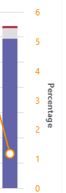

# Activation et utilisation du tableau de bord de qualité des appels pour Microsoft teams et Skype entreprise OnlineTurn on and use Call Quality Dashboard for Microsoft Teams and Skype for Business Online

Apprenez à configurer votre organisation Office 365 pour utiliser le tableau de bord de qualité des appels pour surveiller la qualité des appels.Learn how to configure your Office 365 organization to use the Call Quality Dashboard to monitor call quality.
  
Le tableau de bord de qualité des appels (bord) vous permet d’obtenir des renseignements sur la qualité des appels passés à l’aide de Microsoft teams et des services Skype entreprise online.Call Quality Dashboard (CQD) provides insight into the quality of calls made using Microsoft Teams and Skype for Business Online services. Cette rubrique décrit la procédure de démarrage de la collecte de données que vous pouvez utiliser pour résoudre les problèmes de qualité d’appel.This topic describes the steps to start collecting data you can use to troubleshoot call quality issues.

Pour l’instant, les fonctionnalités avancées bord et bord sont disponibles pour une utilisation.Currently, Advanced CQD and CQD are both available for use. Advanced bord est disponible à https://cqd.teams.microsoft.coml’adresse.Advanced CQD is available at https://cqd.teams.microsoft.com. Nouvelle URL sauf si vous êtes connecté à l’aide de vos informations d’identification d’administrateur.New URL but the same log in with your administrator credentials.

## Dernières modifications et mises à jourLatest changes and updates

La mise à jour bord (à compter du 1er novembre 2019) fournit un tableau de bord bord en temps réel proche.The updated CQD (as of early November 2019) delivers a Near Real-Time CQD dashboard. Les données bord sont désormais disponibles en moyenne dans 30 minutes (par rapport au bord précédent qui est en moyenne de 24 heures).CQD data is now available on average in 30 minutes (in comparison to the previous CQD which is on average of 24 hours).  Le bord mis à jour utilise les informations d’identification de l’utilisateur final (EUII), ce qui permet aux administrateurs de descendre et de zoomer sur le niveau utilisateur.The updated CQD uses End User Identifiable Information (EUII), giving admins the ability to drill down and zoom in to the user level. Il existe également des rapports d’interactivité permettant de prendre en charge de nouveaux scénarios, tels que :There is also report interactivity to support new scenarios such as:

- Qualité des appels par région :Call Quality by Region:
  - date par régiondate-by-region
  - agrégées jusqu’à la plage horaireaggregated down to hour-by-region
  - emplacements spécifiquesspecific locations
  - sous-réseau spécifiquespecific subnet
  - utilisateurs concernés ou utilisateurs concernésimpacted user or users

- Fiabilité/échec de l’appel par région :Call Reliability/Failure by Region:
  - date par régiondate-by-region
  - agrégées jusqu’à la plage horaireaggregated down to hour-by-region
  - emplacements spécifiquesspecific locations
  - sous-réseau spécifiquespecific subnet
  - utilisateurs concernés ou utilisateurs concernésimpacted user or users

- Évaluer mon appel (RMC) par région : d’un mois à une autre dans la zone agrégés vers des emplacements spécifiques pour les utilisateurs qui fournissent des évaluations plus basses.Rate My Call (RMC) by Region: from month-by-region aggregated down to specific locations to users who provide low RMC ratings. BORD v3 inclut également le retour Verbatim.CQD v3 also includes verbatim feedback.
- Support technique disponible pour un utilisateur particulier sur les appels ou réunions P2P, ou pour tous les participants et les détails de l’appel.Helpdesk: available for a specific user on P2P calls or Meetings, or for all participants and call details. Permet d’identifier les problèmes système potentiels en fonction de l’emplacement du réseau, des appareils ou du microprogramme.Helps identify possible system issues based on network location, devices, or firmware.  
- Versions du client : Affichez la session et les comptes des utilisateurs pour chaque version du client, ou explorez les noms d’utilisateurs pour chaque version du client.Client Versions: View the Session and Users counts for each Client Version, or drill down to User names for each client version. Les filtres prédéfinis pour le type produit et client permettent de focaliser les versions sur des clients spécifiques.Pre-built filters for Product and Client Type help focus the versions to specific clients.
- Points de terminaison : affiche les points de terminaison d’ordinateur mappés au PC/Mac.Endpoints: Shows Machine Endpoints mapped to Make/Model of the PC/Mac. Affiche la qualité agrégée par création/modèle.Shows aggregated quality by Make/Model. Le mappage des données est semblable à la génération de données.Mapping data is uploaded similar to Building data.

La prise en charge du RBAC bord Advanced (v3) est également prise en charge par le biais de l’accès EUII.Advanced CQD (V3) also provides RBAC support, in case EUII access is not available.  

Un administrateur peut gérer Skype entreprise Server 2019 (pas seulement Skype entreprise Online et Microsoft Teams) via bord version 3.An admin can manage Skype for Business Server 2019 (not just Skype for Business Online and Microsoft Teams) through CQD version 3. Pour cela, vous devez disposer d’une implémentation hybride et de l’utilisation du connecteur de données d’appel.This requires a hybrid implementation and the use of Call Data Connector. Pour plus d’informations, reportez-vous à la section [plan des données d’appel](/SkypeForBusiness/hybrid/plan-call-data-connector) .See [Plan Call Data Connector](/SkypeForBusiness/hybrid/plan-call-data-connector) for more information.

BORD version 2 ajoutée :CQD version 2 added:

- Données de Microsoft teams et de Skype entreprise OnlineData for Microsoft Teams and Skype for Business Online
- Les rapports de synthèse incluent un filtre produit permettant de sélectionner toutes les données, les données de Microsoft teams ou les données de Skype entreprise online.Summary reports include a product filter to select all data, Microsoft Teams data, or Skype for Business Online data
- Mise à jour de la logique de classification de la qualité des flux vidéo et VBSS.Updated Video and VBSS stream quality classification logic. Pour plus d’en plus d’une définition de classifieur [, voir classification en flux dans le tableau de bord qualité des appels](stream-classification-in-call-quality-dashboard.md)Refer to [Stream Classification in Call Quality Dashboard](stream-classification-in-call-quality-dashboard.md) for the classifier definitions.

Consultez cet article pour obtenir la liste des [dimensions et mesures disponibles dans le tableau de bord de qualité des appels](dimensions-and-measures-available-in-call-quality-dashboard.md).Refer to this article for a list of [Dimensions and measures available in Call Quality Dashboard](dimensions-and-measures-available-in-call-quality-dashboard.md).
  
> [!NOTE]
> Pour afficher des informations sur les mises à jour et les modifications apportées au tableau de bord, cliquez sur le lien dans la **bonne nouvelle.**To see information about updates and changes to the dashboard,  click the link in the **Good news!** bannière affichée sur le tableau de bord.banner when it displays on the dashboard.

BORD version 1 a fourni les fonctionnalités suivantes aux administrateurs 2015 de Skype entreprise Server :CQD version 1 provided Skype for Business Server 2015 admins the following features:

- Accès aux données de rapport mises en cache pour un accès rapideAccess to cached report data for fast access
- Liens en profondeur vers des pages de rapport pour le partage et la publication d’informationsDeep links to report pages for sharing and publishing information
- Simplification de la modification et de la création de rapports et métadonnées modifiables pour les descriptions de rapportStreamlined report editing and creation, and editable metadata for report descriptions
- API Web permettant d’accéder par programmation aux données du cube en vue de leur utilisation dans des tableaux de bord personnalisésWeb APIs that give programmatic access to the cube data for use in custom dashboards

## BORD de données en temps réel (NRT)CQD Near-Real-Time (NRT) Data

Advanced bord (v3, publiée le 2019 novembre) utilise un flux de données en temps réel.Advanced CQD (V3, released November 2019) uses a near-real-time data feed. Les enregistrements d’appels sont disponibles sur le portail bord dans un délai de 30 minutes après la fin de l’appel.Call Records are available at the CQD portal within 30 minutes of the end of the call. Les enregistrements d’appels à partir du pipeline NRT sont uniquement disponibles pendant quelques mois avant d’être supprimés du jeu de données.Call Records from the NRT pipeline are only available for a few months before they are removed from the data set. BORDx, XXXXXXXXX, xxxx xxxx xxxx xxxx xxxx xxxx xxxx xxxx xxxx xxxx xxxx xxxx xxxx xxxx.CQD v3 merges data from the current v2 pipeline with NRT data from the v3 pipeline. Les requêtes sur les portails v2 et v3 pour les données de la période d’archivage produisent les mêmes résultats.Queries on the v2 and v3 portals for the data from the Archival period produce the same results. Les requêtes de données v2 et v3 pour les données NRT et les périodes d’informations d’identification de NRT sont différentes.V2 and v3 data queries for the NRT Data and NRT Data + PII periods will be different.

### Données personnelles/EUIIPII/EUII Data

Les données d’informations d’identification personnelle ou EUII proviennent uniquement du pipeline v3.PII or EUII data only comes from the v3 pipeline. En raison de la conformité, les données d’PII/EUII sont conservées pendant 30 jours.Due to compliance reasons, PII/EUII data is only kept for 30 days. Les données NRT qui se trouvent dans la marque de 30 jours, les champs PII/EUII sont effacés, ce qui crée des données NRT gratuites.As NRT data crosses the 30-day mark, the PII/EUII fields are cleared out, resulting in PII-free NRT data. Les champs PII/EUII sont les suivants :The PII/EUII fields are:

- Adresse IP complèteFull IP address
- Adresse de contrôle d’accès au média (MAC)Media Access Control (MAC) Address
- Identificateur de l’ensemble de services standard (BSSID)Basic Service Set identifier (BSSID)
- URI SIP (Session Initiation Protocol) (Skype entreprise uniquement)Session Initiation Protocol (SIP) URI (Skype for Business only)
- Nom d’utilisateur principal (UPN)User Principal Name (UPN)
- Nom du point de terminaison de l’ordinateurMachine Endpoint Name
- Commentaires textuels de l’utilisateurUser Verbatim Feedback
- ID d’objet (ID d’objet Active Directory de l’utilisateur du point de terminaison);Object ID (the Active Directory object ID of the endpoint's user)

### Contrôles de dateDate controls

BORD v3 ajoute les nouveaux types de tendance de roulement suivants :CQD v3 adds the following new Rolling Trend types:

- 5 jours5-day
- 7 jours7-day
- 30 jours30-day
- 60-jour60-day
- 90-jour90-day

Le paramètre de date URL peut désormais accepter un champ Day.The URL Date parameter can now accept a Day field. Rapports d’une journée à l’aide de dates spécifiées au format AAAA-MM-JJ comme dernier jour de la tendance.Rolling-day reports use dates specified in the YYYY-MM-DD format as the last day of the trend.  Le paramètre de date d’URL « 00 » indique « aujourd’hui ».The URL Date parameter “00”  indicates “today”.

|URLURL| Date de fin de la tendance du jour de roulementEnd date of Rolling Day Trend|
|:---|:---|
|https://<cqdv3>/SPD/#/Dashboard/<reportid>/2019-02/https://<cqdv3>/spd/#/Dashboard/<reportid>/2019-02/   |Jour actuel en février 2019Current Day of Feb 2019|
|https://<cqdv3>/SPD/#/Dashboard/<reportid>/2019-02-15/https://<cqdv3>/spd/#/Dashboard/<reportid>/2019-02-15/|15 février 2019Feb 15, 2019|
|https://<cqdv3>/SPD/#/Dashboard/<reportid>/00/https://<cqdv3>/spd/#/Dashboard/<reportid>/00/        |Jour actuelCurrent Day|
|||

Par défaut, le jour du mois actuel est utilisé comme dernier jour de la tendance du jour de roulement.By default the current day of the month is used as the last day of the Rolling Day Trend.

### Fonctionnalité de perçage viaDrill Thru Functionality

BORD v3 prend en charge l’utilisation de champs d’exploration ou d’exploration dans les rapports SPD.CQD v3 supports the use of drill through or drill-down fields in SPD reports. Si ces champs de dimension sont sélectionnés, le rapport ouvre automatiquement un onglet de rapport différent et filtre sur la valeur sélectionnée.If these dimension fields are selected,  the report automatically opens a different report tab and filters on the selected value. Les champs dotés d’une extraction de filtre peuvent être distingués par une icône de curseur différente (le pointeur) lorsque vous pointez dessus.Fields with an assigned drill through filter are distinguished by a different cursor icon (the pointer) when you hover over them.

Lorsqu’un champ Drill through est sélectionné, le tableau de bord accède automatiquement au nouvel onglet spécifié et applique un filtre avec la valeur sélectionnée.When a drill through field is selected, the Dashboard automatically navigates to the new, specified tab and applies a filter with the selected value. S’il s’agit de ses propres champs de perçage et qu’une option est sélectionnée, les filtres d’extraction de filtres et de nouvelles propagés.If that tab has its own drill through fields and one is selected, the previous drill through filters and the new one all propagate forward. Cela vous permet de générer un rapport pour affiner progressivement le jeu de données résultant.This allows you to build a report that progressively narrows the resulting data set.

Par exemple, dans un rapport d’analyse de qualité d’appel, un utilisateur peut cliquer sur la date à laquelle il souhaite « extraire », ce qui amène à l’onglet emplacement.For example, in a Call quality drill-through report, a user can click the date they would like to 'drill-through', which leads to the Location tab.

Vous pouvez ajouter plusieurs dates à partir de l’onglet emplacement, par exemple, ajouter 2019-09-22 à la date : 2019-09-24 :You can add multiple dates from the location tab, such as adding 2019-09-22 to Date: 2019-09-24: 

> [!NOTE]
> Ne passez pas directement au dernier onglet. Sans filtres sélectionnés à partir d’un affichage d’exploration antérieur les résultats seraient trop volumineux pour être affichés dans un tableau.Don't jump directly to the last tab. Without filters selected from a previous drill-through the results would be too large to show on a table.

## Activer les rapports de synthèse sur le tableau de bord de qualité d’appel Microsoft (bord)Activate Microsoft Call Quality Dashboard (CQD) Summary Reports

Pour pouvoir commencer à utiliser bord, vous devez l’activer pour votre organisation Office 365 comme suit :Before you can start using CQD, activate it for your Office 365 organization as follows:

 de Microsoft teams **à l’aide du centre d’administration Microsoft teams** **Using the Microsoft Teams admin center**

1. Pour ouvrir le centre d’administration, connectez-vous à votre organisation 365 à l’aide du compte d’administrateur du service Microsoft Teams, puis sélectionnez la vignette **administrateur** .Sign in to your Office 365 organization using Microsoft Teams service admin account, and then select the **Admin** tile to open the Admin center.
2. Dans le volet gauche, sous **centres d’administration**, sélectionnez **Microsoft teams** pour ouvrir le centre d’administration Microsoft Teams.In the left pane, under **Admin centers**, select **Microsoft Teams** to open the Microsoft Teams admin center.
3. Dans le centre d’administration de Microsoft Teams, sélectionnez **tableau de bord de qualité des appels** dans le volet gauche.In the Microsoft Teams admin center, select **Call quality dashboard** in the left pane.
4. Dans la page qui s' \(ouvre\), cliquez sur **se connecter** , puis entrez les informations de votre compte d’administrateur général ou d’administrateur du service Microsoft Teams.On the page that opens \(https://cqd.teams.microsoft.com\), click **Sign in** and enter your Global Administrator account or Microsoft Teams Service Admin account information.

    
  
Après vous être connecté, une fois activé, le bord commence la collecte et le traitement des données.After you sign in, once activated, the CQD will begin collecting and processing data.  
> [!NOTE]
> Le traitement d’une quantité suffisante de données pour afficher des résultats significatifs dans les rapports risque de nécessiter une ou plusieurs heures.It may take one or more hours to process enough data to display meaningful results in the reports.

 Skype entreprise **avec le portail hérité Skype entreprise** **Using the Skype for Business legacy portal**

1. Connectez-vous à votre organisation Office 365 à l’aide d’un compte d’administrateur, puis sélectionnez la vignette **administrateur** pour ouvrir le centre d’administration.Sign in to your Office 365 organization using an admin account, and then select the **Admin** tile to open the Admin center.
2. Dans le volet gauche, sous **centres d’administration**, sélectionnez **Microsoft teams** pour ouvrir le centre d’administration Microsoft Teams.In the left pane, under **Admin centers**, select **Microsoft Teams** to open the Microsoft Teams admin center.
3. Dans le centre d’administration de Microsoft Teams, sélectionnez **portail hérité** dans le volet gauche, sélectionnez **Outils**, puis cliquez sur **tableau de bord de qualité des appels de Skype entreprise Online**.In the Microsoft Teams admin center, select **Legacy Portal** in the left pane, select **Tools**, and then select **Skype for Business Online Call Quality Dashboard**.

     

4. Dans la page qui s’affiche, connectez-vous à l’aide de votre compte d’administrateur général, puis indiquez les informations d’identification du compte lorsque vous y êtes invité.On the page that opens, sign in with your Global Administrator account, and then provide the credentials for the account when prompted.

Après vous être connecté, une fois activé, le tableau de bord de qualité des appels commence à collecter et à traiter les données.After you sign in, once activated, the Call Quality Dashboard will begin collecting and processing data.

## Fonctionnalités du tableau de bord de qualité des appels pour Microsoft teams et Skype entreprise OnlineFeatures of the Call Quality Dashboard for Microsoft Teams and Skype for Business Online

BORD-XX XXXXXXX XXXXXXX XXXXXXX XXXXXXX xxxxxxxxx XXXXXXXXX.CQD Summary Reports provide a subset of the features planned for Detailed Reports. Les différences entre les éditions sont résumées ici :The differences between the editions are summarized here:
  
|FonctionnalitéFeature|Rapports de synthèseSummary Reports|Rapports détaillésDetailed Reports|
|:--- |:--- |:--- |
|Métrique du partage d’applicationApplication sharing metric | NonNo | OuiYes |
|Support des informations sur le bâtiment du clientCustomer building information support | OuiYes | Oui Yes |
|Support technique des informations de point de terminaison clientCustomer endpoint information support | Uniquement dans CQD.Teams.Microsoft.comOnly in cqd.teams.microsoft.com | Uniquement dans CQD.Teams.Microsoft.comOnly in cqd.teams.microsoft.com |
|Prise en charge de l’analyse approfondieDrill down analysis support   | NonNo   | OuiYes   |
|Mesures de fiabilité des médiasMedia reliability metrics   | NonNo   | OuiYes   |
|Rapports prêts à l’emploiOut-of-the-box reports   | OuiYes   | Oui Yes   |
|Présentation des rapportsOverview reports   | OuiYes   | Oui Yes   |
|Ensemble de rapports par utilisateurPer-user report set   | NonNo   | OuiYes   |
|Personnalisation d’un ensemble de rapports (ajout, suppression, modification des rapports)Report set customization (add, delete, modify reports)   | NonNo   | OuiYes   |
|Métriques de partage d’écran vidéoVideo-based screen sharing metrics   | NonNo   | OuiYes   |
|Métriques vidéoVideo metrics   | NonNo   | OuiYes   |
|Volume de données disponibleAmount of data available   | 12 derniers moisLast 12 months   | 12 derniers moisLast 12 months   |
|Données de Microsoft teamsMicrosoft Teams data   | OuiYes   | Oui Yes   |
| | | |

### Rapports prêts à l’emploiOut-of-the-box reports

Toutes les éditions de bord fournissent une nouvelle expertise qui vous permet d’appeler des indicateurs de qualité sans avoir à créer de nouveaux rapports.All editions of CQD provide an experience that gives you call quality metrics without the need to create new reports. Une fois que les données sont traitées au serveur principal, vous pouvez afficher les données de qualité d’appel dans les rapports.Once data is processed in the back-end, you see call quality data in the reports.

Nouveauté de janvier 2020 : [Télécharger les modèles de requête Power bi pour bord](https://github.com/MicrosoftDocs/OfficeDocs-SkypeForBusiness/blob/live/Teams/downloads/CQD-Power-BI-query-templates.zip?raw=true).New in January 2020: [Download Power BI query templates for CQD](https://github.com/MicrosoftDocs/OfficeDocs-SkypeForBusiness/blob/live/Teams/downloads/CQD-Power-BI-query-templates.zip?raw=true). Modèles Power BI personnalisables que vous pouvez utiliser pour analyser et enregistrer vos données bord.Customizable Power BI templates you can use to analyze and report your CQD data.
  
### Présentation des rapportsOverview reports

Toutes les éditions du bord fournissent un point d’entrée de haut niveau aux informations générales de qualité des appels, mais la façon dont les informations sont présentées dans les rapports de synthèse est différente des rapports détaillés.All editions of the CQD provide a high-level entry point to the overall call quality information, but the way information is presented in Summary Reports is different from Detailed Reports.  
  
Les rapports de synthèse offrent un affichage simplifié des rapports de pages à onglets pour vous permettre de parcourir et de comprendre rapidement l’État et les tendances de la qualité globale des appels.Summary Reports provide a simplified tabbed page report view so you can quickly browse and understand the overall call quality status and trends.

Les quatre onglets sont les suivants :The four tabs include:
  
- **Qualité d’appel globale** : fournit des informations sur tous les flux, qui est une agrégation qui affiche des tendances mensuelles et journalières pour :**Overall Call Quality** — provides information about all streams, which is an aggregation that shows monthly and daily trends for:
  - Serveur-flux clientServer-Client streams
  - Flux client-clientClient-Client streams
  - Séparer les flux client-client et client-clientSeparate Server-Client and Client-Client streams
- **Serveur-client** : fournit des détails sur les flux entre les points de terminaison serveur et client.**Server—Client** — provides details for the streams between Server and Client endpoints.
- **Client-client** : fournit des détails sur les flux reliant deux points de terminaison client.**Client—Client** — provides details for the streams between two Client endpoints.
- **SLA de qualité vocale** : fournit des informations sur les appels inclus dans le contrat de service de qualité vocale de Skype entreprise online.**Voice Quality SLA** — provides information about calls that are included in the Skype for Business Online Voice Quality SLA.

> [!NOTE]
> BORD version 3 fonctionne avec Microsoft Teams, Skype entreprise Online et Skype entreprise Server.CQD Version 3 works with Microsoft Teams, Skype for Business Online, and Skype for Business Server. Pour utiliser bord avec Skype entreprise Server 2019, vous devez [configurer un connecteur de données d’appel](https://docs.microsoft.com/skypeforbusiness/hybrid/configure-call-data-connector).To use CQD with Skype for Business Server 2019, you will have to [Configure Call Data Connector](https://docs.microsoft.com/skypeforbusiness/hybrid/configure-call-data-connector). Pour commencer, voir [connecteur des données d’appel](https://docs.microsoft.com/skypeforbusiness/hybrid/plan-call-data-connector) .See [Plan Call Data Connector](https://docs.microsoft.com/skypeforbusiness/hybrid/plan-call-data-connector) before you start.

- Qualité des appels par région :Call Quality by Region:

  - date par régiondate-by-region
  - agrégées jusqu’à la plage horaireaggregated down to hour-by-region
  - emplacements spécifiquesspecific locations
  - sous-réseau spécifiquespecific subnet
  - utilisateurs concernés ou utilisateurs concernésimpacted user or users

- Fiabilité/échec de l’appel par région :Call Reliability/Failure by Region:
  - date par régiondate-by-region
  - agrégées jusqu’à la plage horaireaggregated down to hour-by-region
  - emplacements spécifiquesspecific locations
  - sous-réseau spécifiquespecific subnet
  - utilisateurs concernés ou utilisateurs concernésimpacted user or users

- Évaluer mon appel (RMC) par région : d’un mois à une autre dans la zone agrégés vers des emplacements spécifiques pour les utilisateurs qui fournissent des évaluations plus basses.Rate My Call (RMC) by Region: from month-by-region aggregated down to specific locations to users who provide low RMC ratings. BORD v3 inclut également le retour Verbatim.CQD v3 also includes verbatim feedback.
- Support technique disponible pour un utilisateur particulier sur les appels ou réunions P2P, ou pour tous les participants et les détails de l’appel.Helpdesk: available for a specific user on P2P calls or Meetings, or for all participants and call details. Permet d’identifier les problèmes système potentiels en fonction de l’emplacement du réseau, des appareils ou du microprogramme.Helps identify possible system issues based on network location, devices, or firmware.  
- Versions du client : Affichez la session et les comptes des utilisateurs pour chaque version du client, ou explorez les noms d’utilisateurs pour chaque version du client.Client Versions: View the Session and Users counts for each Client Version, or drill down to User names for each client version. Les filtres prédéfinis pour le type produit et client permettent de focaliser les versions sur des clients spécifiques.Pre-built filters for Product and Client Type help focus the versions to specific clients.
- Points de terminaison : affiche les points de terminaison d’ordinateur mappés au PC/Mac.Endpoints: Shows Machine Endpoints mapped to Make/Model of the PC/Mac. Affiche la qualité agrégée par création/modèle.Shows aggregated quality by Make/Model. Le mappage des données est semblable à la génération de données.Mapping data is uploaded similar to Building data.

### Onglet qualité globale des appelsOverall Call Quality tab

Utilisez les données de cet onglet pour évaluer l’État et les tendances de la qualité des appels en fonction du nombre de flux et de faibles pourcentages.Use the data on this tab to evaluate call quality status and trends based on stream counts and poor percentages. La légende dans le coin supérieur droit montre la couleur et les éléments visuels qui représentent ces métriques.The legend in the upper-right corner shows which color and visual elements represent these metrics.
  

  
Les flux sont classés en trois groupes : bon, médiocre et non classés.Streams are classified in three groups: Good, Poor, and Unclassified. Il existe également des valeurs de *pourcentage médiocres* calculées qui vous permettent d’obtenir le rapport entre les flux considérés *médiocres* et le nombre total de flux classés.There are also calculated  *Poor %*  values that give you the ratio of streams classified as *Poor*  to the total classified stream count. Depuis un pourcentage médiocre de mauvaises *chaînes/(mauvais flux + Good Streams) \* 100*, le *% médiocre* n’est pas affecté par la présence de plusieurs flux non *classés* .Since *Poor % = Poor streams/ (Poor streams+ Good streams) \* 100*, the *Poor %*  is unaffected by the presence of multiple *Unclassified*  streams. Pour déterminer le classement d’un flux comme médiocre ou satisfaisant, voir [Classification de flux dans le tableau de bord de qualité des appels](stream-classification-in-call-quality-dashboard.md).To see what classifies a stream as poor or good, refer to [Stream Classification in Call Quality Dashboard](stream-classification-in-call-quality-dashboard.md).
  
Utilisez l’échelle de gauche pour mesurer les valeurs de nombre de flux.Use the scale on the left to measure the stream count values.
  

  
Servez-vous de l’échelle de droite pour mesurer les valeurs de pourcentage médiocres.Use the scale on the right to measure the Poor % values.
  

  
Vous pouvez également obtenir les valeurs numériques réelles en plaçant le pointeur de la souris sur une barre.You can also obtain the actual numerical values by hovering the mouse over a bar.
  
> [!NOTE]
> L’exemple suivant provient d’un jeu de données de très petite taille et les valeurs ne sont pas réalistes pour un déploiement réel.The following example is from a very small sample data set, and the values aren't realistic for an actual deployment.
  

  
Le volume de flux global permet de déterminer le degré de pertinence des pourcentages médiocres.The overall stream volume helps determine how relevant the calculated Poor percentages are. Plus le volume des flux globaux est faible, plus la fiabilité du pourcentage signalé est faible.The smaller the volume of overall streams, the less reliable the reported Poor percentage values are.
  
### Onglets serveur-client et client-clientServer-Client tab and Client-Client tabs

Ces deux onglets fournissent des détails sur les flux ayant eu lieu dans leurs scénarios de point de terminaison.These two tabs provide details for the streams that took place in their endpoint-to-endpoint scenarios. L’onglet serveur-client comporte quatre sections pliantes qui représentent quatre scénarios dans lesquels les flux multimédias seront acheminés.The Server-Client tab has four collapsible sections  that represent four scenarios under which media streams would flow.
  
- Connecté (e)Wired Inside
- Câblé extérieurWired Outside
- WiFi interneWifi Inside
- WiFi extérieurWifi Outside

De même, l’onglet client-client comporte cinq sections réductibles :Similarly, the Client-Client tab has five collapsible sections:

- Connecté (e), à l’intérieurWired Inside — Wired Inside
- Connecté (e), à l’extérieurWired Inside — Wired Outside
- Câblé extérieur-filaireWired Outside — Wired Outside
- Connecté (e) dans le WiFiWired Inside — Wifi Inside
- Connecté (e), WiFi extérieurWired Inside — Wifi Outside

#### Test interneInside Test

Lors du traitement, le serveur principal bord classifie un flux comme *à l’intérieur* ou à l' *extérieur* en utilisant des informations de bâtiment, le cas échéant.During processing, the CQD back-end classifies a stream as  *Inside*  or *Outside*  using Building information, if it exists. Les points de terminaison de chaque flux sont associés à une adresse de sous-réseau.Endpoints of each stream are associated with a subnet address. Si le sous-réseau figure dans la liste des sous-réseaux marqués dans l’entreprise dans les informations de bâtiment téléchargées, il est considéré comme *à l’intérieur*.If the subnet is in the list of the subnets marked InsideCorp in the uploaded Building information, then it is considered *Inside*. Si les informations de bâtiment n’ont pas encore été chargées, le test interne les classifie toujours en tant qu' *extérieur*.If Building information has not yet been uploaded, then Inside Test  always classifies the streams as *Outside*.  

> [!NOTE]
> Le test interne d’un scénario serveur-client considère uniquement le point de terminaison client.The Inside Test for a Server-Client scenario only considers the client endpoint. Étant donné que les serveurs sont toujours extérieurs du point de vue d’un utilisateur, ce n’est pas pris en compte dans le test.Because servers are always outside from a user's perspective, this isn't accounted for in the test.
  
#### Connexion filaire et WiFiWired vs. wifi

Étant donné que les noms indiquent, les critères de classification sont basés sur le type de connexions client.As the names indicate, the classification criteria is based on the type of client connections. Là encore, le serveur est toujours câblé et n’est pas inclus dans le calcul.Again, server is always wired and it isn't included in the calculation.
  
> [!NOTE]
> À partir d’un flux, si l’un des deux points de terminaison est connecté à un réseau WiFi, il est considéré comme WiFi dans bord.Given a stream, if one of the two endpoints is connected to a Wifi network, then it is classified as Wifi in CQD.
  
## Sélection des données de produits à afficher dans les rapportsSelecting product data to see in reports

Dans la liste déroulante du filtre produit, vous pouvez utiliser la liste déroulante du **filtre produit** pour afficher toutes les données de produit, uniquement les données de Microsoft Teams, ou uniquement les données de Skype entreprise online.In the Summary and Location Enhanced Reports, you can use the **Product Filter** drop-down to show all product data, only Microsoft Teams data, or only Skype for Business Online data.
  

  
Dans les rapports détaillés, vous pouvez utiliser la dimension **is teams** pour filtrer les données sur les données de Microsoft teams ou de Skype entreprise online.In Detailed reports, you can use the **Is Teams** dimension to filter the data to Microsoft Teams or Skype for Business Online data.
  
## Télécharger les informations sur les données de clientUpload Tenant Data information

Le tableau de bord des rapports de synthèse de bord inclut une page de **téléchargement de données de client** accessible en sélectionnant télécharger les **données client** dans le menu paramètres dans le coin supérieur droit.The CQD Summary Reports dashboard includes a **Tenant Data Upload** page, accessed by selecting **Tenant Data Upload** from the settings menu in the top-right corner. Cette page permet aux administrateurs de télécharger leurs propres informations, par exemple :This page is used for admins to upload their own information, such as:

- Carte d’adresse IP et informations géographiquesA map of IP address and geographical information
- Carte de chaque point d’accès sans fil et son adresse MACA map of each wireless AP and its MAC address
- Carte de point de terminaison à marque/modèle/type de point de terminaison, etc.A map of Endpoint to Endpoint Make/Model/Type, etc.
  
> [!NOTE]
> Les étiquettes de rapport que vous chargez dans bord seront gérées en tant que *données de support* dans le cadre de votre contrat pour Office 365, y compris les informations qui seraient considérées comme des *données client* ou des *données personnelles*.Reporting Labels that you upload to CQD will be handled as *Support Data* under your agreement for Office 365, including any information that would otherwise be considered *Customer Data* or *Personal Data*. N’incluez pas de données que vous ne souhaitez pas envoyer à Microsoft en tant que *données de support technique*, ces informations seront visibles par les ingénieurs Microsoft à des fins de support.Please do not include data you do not wish to provide to Microsoft as *Support Data*, this information will be visible to Microsoft Engineers for support purposes.

  
1. Dans la page **téléchargement de données du client** , utilisez le menu déroulant pour choisir le type de fichier de données à télécharger.On the **Tenant Data Upload** page, use the drop-down menu to choose a data file type to upload. Le type de données de fichier indique le contenu du fichier (par exemple, « bâtiment » désigne le mappage de l’adresse IP et de la construction ainsi que d’autres informations géographiques, « point de terminaison » fait référence au mappage du nom du point de terminaison aux informations sur la création/type de point de terminaison.The file data type denotes the content of the file (for example, "Building" refers to mapping of IP address and building and other geographical information, “Endpoint” refers to mapping of Endpoint Name to Endpoint Make/Model/Type information). Pour l’instant, bord prend en charge les types de données « bâtiment » et « point de terminaison » pour cqd.teams.microsoft.com (en phase d’aperçu et non officiellement disponible), cqd.lync.com prend uniquement en charge le type de données « bâtiment ».Currently CQD supports “Building” and “Endpoint” data types for cqd.teams.microsoft.com (in preview stage and not officially available yet), cqd.lync.com only supports the "Building" data type.

2. Après avoir sélectionné le type de données du fichier, cliquez sur **Parcourir** pour choisir un fichier de données.After you select the file data type, click **Browse** to choose a data file.

   - Un fichier de données doit être un fichier. TSV (valeurs séparées par des tabulations) ou un fichier. csv (valeurs séparées par des virgules).A data file must be a .tsv (Tab-separated values) file or a .csv (Comma-separated value) file. Dans un fichier. csv, les champs qui contiennent une virgule doivent être entourés de guillemets ou être supprimés.With a .csv file, any field that contains a comma must be surrounded by quotes or have the comma removed. Par exemple, si le nom de votre bâtiment est NY, NY, entrez « NY, NY » dans le fichier. csv.For example, if your building name is NY,NY,  enter  "NY,NY" in the .csv file.
   - Le fichier de données ne doit pas dépasser 50 Mo.The data file must be no larger than 50 MB.
   - Les fichiers téléchargés sur cqd.teams.microsoft.com ont une limite de lignes développée de 1 million pour garantir une performance rapide des requêtes.Files uploaded to cqd.teams.microsoft.com have an expanded row limit of 1,000,000 to keep query performance fast. Cette limite s’applique également à bord v2 surbord.Lync. com.This limit also applies to CQD v2  on cqd.lync.com.
   - Pour chaque fichier de données, chaque colonne du fichier doit correspondre à un type de données prédéfini, abordé plus loin dans cette rubrique.For each data file, each column in the file must match a predefined data type, discussed later in this topic.
3. Ensuite, spécifiez une **Date de début** et, éventuellement, **Spécifiez une date de fin**.Next, specify a **Start date** and, optionally, **Specify an end date**.
4. Enfin, sélectionnez **Télécharger** pour télécharger le fichier sur le serveur bord.Finally, select **Upload** to upload the file to the CQD server.
    Avant de télécharger le fichier, il est d’abord validé.Before the file is uploaded, it is first validated. Une fois validée, elle est stockée dans un blob Azure.Once validated, it is stored in an Azure blob. Si la validation échoue ou que le fichier ne peut pas être stocké dans un objet BLOB Azure, un message d’erreur demande une correction du fichier.If validation fails or the file fails to be stored in an Azure blob, an error message requests a correction to the file. L’image suivante montre un exemple d’erreur avec un nombre incorrect de colonnes dans le fichier de données.The following image shows a sample error with an incorrect number of columns in the data file.

     
  
5. Si aucune erreur ne se produit lors de la validation, le téléchargement du fichier réussit.If no errors occur during validation, the file upload succeeds. Le fichier de données chargé est alors affiché dans la table **Mes téléchargements** .You can then see the uploaded data file in the **My uploads** table. Le bas de cette page affiche également une liste complète de tous les fichiers téléchargés pour le client actuel.The bottom of that page also shows a full list of all files uploaded for the current tenant.
    Chaque enregistrement affiche un fichier de données client téléchargé, avec le type de fichier, l’heure de la dernière mise à jour, la période, la description, une icône de suppression et une icône de téléchargement.Each record shows one uploaded tenant data file, with file type, last update time, time period, description, a remove icon, and a download icon. Pour supprimer un fichier, sélectionnez l’icône de corbeille dans le tableau.To remove a file, select the trash bin icon in the table. Pour télécharger un fichier, sélectionnez l’icône de téléchargement dans la colonne **Télécharger** du tableau.To download a file, select the download icon in the **Download** column of the table.

     

6. Si vous optez pour l’utilisation de plusieurs fichiers de données de construction ou de plusieurs fichiers de données de point de terminaison, certains rapports génèrent une plus plus lente.If you choose to use multiple building data files or multiple endpoint data files, some reports generate more slowly.

### Format et structure du fichier de données clientTenant data file format and structure

### Création d’un fichier de donnéesBuilding data file

BORD utilise un fichier de données de bâtiment qui vous permet de fournir des informations d’appel utiles.CQD uses a Building data file, which helps provide useful call details. La colonne de sous-réseau repose sur le développement de la colonne Network + plage du réseau, puis sur la colonne de sous-réseau pour le premier sous-réseau de l’enregistrement d’appel ou sur le second sous-réseau.The Subnet column is derived by expanding the Network+NetworkRange column, then joining the Subnet column to the call record’s First Subnet or Second Subnet column to show Building, City, Country, or Region information. Pour que le format du fichier de données réussisse le contrôle de validation avant le téléchargement, il doit respecter les critères suivants.The format of the data file you upload must meet the following criteria to pass the validation check before upload:

Vous pouvez télécharger un exemple de modèle [ici](https://github.com/MicrosoftDocs/OfficeDocs-SkypeForBusiness/blob/live/Teams/downloads/locations-template.zip?raw=true)You can download a sample template [here](https://github.com/MicrosoftDocs/OfficeDocs-SkypeForBusiness/blob/live/Teams/downloads/locations-template.zip?raw=true)
  
- Il doit s’agir d’un fichier. TSV (les colonnes sont séparées par une tabulation) ou d’un fichier. csv (les colonnes sont séparées par une virgule).The file must be either a .tsv file (columns are separated by a TAB) or a .csv file (columns are separated by a comma).
- Le fichier de données n’inclut pas de ligne d’en-tête de tableau.The data file doesn't include a table header row. La première ligne du fichier de données est censée être de véritables données, pas d’étiquettes d’en-tête comme « réseau ».The first line of the data file is expected to be real data, not header labels like "Network".
- Les types de données dans le fichier ne peuvent être que des chaînes, des entiers ou des valeurs booléennes.Data types in the file can only be String, Integer, or Boolean. Pour le type de données Integer, la valeur doit être une valeur numérique.For the  Integer data type, the value must be a numeric value. Les valeurs booléennes doivent être égales à 0 ou 1.Boolean values must be either 0 or 1.
- Si une colonne utilise le type de données chaîne, un champ de données peut être vide, mais doit toujours être séparé par une tabulation ou une virgule.If a column uses the String data type, a data field can be empty but must still be separated by a tab or comma. Un champ de données vide attribue simplement une valeur de chaîne vide.An empty data field just assigns an empty String value.
- Chaque ligne doit comporter 14 colonnes, chaque colonne doit avoir le type de données approprié, et les colonnes doivent être dans l’ordre indiqué dans le tableau suivant :There must be 14 columns for each row, each column must have the appropriate data type, and the columns must be in the order listed in the following table:

||||||||||||||||
|:--- |:--- |:--- |:--- |:--- |:--- |:--- |:--- |:--- |:--- |:--- |:--- |:--- |:---  |:--- |:---|
|**Nom de champ de colonne****Column field name**|NetworkIPNetworkIP  |Nom réseauNetworkName              |NetworkRangeNetworkRange|BuildingNameBuildingName  |Type de propriétéOwnershipType| Type de bâtimentBuildingType  |BuildingOfficeTypeBuildingOfficeType|VilleCity   |ZipCodeZipCode|PaysCountry|ÉtatState |RégionRegion|InsideCorp&dagger;InsideCorp&dagger;|ExpressRoute&Dagger;ExpressRoute&Dagger;|VPN (facultatif)VPN (optional)|
|**Type de données****Data type**        | StringString    | StringString                  |NuméroNumber      | StringString       | StringString      | StringString        |StringString            |StringString |StringString |StringString |StringString|StringString|BooleanBoolean   |BooleanBoolean     |BooleanBoolean|
|**Exemple de valeur****Example value**    |192.168.1.0192.168.1.0|États-Unis/Seattle/SEATTLE-SEA-1USA/Seattle/SEATTLE-SEA-1| 26/08/0326         | SEATTLE-SEA-1SEATTLE-SEA-1| ChezContoso     | ArrêtIT Termination|IngénieurEngineering       |SeattleSeattle|9800198001  |NousUS     |WAWA    |MSUSMSUS  | 11        |0,40           | 0,40|
|||||||||||||||||

&dagger;Ce paramètre peut être utilisé pour indiquer si le sous-réseau se trouve ou non dans le réseau d’entreprise.&dagger; This setting can be used to reflect whether or not the subnet is inside the corporate network. Vous pouvez personnaliser l’utilisation pour d’autres raisons si vous le souhaitez.You can customize usage for other purposes if you decide to.

&Dagger;Ce paramètre peut être utilisé pour indiquer si le réseau utilise ou non Azure ExpressRoute.&Dagger; This setting can be used to reflect whether or not the network uses Azure ExpressRoute. Vous pouvez personnaliser l’utilisation pour d’autres raisons si vous le souhaitez.You can customize usage for other purposes if you decide to.  

**Ligne d’exemple :****Sample row:**

`192.168.1.0,USA/Seattle/SEATTLE-SEA-1,26,SEATTLE-SEA-1,Contoso,IT Termination,Engineering,Seattle,98001,US,WA,MSUS,1,0,0`

> [!IMPORTANT]
> La plage réseau peut être utilisée pour représenter un super-réseau (combinaison de plusieurs sous-réseaux avec un seul préfixe de routage).The network range can be used to represent a supernet (combination of several subnets with a single routing prefix). Les nouveaux chargements de construction seront examinés pour toutes les plages qui se chevauchent.All new building uploads will be checked for any overlapping ranges. Si vous avez déjà téléchargé un fichier de construction, vous devez télécharger le fichier actif et le télécharger à nouveau pour identifier les chevauchements et résoudre le problème avant de le télécharger à nouveau.If you have previously uploaded a building file, you should download the current file and re-upload it to identify any overlaps and fix the issue before uploading again. Tout chevauchement dans les fichiers précédemment téléchargés risque de provoquer des mappages incorrects de sous-réseaux sur les bâtiments dans les rapports.Any overlap in previously uploaded files may result in the wrong mappings of subnets to buildings in the reports. Certaines implémentations de réseau privé virtuel n’indiquent pas exactement les informations de sous-réseau.Certain VPN implementations do not accurately report the subnet information. Lorsque vous ajoutez un sous-réseau VPN au fichier de construction au lieu d’une entrée pour le sous-réseau, nous vous conseillons d’ajouter des entrées distinctes pour chaque adresse du sous-réseau VPN en tant que réseau 32 différent.It is recommended that when adding a VPN subnet to the building file, instead of one entry for the subnet, separate entries are added for each address in the VPN subnet as a separate 32-bit network. Chaque ligne peut avoir les mêmes métadonnées de bâtiment.Each row can have the same building metadata. Par exemple, au lieu d’une ligne pour 172.16.18.0/24, vous devez disposer de lignes 256, avec une ligne pour chaque adresse entre 172.16.18.0/32 et 172.16.18.255/32, inclusive.For example, instead of one row for 172.16.18.0/24, you should have 256 rows, with one row for each address between 172.16.18.0/32 and 172.16.18.255/32, inclusive.
>
> La colonne RPV est facultative et utilise par défaut la valeur 0.The VPN column is optional and will default to 0.  Si la valeur de la colonne VPN est définie sur 1, le sous-réseau représenté par cette ligne sera entièrement étendu pour correspondre à toutes les adresses IP au sein du sous-réseau.If the VPN column’s value is set to 1, the subnet represented by that row will be fully expanded to match all IP addresses within the subnet.  N’hésitez pas à utiliser cette fonction et uniquement pour les sous-réseaux VPN dans la mesure où le développement complet de ces sous-réseaux aura un impact négatif sur les requêtes de création de données.Please use this sparingly and only for VPN subnets since fully expanding these subnets will have a negative impact on query times for queries involving building data.

### Fichier de données du point de terminaisonEndpoint data file

BORD utilise un fichier de données de point de terminaison.CQD uses an Endpoint data file. Les valeurs de colonne sont utilisées dans la première colonne nom du point de terminaison du client ou deuxième nom du point de terminaison du client pour afficher les informations de point de terminaison, de modèle ou de type.The column values are used in the call record’s First Client Endpoint Name or Second Client Endpoint Name column to show Endpoint Make, Model, or Type information. Pour que le format du fichier de données réussisse le contrôle de validation avant le téléchargement, il doit respecter les critères suivants.The format of the data file you upload must meet the following criteria to pass the validation check before upload:

- Il doit s’agir d’un fichier. TSV (les colonnes sont séparées par une tabulation) ou d’un fichier. csv (les colonnes sont séparées par une virgule).The file must be either a .tsv file (columns are separated by a TAB) or a .csv file (columns are separated by a comma).
- Le contenu du fichier de données ne comporte pas d’en-têtes de tableau.The content of the data file doesn't include table headers. La première ligne du fichier de données est censée être une véritable donnée, et non une étiquette d’en-tête telle que « EndpointName ».The first line of the data file is expected to be real data, not a header label like "EndpointName".
- Les sept colonnes utilisent uniquement le type de données chaîne.All seven columns use the String data type only. La longueur maximale autorisée est de 64 caractères.The maximum allowed length is 64 characters.
- Un champ de données peut être vide, mais doit toujours être séparé par une tabulation ou une virgule.A data field can be empty but must still be separated by a tab or comma. Un champ de données vide attribue simplement une valeur de chaîne vide.An empty data field just assigns an empty String value.
- EndpointName doit être unique, sinon le téléchargement échoue.EndpointName must be unique, otherwise the upload fails. S’il existe une ou deux lignes en double utilisant la même EndpointName, le conflit provoquera une jointure incorrecte.If there is a duplicate row or two rows that use the same EndpointName the conflict will  cause incorrect joining.
- EndpointLabel1, EndpointLabel2 et EndpointLabel3 sont des étiquettes personnalisables.EndpointLabel1, EndpointLabel2, and EndpointLabel3 are customizable labels. Il peut s’agir de chaînes vides ou de valeurs telles que « service informatique de l’ordinateur portable 2018 » ou « indicateur de ressources 5678 ».They can be empty Strings or values such as “IT Department designated 2018 Laptop” or “Asset Tag 5678”.
- Il doit y avoir sept colonnes pour chaque ligne et les colonnes doivent être dans l’ordre suivant :There must be seven columns for each row and the columns must be in the following order:

  **Ordre des champs :****Field order:**

EndpointName, EndpointMake, EndpointModel, EndpointType, EndpointLabel1, EndpointLabel2, EndpointLabel3EndpointName, EndpointMake, EndpointModel, EndpointType, EndpointLabel1, EndpointLabel2,  EndpointLabel3

  **Ligne d’exemple :****Sample row:**

' 1409W3534, fabricant 123, Fabrikam Model 123, ordinateur portable, ordinateur portable 2018, balise de ressources 5678, achat 2018\`1409W3534, 123 manufacturer, Fabrikam Model 123, Laptop, IT designated 2018 Laptop, Asset Tag 5678, Purchase 2018

## Migrer des rapports à partir d’une version précédente de bordMigrate reports from previous version of CQD

Si vous avez créé des rapports ou téléchargé des fichiers de données client (mappage) sur bord pour Skype entreprisehttps://cqd.lync.com) (et que vous voulez les migrer vers bordhttps://cqd.teams.microsoft.com)pour Teams (, procédez comme suit :If  you created reports or uploaded tenant data (mapping) files to CQD for Skype for Business (https://cqd.lync.com) and want to migrate them to CQD for Teams (https://cqd.teams.microsoft.com), here’s how:

1.  Accédez à [https://cqd.lync.com/cqd/](https://cqd.lync.com/cqd/) l’ensemble de rapports que vous souhaitez exporter, puis recherchez-le.Go to [https://cqd.lync.com/cqd/](https://cqd.lync.com/cqd/) and browse to the report set you want to export. 
2.  Placez le pointeur de la souris sur le rapport et, sur le « ... » , sélectionnez **exporter l’arborescence du rapport**.Hover over the report and, on the "..." menu, choose **Export Report Tree**. Enregistrez le fichier d’exportation.Save the export file.
3.  Accédez à [https://cqd.teams.microsoft.com/cqd/](https://cqd.teams.microsoft.com/cqd/) l’emplacement où vous souhaitez importer les rapports, puis recherchez-le.Go to [https://cqd.teams.microsoft.com/cqd/](https://cqd.teams.microsoft.com/cqd/)  and browse to the location where you want to import the reports.
4.  Dans les liens de gauche, cliquez sur **Importer** , puis sélectionnez le fichier exporté.From the links on the left, click **Import** and select the exported file. 
5.  Après l’importation des rapports, le message suivant s’affiche : «l’importation du rapport a réussi.After the reports are imported, you'll see this message: "Report import was successful. Le nouveau rapport a été ajouté à la fin de l’ensemble de rapports.»The new report has been added at the end of report set." 

## Créer des rapports détaillés personnalisésCreate custom detailed reports

Si vous souhaitez créer un rapport spécifique qui porte sur une dimension des données de telle sorte que les rapports détaillés fournis ne le sont pas, créez un rapport personnalisé.If you find you want to create a specific report that focuses on a dimension of the data in a way the provided detailed reports do not, create a custom report.

Dans la liste déroulante des rapports qui se trouvent en haut de l’écran, \(dans **l’écran** \) de connexion, sélectionnez **rapports détaillés** **, puis cliquez** sur modifier dans le menu action d’un rapport pour afficher l’éditeur de requête.From the pull-down list of reports at the top of the screen displayed at login \(the **Summary Reports** screen\) Select **Detailed Reports**  and then **New** d Click "Edit" in the action menu of a report to see the Query Editor. Chaque rapport est complété par une requête effectuée dans le cube.Each report is backed by a query into the cube. Il s’agit de la visualisation des données renvoyées par la requête.A report is a visualization of the data returned by its query. L’éditeur de requête vous permet de modifier ces requêtes et les options d’affichage du rapport.The Query Editor helps you edit these queries and the display options of the report. Lorsque vous ouvrez l’éditeur de requête pour un nouveau rapport, vous voyez une section semblable à celle-ci :When you open the Query Editor for a new report, you see something similar to this screenshot:

1. Les dimensions, les mesures et les filtres sont sélectionnés dans le volet gauche.Dimensions, measures, and filters are chosen in the left pane. Cliquez sur le bouton « plus » en regard d’un titre pour ouvrir la boîte de dialogue dans laquelle vous pouvez ajouter une dimension, une mesure ou un filtre et cocher la case correspondante.Click the "plus" button next to a heading to open the dialog where you can add a  dimension, measure, or filter and check the corresponding box. Si vous modifiez un rapport existant, vous pouvez décocher les valeurs existantes pour les supprimer.If you edit an existing report, you can uncheck existing values to remove them. Pour plus d’informations, consultez [dimensions et mesures disponibles dans le tableau de bord de qualité des appels](dimensions-and-measures-available-in-call-quality-dashboard.md).For details, see [Dimensions and measures available in Call Quality Dashboard](dimensions-and-measures-available-in-call-quality-dashboard.md).
2. Les options de personnalisation de graphique figurent en haut.Options for chart customization are displayed at the top.
3. Un aperçu du rapport est disponible dans l’éditeur de requête.A preview of the report is available in the Query Editor.
4. Le nom et la description du rapport détaillé peuvent être créés à l’aide de la zone d’édition en bas.A detailed report name and description can be created with the edit box at the bottom.

## Forum aux questionsFrequently Asked Questions

### Pourquoi les données du rapport bord v2 sont-elles différentes de celles du rapport bord v3 ?Why does my CQD v2 report data look different than the CQD v3 report data? 

Si vous voyez des différences de données entre bord v2 et v3, assurez-vous que la comparaison ou la validation des données est réalisée sur une « pommes-to-pommes » et un niveau étroit, et non sur un niveau agrégé.If you see data differences between CQD v2 and v3, make sure that data comparison or validation is done on an 'apples-to-apples'  and narrow level, not an aggregated level. Par exemple, si vous filtrez les deux rapports pour les données du client de bureau MSIT de la construction de 30 ', le pourcentage de qualité médiocre doit être identique entre la version v2 et la version v3.For example, if you filter both reports for MSIT ‘Building 30' WiFi Teams Desktop client data, the Percentage of Poor Quality should be the same between v2 and v3.

Le nombre total de BORDs v2 et bord v3 est différent dans la mesure où bord v3 a de nouveaux scénarios non présents dans bord v2.CQD v2 and CQD v3 have different total counts since CQD v3 has new scenarios not present in CQD v2. Le total cumulé ou le nombre d’agrégats cumulés sans aucun filtre ne devrait être différent.Summary Total or Aggregated all-up numbers with no filters are expected to be different.  

Si le scénario d’utilisation inclut les appels Skype entreprise Server 2019, les données de bord v3 incluent les appels Skype bot (standard automatique, CVI, l’interface de bureau virtuel), les événements en direct et les appels RTC.If the usage scenario includes Skype for Business Server 2019 calls, CQD v3 data includes Skype Bot calls (auto attendant, CVI, Virtual Desktop Interface), Live Events, and PSTN calls. BORD v2 n’utilise pas ces données.CQD v2 does not use this data. (Bord V3 nécessite Skype entreprise Server 2019 avec le Cloud Data Connector configuré.)(CQD v3 requires Skype for Business Server 2019 with cloud data connector configured.)

Par exemple, si vous voyez des flux audio 200 000 avec 5000 échecs dans un rapport de synthèse bord v2, il n’était pas rare de voir les flux audio 300 000 avec les échecs de la fonction 5500 (la différence peut être due à Skype entreprise Server 2019 appels, appels CVI, appels RTC , et ainsi de suite) dans un rapport de synthèse bord v3.For instance, if you see 200,000 audio streams with 5000 failures in a CQD v2 Summary Report it would not be unusual to see 300,000 audio streams with 5500 failures (the difference can be due to Skype for Business Server 2019 calls, CVI calls, PSTN calls, and so on) in a CQD v3 Summary report.

Pour éliminer toute ambiguïté de différences inattendues, observez plus d’une répartition des données globales.To disambiguate unexpected differences, look at more than one breakdown of the overall data. Filtrez les données à l’aide d’un ou de plusieurs des paramètres suivants :Filter the data by one or more of the following parameters:

- User Agent Category PairUser Agent Category Pair
- Premier produitFirst Product
- Deuxième produitSecond Product

### Autres différences attendues entre bord v2 et bord v3Other expected differences between CQD v2 and CQD v3

Il existe de nombreuses améliorations de la qualité et de la fiabilité dans Teams, mais pas dans Skype entreprise Online :There are several Quality and Reliability improvements in Teams but not Skype for Business Online:

- Reconnexion automatiqueAuto-reconnect
- Itinérance rapideFast roaming
- Gestion des BW amélioréeImproved BW management

Lorsque vous comparez des données pour ces deux services :When you compare data for these two services:

- Choisissez un scénario avec le focus étroit, tel que les connexions câblées d’entreprise, les ordinateurs de bureau Windows, ou une région ou un bâtiment unique.Pick a scenario with a tight focus, such as corporate wired connections, Windows Desktops, or a single region or building.
- Vérifiez les plages d’adresses IP de RM, TR ou MP.Check the Teams MR, TR, or MP IP ranges. Les plages d’équipes sont plus récentes que Skype entreprise Online et peuvent entraîner des problèmes de connectivité liés à des pare-feu.The Teams ranges are newer than Skype for Business Online, and that can cause connectivity issues involving firewalls
- Ne pas comparer les numéros de synthèse ou de niveau supérieur.Don't compare summary or top-level numbers. Ces comparaisons vous aideront à comparer le volume des appels de Skype entreprise Online sur une connexion câblée d’entreprise à un petit volume d’appels d’équipe sur un réseau LTE ou privé.These comparisons will lead you to compare a large call volume of Skype for Business Online calls on a corporate wired connection to a small volume of Teams calls on an LTE or private network.
- Soyez attentif aux différences de décalage d’emplacement et de population : de nombreuses comparaisons sont trop différentes pour être utiles :Beware of location bias and population differences: There are many comparisons that are too dissimilar to be useful:
  - NOAM : APACNOAM : APAC
  - NY : autorités australiennesNY : Goa
  - Filaire : wifiWired : wifi
  - Réseau d’entreprise : réseau domestiqueCorporate network : home network
  
### Pourquoi ne puis-je pas voir EUII dans bord ?Why can't I see EUII in CQD?

Ces rôles d’administrateur peuvent accéder à bord, mais ils ne peuvent pas afficher EUII (informations d’identification de l’utilisateur final) :These admin roles can access CQD, but they can't view EUII (end-user identifiable information):
- Lecteur de rapports Office 365Office 365 Reports Reader
- Spécialiste du support des communications teamsTeams Communications Support Specialist

Pour en savoir plus sur les rôles qui peuvent accéder à bord, y compris les [rôles d’attribution de EUII-lecture des rôles pour accéder à bord](quality-of-experience-review-guide.md#assign-roles-for-accessing-cqd).To learn more about roles that can access CQD - including EUII - read [Assign roles for accessing CQD](quality-of-experience-review-guide.md#assign-roles-for-accessing-cqd).

### Pourquoi des informations Skype entreprise s’afficheront dans bord lorsque j’ai filtré uniquement pour les équipes ?Why am I seeing Skype for Business information in CQD when I've filtered for Teams only?

Lorsque vous filtrez les équipes uniquement dans les rapports bord (isTeams = 1), vous filtrez tous les appels dans lesquels le *premier point de terminaison* est Teams.When you filter for Teams only in CQD reports (isTeams = 1), you're filtering for all calls where the *first endpoint* is Teams. Si le *deuxième point de terminaison* est Skype entreprise, ces informations apparaissent dans votre rapport bord.If the *second endpoint* is Skype for Business, that information will show up in your CQD report.

## Voir aussiRelated topics

[Dimensions et mesures disponibles dans le tableau de bord de qualité des appelsDimensions and measures available in Call Quality Dashboard](dimensions-and-measures-available-in-call-quality-dashboard.md)

[Classification de flux de données dans le tableau de bord de qualité des appelsStream Classification in Call Quality Dashboard](stream-classification-in-call-quality-dashboard.md)

[Configurer l'analyse des appels Skype EntrepriseSet up Skype for Business Call Analytics](set-up-call-analytics.md)

[Utiliser l’analyse des appels pour résoudre les problèmes de qualité des appelsUse Call Analytics to troubleshoot poor call quality](use-call-analytics-to-troubleshoot-poor-call-quality.md)

[Tableau de bord Analyse des appels et Qualité des appelsCall Analytics and Call Quality Dashboard](difference-between-call-analytics-and-call-quality-dashboard.md)
