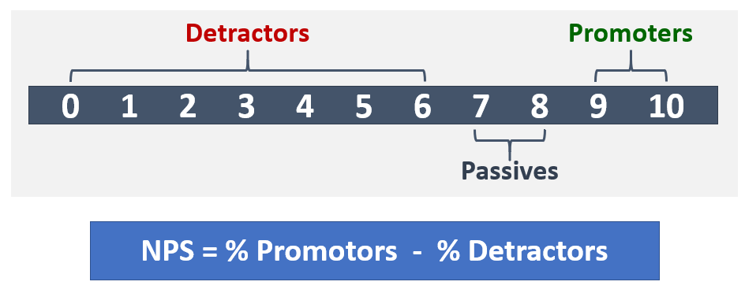

# Exploiter votre service

Cet article fait partie de la phase d’excellence opérationnelle de votre parcours de mise à niveau, qui commence dès que vous avez terminé votre mise à niveau de Skype Entreprise vers Teams.

Cet article donne une vue d’ensemble des conditions requises pour une utilisation Teams pour votre organisation après la mise à niveau. En fonctionnant correctement vos services Teams client, vous êtes sûr de fournir une expérience de haute qualité et fiable à votre organisation.

## Introduction au Guide des opérations

Le guide des opérations vous donne une vue d’ensemble de toutes les tâches et activités requises dans le cadre de la fonction de gestion des services Microsoft Teams.

La gestion des services est un vaste sujet qui couvre les opérations quotidiennes du service Microsoft Teams après son déploiement et son activation pour les utilisateurs. Le service Teams englobe Microsoft 365 Office 365 et les composants d’infrastructure déployés localement (par exemple, réseau).

La notion de gestion des services n'est probablement pas un concept nouveau pour la plupart des organisations. Vous avez peut-être déjà implémenté des processus et des tâches associés à des services existants. Cela dit, vous pouvez probablement améliorer vos processus actuels lorsque vous envisagez de prendre en charge la gestion des services dès aujourd’hui Teams en charge.

La gestion des services englobe l’ensemble des activités et processus impliqués dans la gestion des Teams de bout en bout. Comme indiqué précédemment, certains composants de la gestion des services, l’infrastructure propre au service Microsoft 365 ou Office 365 proprement dit, sont de la responsabilité de Microsoft, tandis que vous, le client, êtes responsables pour vos utilisateurs de la gestion des différents aspects de Teams, du réseau et des points de terminaison que vous fournissez.

Les tâches et activités de ce guide sont regroupées en huit catégories, comme décrit dans le diagramme suivant. Chacune de ces catégories sera étendue dans les sections suivantes.

<table>
<tr><td>  Points de décision</td><td><ul><li>Décidez comment les opérations seront implémentées pour Teams.</li></ul></td></tr>

<tr><td> Étapes suivantes</td><td><ul><li>Examinez le Guide des opérations en entier.</li><li>Implémenter une stratégie d’opérations alignée sur les objectifs de votre organisation afin d’offrir la qualité et la fiabilité des charges Teams charges de travail.</li><li>Examinez le guide de révision de la qualité de l’expérience.</li><li> Implémentez une stratégie d’opérations pour effectuer régulièrement des révisions de la qualité de l’expérience afin de vous assurer que votre déploiement Teams fonctionne à ses fonctionnalités de pointe.</li></ul></td></tr>

</table>

### Mappage des rôles opérationnels

La planification que vous avez prévue pour les opérations au cours de la phase de conception est critique, car les activités d’opérations commencent lorsque les premiers utilisateurs pilotes sont activés. Ce guide répertorie les activités et les tâches qui doivent être effectuées quotidiennement, hebdomadaires, mensuelles ou selon les besoins afin de maintenir une qualité Teams déploiement. Ce guide fournit des connaissances et des instructions sur la façon d’effectuer ces activités et tâches critiques.

L’un des éléments essentiels de la réussite d’un déploiement consiste à s’assurer que la planification effectuée au tout début de la phase de conception consiste à déterminer qui sera responsable d’effectuer des activités spécifiques. Une fois que vous avez compris quelles tâches et activités s’appliquent à votre déploiement, elles doivent être comprises et suivies par les groupes ou les individus que vous leur affectez.

Chaque équipe que vous identifiez doit examiner les tâches et responsabilités identifiées et commencer à se préparer. Cela peut inclure une formation et une préparation, la fourniture de mises à jour du plan de personnel ou la garantie que des fournisseurs externes sont prêts à fournir ces ressources.

Les activités et rôles définis dans ce guide doivent être valides dans la plupart des scénarios, mais chaque déploiement Teams est unique. par conséquent, vous pouvez utiliser ce guide comme point de départ pour personnaliser les activités et les rôles par défaut en fonction de vos besoins.

Assurez-vous que chaque équipe responsable a une bonne compréhension des activités requises pour exécuter le service. Il est essentiel que chaque équipe accepte et se signe sur la responsabilité de votre organisation avant le début du premier pilote.

Une fois qu’un accord est en place, les équipes correspondantes doivent commencer à opérationnel leurs rôles.

<table>
<tr><td> Étapes suivantes</td>
<td><ul><li>Utilisez ce document pour faciliter l’exercice de mappage opérationnel du rôle.</li><li>Réunissez les équipes de support pour attribuer des noms à chaque élément de la liste des activités requises.</li><li>Obtenir l’acceptation ou l’approbation des rôles attribués.</li><li>Assurez-vous que les équipes correspondantes disposent de la formation, de la préparation et des ressources appropriées pour effectuer les activités requises.</li></ul></td></table>

### Teams dépendances de service

Microsoft Teams rassemble les technologies à travers Microsoft 365 et Office 365 pour fournir une plate-forme pour le travail d’équipe. Voici quelques exemples :

- Azure Active Directory (Azure AD) fournit des services d’authentification et d’autorisation pour Teams.

- Exchange Online fournit des fonctionnalités avancées telles que la recherche légale et la découverte électronique.

- SharePoint Online offre la possibilité de partager des fichiers dans des canaux et OneDrive Entreprise fournit un mécanisme de partage de fichiers au sein d’une conversation privée.

Les organisations peuvent également tirer parti des investissements existants dans l’infrastructure locale. Par exemple, vous pouvez utiliser des comptes Active Directory locaux existants pour l’authentification en tirant parti d Azure AD Connecter. Certaines versions de Exchange Server peuvent être utilisées à la place d’Exchange Online.

Ces technologies sont utilisées pour offrir aux utilisateurs une suite de communications enrichies, collaboratives et intelligentes. Cette intégration étroite est un avantage majeur de Teams, mais entraîne également une exigence de gestion des services au sein de ces technologies.

Ce guide couvre les principaux domaines dans le domaine de la gestion Teams service. Vous avez probablement des plans de gestion des services pour les technologies de prise en charge dont Teams dépend. Si ce n’est pas le cas, vous devez établir des plans de gestion des services appropriés pour ces composants technologiques (tant locaux qu’en ligne). Vos utilisateurs bénéficieront ainsi d’une expérience haute qualité et fiable avec Teams.

#### Références

[Présentation de Microsoft Teams](teams-overview.md)

[Interaction entre Exchange et Microsoft Teams](exchange-teams-interact.md)

[Interaction de SharePoint Online et OneDrive Entreprise avec Microsoft Teams](sharepoint-onedrive-interact.md)

[Microsoft Teams coexistence et Skype Entreprise interopérabilité](teams-and-skypeforbusiness-coexistence-and-interoperability.md)

<!--ENDOFSECTION-->

## Activités du Guide des opérations

Les sections suivantes donnent une vue d’ensemble des activités requises pour Microsoft Teams service. Ils font référence à des outils, à des informations contextuelles et à du contenu supplémentaire pour vous aider à comprendre l’activité et aider à des initiatives de préparation.

<!--ENDOFSECTION-->

## Surveiller l’état du service

Il est important de comprendre l’état global du service Microsoft Teams afin de pouvoir avertir les autres membres de votre organisation de tout événement affectant le service. Comme décrit précédemment, Teams dépend d’autres services Microsoft 365 et Office 365 tels que Azure Active Directory, Exchange Online, SharePoint Online et OneDrive Entreprise. C’est pourquoi il est également important de surveiller l’état des services dépendants.

Intégrez cette activité à votre processus de gestion des incidents pour informer de façon proactive les utilisateurs, le service d’aide et vos équipes de production afin de préparer la gestion des escalades des utilisateurs.

Les sections suivantes décrivent les outils que vous pouvez utiliser pour surveiller les [incidents](/office365/servicedescriptions/office-365-platform-service-description/service-health-and-continuity#Anchor_1) de service qui affectent Teams service. Un résumé des avantages de chaque outil, et le moment où vous devez l’utiliser, est inclus dans le tableau suivant.

| Outil d’analyse | Avantages | Quand utiliser |
|---|---|---|
| Centre d'administration Microsoft 365 | Disponible à partir de n’importe quel appareil avec un navigateur pris en charge. | À utiliser lorsque vous n’avez pas besoin de notifications en temps réel. |
| Administration Microsoft 365 appappe | Fournit des notifications Push à votre appareil mobile. | Utilisez cette fonction lorsque vous devez être averti des incidents de service lorsque vous êtes en cours. |
| Microsoft System Center | Intégration à Microsoft System Center. | Utilisez cette fonctionnalité lorsque vous avez besoin de fonctionnalités avancées de surveillance et de prise en charge des notifications. |
| Microsoft 365 Service Communications API | Accès par programme à l Microsoft 365'état Office 365 service. | À utiliser lorsque vous avez besoin d’être intégré à un outil de surveillance tiers ou que vous souhaitez créer votre propre solution. |

> [!NOTE]
> Seules les personnes ayant le rôle **d’administrateur général** ou d’administrateur **de service** peuvent afficher l’état du service.

### Surveillance avec la Centre d'administration Microsoft 365

La [Centre d'administration Microsoft 365](https://portal.office.com/) fournit un tableau de bord [d’état du](https://portal.office.com/adminportal/home#/servicehealth) service dans lequel vous pouvez afficher l’état actuel du service Teams en plus des services dépendants.

### Surveillance avec l’application mobile

L’Administration Microsoft 365 est disponible sur Apple iOS, Android et Windows (PC et appareils mobiles). L’application fournit aux administrateurs des informations sur l’état du service et les modifications à venir. L’application prend en charge les notifications Push qui peuvent vous avertir presque immédiatement après la mise en service d’un avis. Cela vous permet de rester au courant de l’état, de l’état d’état et des modifications à venir du service. La prise en charge des notifications en fait l’outil de surveillance recommandé pour les administrateurs. Pour plus d’informations, consultez :

[Administration Microsoft 365 Application mobile](https://support.office.com/article/Office-365-Admin-Mobile-App-e16f6421-2a1a-4142-bf9d-9846600a060a)

[Télécharger l’application Administration Microsoft 365 Mobile](https://products.office.com/business/manage-office-365-admin-app)

### Surveillance avec Microsoft System Center

Microsoft System Center est une plateforme de gestion intégrée qui vous permet de gérer des centres de données, des appareils clients et des environnements informatiques cloud hybrides. Microsoft 365 ou Office 365 les administrateurs qui utilisent System Center ont désormais la possibilité d’importer le pack de gestion, ce qui leur permet d’afficher toutes les communications de service dans le Gestionnaire des opérations dans System Center. Cet outil vous permet d’accéder à l’état de vos services abonnés, aux incidents de service actifs et résolus, ainsi qu’à vos communications dans le Centre de messages (modifications à venir). Pour plus d’informations, voir le [billet de blog suivant.](https://www.microsoft.com/en-us/microsoft-365/blog/2014/07/29/new-office-365-admin-tools/)

Si vous tirez parti d’System Center pour surveiller l’état Teams du service (et des services dépendants), vous pouvez personnaliser davantage le pack de gestion pour alerter ou avertir les groupes spécifiques ou les personnes identifiées pour réagir aux incidents.
Ces groupes peuvent inclure des propriétaires de services, des support technique, des groupes de support de deuxième et troisième niveaux, et des gestionnaires d’incidents dans votre organisation.

### Surveillance des scénarios avancés

Vous pouvez surveiller l’état du service et les modifications à venir en tirant parti de l’API de communications de service pour accéder à l’état du service et aux modifications par programme. Utilisez cette API pour créer votre propre outil de surveillance ou connecter vos outils de surveillance existants aux communications de service Microsoft 365 ou Office 365, ce qui simplifie potentiellement la façon dont vous surveillez votre environnement. Pour plus d’informations, [voir Microsoft 365 ou Office 365 pour Enterprise développeurs.](/office/developer-program/microsoft-365-developer-program-faq)

### Tâches quotidiennes/hebdomadaires/mensuelles/en cas de besoin

| Activité | Description | Cadence | Équipe affectée |
|---|---|---|---|
| Surveiller l’état du service | Surveillez de façon proactive Microsoft Teams l’état du service (et des services dépendants) à l’aide des outils disponibles. Les services dépendants sont les suivants : Exchange Online, SharePoint Online, OneDrive Entreprise, Azure Active Directory. | En temps réel | |
| Notification d’incident | Informez les parties prenantes internes des événements qui affectent Teams service. Les parties prenantes internes peuvent inclure des utilisateurs, des intervenants et des gestionnaires d’incidents. | Selon les besoins | |

### Références

[Vérifier l’état Microsoft 365 service Office 365 service](https://support.office.com/article/How-to-check-Office-365-service-health-932AD3AD-533C-418A-B938-6E44E8BC33B0)

[Vérifier l’état du service Microsoft Teams](service-health.md)

[État du service et continuité](/office365/servicedescriptions/office-365-platform-service-description/service-health-and-continuity)

<!--ENDOFSECTION-->

## Gérer les changements d’organisation

Microsoft Teams est un service cloud. Cela vous permet de fournir de nouvelles fonctionnalités à un rythme rapide. Offrir une innovation continue offre aux organisations un avantage évident, mais ces changements doivent être gérés correctement au sein de votre organisation afin d’éviter la résistance des utilisateurs ou les escalades à votre aide.

Les mises à jour Teams sont déployées automatiquement pour vos utilisateurs. Vos utilisateurs disposeront toujours du client et des fonctionnalités les plus récents disponibles dans le service Teams client. Il n’est pas possible de gérer le déploiement des mises à jour Teams pour vos utilisateurs. Il est donc essentiel de gérer les changements à l’aide de programmes efficaces de communication, de formation et d’adoption. Si vos utilisateurs sont conscients du changement, informés des avantages et de la possibilité de tirer parti des nouvelles fonctionnalités, ils pourront s’adapter plus rapidement et accueillir &mdash; le changement.

### Surveillance des changements

La première étape de la gestion des modifications consiste à surveiller les modifications planifiées pour Teams. La meilleure source pour surveiller ces modifications est la feuille de route [Microsoft 365,](https://www.microsoft.com/microsoft-365/roadmap)qui répertorie les fonctionnalités en cours de développement, déployées pour les clients ou entièrement lancées. Vous pouvez rechercher Teams fonctionnalités spécifiques à l’aide du filtre fourni, ou télécharger la feuille de route vers un fichier Excel pour une analyse approfondie. Pour chaque fonctionnalité, la feuille de route fournit une brève description, ainsi que la date de publication prévue.

Le blog [Microsoft Teams vous](https://techcommunity.microsoft.com/t5/Microsoft-Teams-Blog/bg-p/MicrosoftTeamsBlog)permet d’en savoir plus sur les meilleures pratiques, les tendances et les actualités sur Teams mises à jour de produit. Nous vous attendons à trouver les principales mises à jour Teams fonctionnalités à annoncer ici. Vous pouvez également vous abonner au blog via un flux RSS. Vous pouvez ensuite ajouter le flux [RSS](https://techcommunity.microsoft.com/gxcuf89792/rss/board?board.id=MicrosoftTeamsBlog) directement dans un Teams, afin que toutes les informations importantes y sont directement Teams.

Toutes les fonctionnalités publiées sont consignées dans les Notes de publication [pour Microsoft Teams.](https://support.office.com/article/Release-notes-for-Microsoft-Teams-d7092a6d-c896-424c-b362-a472d5f105de)
Vous y trouverez la liste des fonctionnalités publiées pour le bureau, le web et les appareils mobiles. Le même jeu de notes de publication est également disponible sous **l’onglet** Nouveautés de [l’Aide.](get-help-in-microsoft-teams.md)

Familiarisez-vous avec les ressources disponibles et assurez-vous d’affecter les propriétaires applicables à surveiller les changements.

### Planification des changements

Maintenant que vous avez connaissance des modifications à venir du service Teams service, l’étape suivante consiste à vous préparer et planifier en conséquence. Évaluez chaque changement pour déterminer quelles modifications nécessitent une communication aux utilisateurs, des campagnes de sensibilisation, des formations pour les équipes de support ou des utilisateurs, ou des campagnes d’évaluation et d’adoption des fonctionnalités. Il s’agit du rôle principal d’une équipe de gestion des changements au sein de votre organisation. Vous trouverez ci-dessous un ensemble d’exemples de tableaux qui peuvent vous aider à planifier les changements.

#### Fonctionnalité : Enregistrement cloud (date de publication : janvier 2018)

**Piste générale**

| Modifier la disponibilité | État | Remarques/étapes suivantes | Propriétaire |
|---|---|---|---|
| Révision légale | Terminé | Cette fonctionnalité est une condition préalable à l’intégration de l’équipe de formation. | Project d’équipe |

**Gestion des changements techniques**

| Modifier la disponibilité | État | Remarques/étapes suivantes | Propriétaire |
|---|---|---|---|
| Modifications requises de l’it | Oui | L’administrateur doit activer l’enregistrement pour les utilisateurs identifiés uniquement. | Équipe de support technique |
| Préparation technique terminée | Oui | | Équipe de support technique |
| | | | |

**Gestion des changements d’utilisateur**

| Modifier la disponibilité | État | Remarques/étapes suivantes | Propriétaire |
|---|---|---|---|
| Impact sur les utilisateurs | Bas | | |
| Disponibilité des utilisateurs requise | Oui | | |
| Communications prêtes | Non | Le brouillon du courrier électronique de communication a été envoyé (en attente de révision). | Équipe de communication |
| Formation prête | Oui | La formation tire parti de la vidéo Microsoft existante. | Équipe de formation |

**Suivi de l’état**

| Modifier la disponibilité | État | Remarques/étapes suivantes | Propriétaire |
|---|---|---|---|
| État de publication | en cours | Révision en attente par le sponsor exécutif. | Équipe de gestion des changements |
| Publication de l' signer | | | |
| Date de publication | | | |

Pour plus d’informations sur la planification de la gestion des Teams, voir Créer une stratégie de gestion des [changements pour les Microsoft Teams.](change-management-strategy.md)

### Tâches quotidiennes/hebdomadaires/mensuelles/en cas de besoin

| Activité| Description| Cadence| Équipe affectée |
|---|---|---|---|
| Surveiller les changements| Surveillez les modifications à venir Microsoft Teams service.| Jour||
| Planification des changements| Évaluez et planifiez de nouvelles fonctionnalités, notamment des plans de communication, des campagnes de sensibilisation et des formations.| Selon les besoins ||
| Disponibilité des utilisateurs| Effectuer des campagnes de communication ciblée, de sensibilisation ou de formation pour veiller à ce que les utilisateurs soient prêts pour la prochaine modification.| Selon les besoins ||
| Préparation de l’équipe de support | Effectuer des campagnes de communication ciblée, de sensibilisation ou de formation pour garantir que l’équipe de support soit prête. Les équipes de support technique peuvent inclure l’équipe « white », les support technique, le support de niveau 2 ou de niveau 3, des partenaires externes, etc. | Selon les besoins ||

<!--ENDOFSECTION-->

## Évaluer Teams’utilisation

Après le début du pilote initial, il est essentiel d’établir une cadence régulière pour mesurer l’utilisation Teams réelle. Cela permet à votre organisation d’obtenir des informations sur l’alignement de l’utilisation réelle avec l’utilisation que vous avez prévue au cours de la phase de réflexion. Bien que cette section se concentre sur Teams’utilisation globale, elle doit faire partie d’un effort plus large de mesure et d’évaluation de Microsoft 365 ou Office 365'utilisation globale.

L’examen fréquent de l’utilisation au début du déploiement vous permet d':

- Vérifier si les utilisateurs utilisent Teams.

- Identifiez les défis potentiels à l’adoption avant qu’ils ne créent des problèmes critiques dans l’organisation.

- Comprenez s’il existe des différences entre les exigences de la phase de conception et l’utilisation réelle.

Si l’utilisation n’est pas celle que vous attendiez, cela peut être dû à un problème de déploiement, à l’exécution du plan d’adoption ne fonctionne pas correctement, ou à un autre problème. Selon la raison réelle de la faible utilisation, l’administrateur doit collaborer avec les équipes associées pour contribuer à supprimer les barrières d’utilisation.

### Mesure de l’utilisation à l’Centre d'administration Microsoft 365

Les données d’utilisation Teams disponibles dans le tableau de bord Rapports. Teams données d’utilisation sont disponibles dans trois rapports différents. Le premier rapport fournit une vue d’ensemble des produits de la façon dont les utilisateurs communiquent et collaborent à l’aide des différents services Microsoft 365 ou Office 365. Vous pouvez trouver ce rapport ici : utiliser Microsoft 365 [rapports dans le Centre d’administration - Utilisateurs actifs](https://support.office.com/article/Office-365-Reports-in-the-Admin-Center-Active-Users-FC1CF1D0-CD84-43FD-ADB7-A4C4DFA8112D)

Les deux autres rapports sont spécifiques Teams et fournissent des détails supplémentaires sur l’utilisation Teams d’un utilisateur et d’un appareil. Les deux rapports sont trouvés ici :

[Rapport d’utilisation des périphériques de Microsoft Teams](https://support.office.com/article/Office-365-Reports-in-the-Admin-Center-Microsoft-Teams-device-usage-917b3e1d-203e-4439-8539-634e80196687)

[Rapport d’activité des utilisateurs de Microsoft Teams](https://support.office.com/article/Office-365-Reports-in-the-Admin-Center-Microsoft-Teams-user-activity-07f67fc4-c0a4-4d3f-ad20-f40c7f6db524)

#### Autorisations requises

Les rapports d’utilisation dans le Centre d’administration  sont accessibles par les personnes à qui un rôle d’administrateur général ou un rôle d’administrateur spécifique au produit ont été attribués (administrateur **Exchange,** administrateur **Skype Entreprise,** administrateur **SharePoint).**

En outre, **le** rôle de lecteur de rapports est disponible pour les utilisateurs qui ont besoin d’accéder aux rapports, mais n’effectuent aucune tâche qui nécessite des autorisations au niveau de l’administrateur. Vous attribuez ce rôle pour fournir des rapports d’utilisation à toute personne concernée, afin de surveiller et de contrôler l’adoption. Pour plus d’informations sur les différents rôles disponibles, voir À propos [Microsoft 365 rôles d’administrateur.](https://support.office.com/article/About-Office-365-admin-roles-da585eea-f576-4f55-a1e0-87090b6aaa9d)

### Évaluation de l’utilisation

Après avoir utilisé le tableau de bord de rapport pour mesurer l’utilisation, il est important de comparer l’utilisation mesurée avec les indicateurs de réussite clés (KSI) que vous avez définis lors de la phase de conception du projet. Vous pouvez définir un KSI défini comme utilisation active ou indirectement lié à l’utilisation active.

Il est important d’identifier les écarts entre l’utilisation réelle et planifiée avant de reprendre le déploiement sur d’autres sites ou utilisateurs. Vous allez probablement identifier les apprentissages de l’organisation dans le cadre de cette activité que vous pourrez exploiter pour vous assurer que le lot suivant de sites ou d’utilisateurs ne rencontrent pas les mêmes problèmes.

Tout d’abord, indiquez s’il s’agit d’un problème d’adoption ou technique. Commencez par examiner les éléments ci-dessous, dans l’ordre, pour déterminer où se trouve le problème.

1. Valider la qualité en faisant l’examen [de la qualité de l’expérience.](upgrade-monitor-quality.md)

2. Travaillez avec l’équipe du support technique pour vérifier qu’aucun problème technique tendance n’empêche les utilisateurs d’accéder au service ou d’utiliser celui-ci. Si des tendances de problème existent, utilisez la [section](#endpoint-troubleshooting) de dépannage du point de terminaison plus loin dans cet article pour tenter de résoudre le problème avant d’engager l’assistance.

3. Travaillez avec l’équipe de formation et d’adoption pour recueillir des commentaires directs des utilisateurs (voir Évaluer les opinions des utilisateurs plus loin dans cet article) et vérifier l’efficacité des activités de sensibilisation et d’adoption. 

### Tâches quotidiennes/hebdomadaires/mensuelles/en cas de besoin

| Activité | Description | Cadence | Équipe affectée |
|---|---|---|---|
| Mesurer l’utilisation (phase d’enablement) | Mesurez et évaluez Teams l’utilisation continue des sites pendant la phase d’intégration. Résoudre les problèmes d’utilisation si nécessaire. | Toutes les semaines | |
| Mesurer l’utilisation | Mesurer et évaluer Teams’utilisation dans la phase De valeur de lecteur (une fois le déploiement terminé). Résoudre les problèmes d’utilisation si nécessaire. | Toutes les semaines | |
| (phase de valeur du lecteur) | | | |
| Mettre à jour le plan d’adoption | Mettez à jour votre plan d’adoption en fonction de la mesure de l’utilisation par rapport à vos objectifs de planification. | Selon les besoins | |

### Références

[À propos de la Centre d'administration Microsoft 365](https://support.office.com/article/About-the-Office-365-admin-center-758befc4-0888-4009-9f14-0d147402fd23)

[Rapports d’activité dans la Centre d'administration Microsoft 365](https://support.office.com/article/Activity-Reports-in-the-Office-365-admin-center-0d6dfb17-8582-4172-a9a9-aed798150263)

<!--ENDOFSECTION-->

## Évaluer les opinions des utilisateurs

Le fait de comprendre les opinions des utilisateurs peut agir comme un indicateur clé pour mesurer la réussite de Teams déploiement. Les commentaires des utilisateurs peuvent être à l’base des modifications apportées à votre organisation. Cela peut inclure des modifications de vos plans de communication, de vos programmes de formation ou de la manière dont vous offrez de l’assistance à vos utilisateurs.

Il est important d’obtenir des commentaires rapidement et de continuer à évaluer les opinions des utilisateurs tout au long du cycle de vie du projet et au-delà. Utilisez les instructions suivantes pour déterminer l’intervalle dans lequel votre organisation va rechercher des commentaires :

- **Début du projet**: en évaluez les opinions des utilisateurs au début du projet, vous pouvez obtenir une vue d’avant-première de l’expérience de vos utilisateurs en ce qui Teams leur expérience.

- **Après les principaux jalons**: en collectant des commentaires tout au long du cycle de vie du projet, vous pouvez évaluer l’opinion des utilisateurs en continu et apporter des modifications en fonction des besoins. Cette opération est particulièrement utile après les principaux jalons.

- **Project conclusion**: L’évaluation des opinions des utilisateurs à la fin d’un projet vous indique à quel point vous avez fait et où le travail doit encore être effectué, et vous permet de comparer les résultats par rapport à l’enquête précédente.

- **Continu :** Continuer à mesurer l’opinion des utilisateurs indéfiniment. Les modifications apportées aux opinions des utilisateurs peuvent être dues à des changements dans l’environnement de votre organisation ou à des modifications apportées au service Teams utilisateur. En attignant les sentiments des utilisateurs à intervalles réguliers, vous pouvez comprendre les bonnes performance de vos équipes de gestion des services et la manière dont votre organisation répond aux modifications apportées au service Teams service.

Les opinions des utilisateurs peuvent être évaluées à l’au travers de nombreuses méthodes différentes. Il peut s’agir d’enquêtes par courrier électronique, d’entretiens en personne ou par téléphone, ou de la création d’un canal de commentaires dans Teams ou Yammer. Pour plus d’informations, voir [Meilleures pratiques pour les méthodes de commentaires des utilisateurs dans Microsoft Teams.](best-practices-feedback.md)

Vous pouvez également utiliser une approche à l’échelle de l’industrie pour évaluer les opinions des utilisateurs appelée score promotor net (NPS), qui est décrite dans la section suivante.

### NPS

Les scores nets des promoteurs (NPS) sont une mesure de fidélisation à l’échelle du secteur et une bonne approche à utiliser pour évaluer les opinions des utilisateurs. Le programme peut être calculé en posez deux questions : « Allez-vous recommander Teams à un collègue ? », suivi de la question de forme libre « Pourquoi ?

NPS est un index compris entre –100 et 100 qui mesure les demandes d’un client en relation avec la recommandation d’un produit ou d’un service de l’entreprise. La fonction NPS est basée sur une enquête anonyme livrée aux utilisateurs par courrier électronique ou par d’autres moyens électroniques. NPS mesure la fidélité entre un fournisseur et un consommateur. Il se compose d’une seule question, qui invite les utilisateurs à évaluer leur expérience de 1 à 10, avec la possibilité de fournir des commentaires supplémentaires. Les utilisateurs sont ensuite classés selon les évaluations suivantes :

- 9 ou 10 sont des organisateurs : passionnés de fidélité qui vont promouvoir votre service et de l’essence pour d’autres personnes.

- 7 ou 8 sont passifs : satisfaits, mais non satisfaits, vulnérables à un autre service ou offre.

- De 1 à 6 sont des consommateurs : clients tristes qui peuvent endommager votre service et empêcher la croissance.

Bien que le nombre de PNS de base soit utile, l’analyse des commentaires des utilisateurs vous sera très utile. Ils vous aideront à comprendre pourquoi l’utilisateur recommanderait (ou ne le recommanderait pas) à d’Teams personnes. Ces commentaires peuvent fournir des commentaires utiles pour aider les équipes de gestion de projet ou de service à comprendre les ajustements nécessaires à la qualité du service.

Pour fournir des enquêtes NPS à votre organisation, vous pouvez tirer parti de votre outil d’enquête en ligne préféré.

### Tâches quotidiennes/hebdomadaires/mensuelles/en cas de besoin

| Activité | Description | Cadence | Équipe affectée |
|---|---|---|---|
| Évaluer les opinions des utilisateurs | Capturez et évaluez les opinions des utilisateurs à l’aide d’enquêtes ou d’entretiens, ou via un canal de commentaires Teams ou Yammer. | Selon les besoins | |
| Mettre à jour les plans d’adoption | Drive change in your organization based on user feedback; Cela peut inclure des modifications de vos plans de communication, de vos programmes de formation ou de la manière dont vous offrez de l’assistance à vos utilisateurs. | Selon les besoins | |

### Références

[Net Promoter Score](https://en.wikipedia.org/wiki/Net_Promoter)

[Utilisation de Yammer pour recueillir des commentaires](https://techcommunity.microsoft.com/t5/Yammer-Blog/The-Microsoft-Teams-team-uses-Yammer/ba-p/55210)

[Meilleures pratiques pour les commentaires des utilisateurs](best-practices-feedback.md)

<!--ENDOFSECTION-->

## Gérer la qualité du réseau

De nombreux éléments de planification principaux vont dans l’optimisation, le reizing à droite et la correction de votre infrastructure réseau afin de garantir un chemin d’accès efficace et de haute qualité au service Microsoft Teams service. Les tâches de planification et les exigences sont couvertes par nos [conseils en matière de préparation réseau.](prepare-network.md) Les réseaux évoluent souvent au fil du temps en raison de mises à niveau, d’extensions ou d’autres besoins de l’entreprise. Il est important de prendre en compte vos besoins en matière Teams dans vos activités de planification réseau.

Bien que la planification réseau soit un aspect critique d’un déploiement Teams, il est également important de s’assurer que le réseau reste en bonne santé et reste à jour, en fonction de l’évolution des exigences professionnelles ou techniques.

Pour garantir l’état de votre réseau, un certain nombre d’activités d’opérations doivent être effectuées à intervalles réguliers.

### Tâches quotidiennes/hebdomadaires/mensuelles/en cas de besoin

| Activité | Description | Cadence | Équipe affectée |
|---|---|---|---|
| Surveiller Microsoft 365 adresses Office 365 adresses IP et URL | Surveillez les modifications [apportées aux URL](/microsoft-365/enterprise/urls-and-ip-address-ranges) Office 365 et plages d’adresses IP à l’aide du flux [RSS](https://go.microsoft.com/fwlink/p/?linkid=236301) fourni et lancez une demande de modification pour les groupes réseau applicables. | Jour | |
| Mettre à jour le réseau en fonction des modifications apportées aux adresses Microsoft 365 ou Office 365 adresses IP et URL | Mettez à jour les composants réseau applicables (pare-feu, serveurs proxy,VPN, pare-feu côté client, etc.) afin de refléter les modifications apportées aux URL et [plages d’adresses IP Office 365.](/microsoft-365/enterprise/urls-and-ip-address-ranges) | Selon les besoins | |
| Fournir des données de création | Fournissez des informations de sous-réseau mises à jour à l’équipe de champion de la qualité (ou à des parties prenantes concernées) pour vous assurer que les définitions de bâtiment du [CQD](/SkypeForBusiness/using-call-quality-in-your-organization/turning-on-and-using-call-quality-dashboard#upload-building-information) sont tenues à jour. | Selon les besoins | |
| Implémenter une modification | Implémentez les modifications apportées au réseau pour prendre en charge le changement Teams exigences professionnelles et techniques. Les éléments réseau peuvent inclure les éléments suivants :<ul><li>Pare-feu</li><li>VPNs</li><li>Réseaux câblés et Wi-Fi réseaux</li><li>Connectivité Internet et ExpressRoute</li><li>DNS</li></ul> | Selon les besoins | |
| Surveillance et rapport réseau | Surveillez de bout en bout les tendances de disponibilité, d’utilisation et de capacité du réseau en utilisant vos outils de gestion réseau tiers existants et les fonctionnalités de rapports disponibles de vos fournisseurs réseau. Utilisez des données tendances pour la planification de la capacité réseau. | Quotidienne, hebdomadaire, mensuelle | |
| Planification de capacité | Collaborez avec les propriétaires Teams de service pour comprendre l’évolution des exigences professionnelles et techniques, ce qui peut se baser sur des changements de capacité supplémentaires.  | Selon les besoins | |
| Résolution des problèmes et corrections du réseau | Aidez les Teams, les propriétaires de service et les principales parties prenantes à résoudre et corriger les problèmes liés à la Teams, à la fiabilité ou à la qualité. Les éléments réseau peuvent inclure les éléments suivants :<ul><li>Pare-feu</li><li>VPNs</li><li>Réseaux câblés et Wi-Fi réseaux</li><li>Connectivité Internet et ExpressRoute</li><li>DNS</li></ul> | Selon les besoins | |
| Récupération d’urgence et test de haute disponibilité | Effectuez régulièrement des tests de haute disponibilité et de récupération d’urgence sur l’infrastructure réseau pour vous assurer qu’elle répond aux objectifs s’y rapportant (S SLOS) ou les contrats de niveau de service (S SLA) pour le service Teams service. | Mois | |

### Références

[URL et plages d’adresses IP Office 365](/microsoft-365/enterprise/urls-and-ip-address-ranges)

[Création d’un schéma de données](/SkypeForBusiness/using-call-quality-in-your-organization/turning-on-and-using-call-quality-dashboard#tenant-data-file-format-and-building-data-file-structure)

<!--ENDOFSECTION-->

## Évaluer et garantir la qualité

Toutes les organisations ont besoin qu’un groupe ou une personne soit responsable de la qualité. Il s'agit du rôle le plus important dans la gestion des services. Le rôle De qualité Champion est attribué à une personne ou à un groupe qui est passionné par l’expérience des utilisateurs.
Ce rôle exige les compétences nécessaires pour cerner les tendances de l'environnement et le parrainage pour travailler avec d'autres équipes afin d'orienter les mesures correctives. En général, le meilleur candidat au rôle de Champion Qualité est le responsable du service clientèle. En fonction de la taille et de la complexité de l’organisation, il peut s’agit de toute personne ou groupe qui a une passion pour garantir une expérience utilisateur de haute qualité.

L’équipe de champion de la qualité tire parti d’outils et de processus documentés existants, tels que le tableau de bord de qualité des appels, ainsi que Améliorer et surveiller la qualité des appels pour [Teams,](monitor-call-quality-qos.md)afin de surveiller l’expérience des utilisateurs, d’identifier les tendances en matière de qualité et de conduire les corrections au besoin.
L’organisateur de la qualité doit travailler avec les équipes appropriées pour conduire des actions de correction et signaler auprès d’un comité directeur l’avancement de l’avancement et les problèmes ouverts.

[Améliorez et surveillez](monitor-call-quality-qos.md) la qualité des appels pour Teams notamment des activités qui évaluent et fournissent des recommandations de correction dans les domaines clés qui ont le plus fort impact sur l’amélioration de l’expérience utilisateur. Les conseils fournis dans le guide de révision de l’expérience de qualité se concentrent sur l’utilisation de CQD Online comme outil principal pour signaler et examiner chaque domaine, avec un focus sur l’audio pour optimiser l’adoption et l’impact. Toutes les optimisations apportées au réseau pour améliorer l'expérience audio se traduiront aussi directement par des améliorations dans le partage de la vidéo et du bureau.

Nous vous recommandons vivement de désigner le champion de la qualité en avant-première. Une fois désignées, elles doivent commencer à  se familiariser avec le contenu dans Améliorer et surveiller la qualité des appels pour les Teams documents de formation associés.

### Tâches quotidiennes/hebdomadaires/mensuelles/en cas de besoin

| Activité | Description | Cadence | Équipe affectée |
|---|---|---|---|
| Des champions de la qualité des train et des désignent | Désignez un champion de la qualité. | Selon les besoins | |
| Effectuer des révisions de qualité de l’expérience (QER) | Effectuez un QER pour identifier les tendances en matière de qualité et de fiabilité, effectuer des examens par rapport à des cibles définies et rendre des rapports aux principales parties prenantes de l’organisation. | Tous les mois (toutes les semaines pendant les déploiements) | |
| Des corrections sur les disques | Coordonnez les efforts de correction dans l’organisation sur la base des analyses et résultats de la QER. | Selon les besoins | |
| Mettre à jour les données du bâtiment dans le DQD | Mettez à jour ou ajoutez de nouvelles définitions de bâtiment dans le CQD lorsque des modifications sont apportées au réseau (voir Télécharger [informations sur le bâtiment).](/SkypeForBusiness/using-call-quality-in-your-organization/turning-on-and-using-call-quality-dashboard#upload-building-information) | Selon les besoins | |
| Remplir le rôle Quality Champion | Responsabilité de bout en bout en ce qui a lieu au niveau de la qualité au niveau de l’organisation. Cela inclut :<ul><li>Assurez-vous que la QER est effectuée régulièrement.</li><li>Reportez-vous aux principales parties prenantes sur l’état de la qualité.</li><li>Assurez-vous que les définitions de données du bâtiment sont à jour.</li><li>Coordonnez les efforts de correction dans l’organisation pour vous assurer que les utilisateurs ont une expérience de haute qualité avec Teams.</li></ul> | Jour | |

### Références

[Télécharger Informations sur le bâtiment](/SkypeForBusiness/using-call-quality-in-your-organization/turning-on-and-using-call-quality-dashboard#upload-building-information)

[Améliorer et surveiller la qualité des appels pour les Teams](monitor-call-quality-qos.md)

<!--ENDOFSECTION-->

## Gérer les points de terminaison

Microsoft Teams points de terminaison peuvent être définis comme n’importe quel PC, Mac, tablette ou appareil mobile (ou tout autre) exécutant Teams client. Le  terme point de terminaison englobe non seulement l’appareil lui-même, mais également la façon dont un utilisateur se connecte à l’appareil, par exemple, en utilisant le micro ou le haut-parleur intégré de l’appareil, les écouteurs ou un casque optimisé. Une fois déployés, les points de terminaison ne doivent pas être oubliés. Les Teams de terminaison nécessitent un entretien et un entretien continus. Les sections suivantes décrivent des zones spécifiques sur qui se concentrer.

### Conditions requises pour les points de terminaison

L’un des principaux avantages d Teams est que le client est automatiquement tenu à jour. Les clients sur PC et Mac sont mis à jour à l'aide d'un processus en arrière-plan qui vérifie les nouvelles versions et télécharge le nouveau client lorsque l'application est inactive. Les Teams applications mobiles sont conservées à jour sur leurs magasins d’applications respectifs.

Le Teams client a des exigences minimales en ce qui concerne la plateforme logicielle sous-jacente. Ces exigences peuvent changer au fil du temps et il est donc important de les surveiller en cas de modification. Par exemple, le Teams client dispose d’une version minimale d’iOS. Si le client utilise un navigateur Internet, il doit également être à jour. Vous pouvez trouver la liste des plateformes pris en charge dans [obtenir des clients pour Microsoft Teams.](get-clients.md)

### Pare-feu des points de terminaison

Les pare-feu côté client peuvent avoir un impact significatif sur l'expérience utilisateur.
Les pare-feu côté client peuvent affecter la qualité des appels et même empêcher l’établi. Une fois les exclusions appropriées configurées sur le pare-feu du client, vous devez les garder à jour en fonction des informations des URL et [plages](/microsoft-365/enterprise/urls-and-ip-address-ranges)d’adresses IP Office 365 . Votre fournisseur tiers pourra vous donner des conseils spécifiques sur la mise à jour des exclusions.

### Pilotes Wi-Fi

Wi-Fi pilotes peuvent être problématiques. Par exemple, un pilote peut avoir des comportements d’itinérance très agressives entre les points d’accès qui peuvent déclencher un basculement inutile de point d’accès, ce qui peut entraîner une mauvaise qualité des appels. Il est possible qu’un pilote de qualité Wi-Fi soit détecté  par le biais d’une révision de la qualité de l’expérience (voir Améliorer et surveiller la qualité des appels Teams pour plus de détails). Il est essentiel d’implémenter un processus piloté par la qualité qui surveille les nouveaux pilotes Wi-Fi et garantit qu’ils sont testés avant d’être déployés vers la population générale des utilisateurs.

### Gestion des points de terminaison

Un catalogue de points de terminaison et d’appareils interface pris en charge (tels que des casques) doit être disponible et conservé. Ce catalogue inclura une liste des appareils approuvés qui ont été sélectionnés et validés dans le cadre des phases De conception et d’intégration. En règle générale, des appareils spécifiques sont sélectionnés pour chaque type de personnage de votre organisation afin de répondre aux besoins des attributs de ce personnage. Tous les points de terminaison ont un cycle de vie et vous devez gérer les contrats des fournisseurs, la garantie, le remplacement, la distribution et les stratégies de réparation associés à ces appareils.

### Résolution des problèmes de point de terminaison

Même si vous avez suivi les instructions précédentes, les utilisateurs de votre organisation peuvent encore être en situation de Teams. Bien que le problème ne soit pas du point de terminaison lui-même, les symptômes de ce problème sont généralement resser relation entre le client et l’utilisateur. Les conseils suivants ont pour but de fournir des étapes générales que vous pouvez suivre pour résoudre le problème. il n’est pas destiné à être un guide de dépannage complet. Les étapes sont fournies dans un ordre spécifique, mais elles ne doivent pas être suivies de manière explicite et peuvent ne pas être applicables, selon la nature du problème.

1. **Valider l’état du service :** Le problème qu’un utilisateur peut rencontrez peut être lié à un événement qui affecte négativement le service Teams ses services dépendants. Dans un premier temps, nous vous recommandons de confirmer l’absence de problèmes de service actif. Consultez [comment vérifier Microsoft 365'état du service.](/office365/enterprise/view-service-health) N’oubliez pas de vérifier l’état des services dépendants (par exemple, Exchange, SharePoint, OneDrive Entreprise). La surveillance de l’état du service est abordée plus en détail dans la section précédente, à savoir [surveiller l’état du service.](#monitor-service-health)

2. **Valider la connectivité des clients :** Les problèmes de connectivité entraînent des problèmes de fonctionnalité ou de connexion dans Teams. Nous vous recommandons (en particulier pour les nouveaux sites ou emplacements) de valider la connectivité au service. Assurez-vous que [les instructions Office 365 url et plages d’adresses IP suivantes](/microsoft-365/enterprise/urls-and-ip-address-ranges) sont suivies pour chaque site. Vous pouvez tirer parti de l’outil d’évaluation du réseau [Microsoft](https://www.microsoft.com/download/details.aspx?id=53885) pour effectuer un test de connectivité afin de vérifier que les ports multimédias ont été ouverts correctement pour des Teams réseau. Les étapes détaillées de l’exécuter sont fournies dans les conseils de préparation [réseau.](prepare-network.md)

3. **Consultez la liste des problèmes connus :** Consultez [Teams résolution des problèmes](/MicrosoftTeams/troubleshoot/teams) pour déterminer si l’utilisateur a été affecté par l’un de ces problèmes. Suivez la solution de contournement fournie (le caser une) pour résoudre le problème.

4. **Visitez la communauté Microsoft Teams de l’équipe :** La [communauté Microsoft Teams propose des](https://techcommunity.microsoft.com/t5/Microsoft-Teams/ct-p/MicrosoftTeams) espaces dédiés pour l’Teams. La communauté Teams propose une liste de discussions, des billets de blog et des annonces centrés autour d Teams. Vous pouvez publier une question ou rechercher des solutions à votre problème dans des discussions précédentes.

5. **Contactez le Support Microsoft :** Vous pouvez contacter le Support Microsoft en cas de problèmes avec Teams en ligne ou par téléphone. Pour plus d’informations, voir [Contacter le support pour les produits pour les entreprises - Aide de l’administrateur.](/microsoft-365/admin/contact-support-for-business-products) Pour les clients Premier, les demandes de support peuvent être initiées en suivant les recommandations du support technique Microsoft Teams [(clients Premier).](https://support.microsoft.com/premier/contacts)

### Tâches quotidiennes/hebdomadaires/mensuelles/en cas de besoin

| Activité | Description | Cadence | Équipe affectée |
|---|---|---|---|
| Conditions requises pour les points de terminaison | Assurez-vous que Teams point de terminaison continue de répondre à toutes les exigences logicielles pour les Teams répertoriés dans obtenir [des clients pour Microsoft Teams.](get-clients.md) | Mois | |
| Pare-feu des points de terminaison | Tenez à jour les exclusions appropriées sur le pare-feu de point de terminaison en fonction des informations Office 365 [URL et plages d’adresses IP.](/microsoft-365/enterprise/urls-and-ip-address-ranges) Votre fournisseur tiers pourra vous donner des conseils spécifiques sur la gestion des exclusions. Abonnez-vous [au flux RSS](https://support.office.com/o365ip/rss) pour être informé automatiquement des modifications. | Selon les besoins | |
| Pilotes Wi-Fi | Testez et mettez à jour Wi-Fi pilotes sur le PC. Validez les résultats à l’aide du CQD (améliorer et surveiller la qualité des[appels pour Teams).](monitor-call-quality-qos.md) | Selon les besoins | |
| Gestion des points de terminaison | Tenez à jour le catalogue des points de terminaison et des périphériques d’interface pris en charge (tels que des casques). Gérer les contrats des fournisseurs, la garantie, la distribution, le remplacement et les stratégies de réparation. | Mois | |
| Résolution des problèmes de point de terminaison | Les tâches de dépannage peuvent inclure la vérification de la connectivité, la consultation de la liste des problèmes connus, la collecte de journaux, l’analyse et l’escalade vers le Support Microsoft ou les fournisseurs tiers. | Selon les besoins | |

### Références

[URL et plages d’adresses IP Office 365](/microsoft-365/enterprise/urls-and-ip-address-ranges)

[Obtenir des clients pour Microsoft Teams](get-clients.md)

[Microsoft Teams communauté de personnes](https://techcommunity.microsoft.com/t5/Microsoft-Teams/ct-p/MicrosoftTeams)

[Résolution des problèmes de Teams](/MicrosoftTeams/troubleshoot/teams)

[Vérifier l’état du service Microsoft Teams](service-health.md)

[Contacter le support relatif aux produits d’entreprises - Aide de l’administrateur](https://support.office.com/article/Contact-support-for-business-products-Admin-Help-32a17ca7-6fa0-4870-8a8d-e25ba4ccfd4b)

[Contacter le support Premier](https://support.microsoft.com/premier/contacts)

[Résolution des problèmes Teams vidéo](https://www.youtube.com/watch?v=4O4d_7uZTQY)

<!--ENDOFSECTION-->

## Gérer Teams

Une fois Microsoft Teams service déployé, vous devez effectuer plusieurs activités liées à son administration. Les activités vont de l’administration du service et des utilisateurs individuels à la planification de la capacité et l’approvisionnement des licences et des numéros de téléphone. Les sections suivantes couvrent certaines de ces tâches d’administration courantes.

### Administration du service

Le service Teams plusieurs paramètres peuvent être configurés à l’échelle du client.
Les modifications apportées aux paramètres du client affectent tous les utilisateurs qui ont été activés pour Teams. Pour obtenir la liste détaillée de ces paramètres, voir Gérer Microsoft Teams [paramètres pour votre organisation.](enable-features-office-365.md)

### Administration des utilisateurs

Pour prendre en charge les utilisateurs, un organisation peut avoir besoin d’un nombre quelconque de tâches associées : les tâches spécifiques varient d’une organisation à l’autre. Finalement, ces tâches doivent être gérées par une équipe de support à qui ces tâches opérationnelles ont été affectées. Les tâches suivantes sont généralement requises pour prendre en charge les utilisateurs dans Teams.

#### Tâches générales

[Gérer l’accès des utilisateurs à Microsoft Teams](user-access.md)

### Création d’équipe (facultatif)

Par défaut, tous les utilisateurs qui ont une boîte aux lettres dans Exchange Online ont l’autorisation de créer des groupes Microsoft 365 et, par conséquent, une équipe dans Microsoft Teams. Si vous souhaitez avoir un contrôle plus étroit et limiter la création de nouvelles équipes [(et](assign-roles-permissions.md#permissions-to-create-teams) donc la création de groupes Microsoft 365), vous pouvez déléguer des droits de création et de gestion de groupe à un ensemble d’administrateurs. Si votre organisation souhaite poursuivre cette option, consultez le processus décrit dans cet article pour permettre aux utilisateurs d’envoyer des demandes traitées par une équipe assignée.

<!--ENDOFSECTION-->

### Tâches quotidiennes/hebdomadaires/mensuelles/en cas de besoin

| Activité | Description | Cadence | Équipe affectée |
|---|---|---|---|
| Administration du service | Administration des paramètres de gestion des Teams à l’échelle du client. | Selon les besoins | |
| Administration des utilisateurs | Administration des paramètres et licences basés sur l’utilisateur dans Teams. | Selon les besoins | |
| Gestion des licences | Planifiez les besoins actuels et futurs pour les licences basées sur la consommation et les utilisateurs (plans d’appels et crédits de communication) en tirant parti du rapport d’utilisation [PSTN](/skypeforbusiness/skype-for-business-online-reporting/pstn-usage-report) et des pools de [minutes PSTN.](/skypeforbusiness/skype-for-business-online-reporting/pstn-minute-pools-report) | Toutes les semaines | |
| Gestion des numéros de téléphone | Gérez les numéros de téléphone disponibles pour une croissance future et ajustez les niveaux de stock en vue de répondre aux besoins de votre organisation. | Toutes les semaines | |
| Création d’équipe (facultatif) | Passer en revue et traiter les demandes de création d’équipe. | Selon les besoins | |

<!--ENDOFSECTION-->