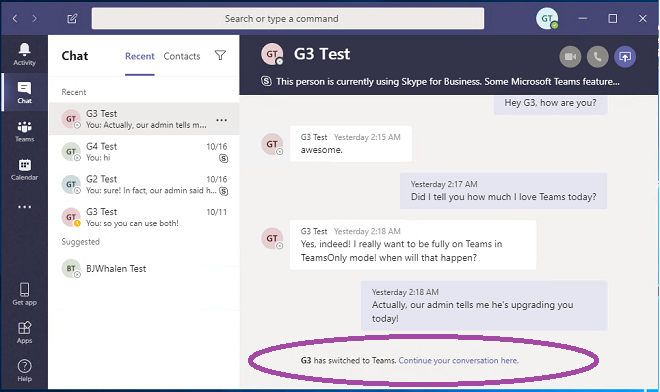

# <a name="upgrade-from-skype-for-business-to-teams-mdash-for-it-administrators"></a><span data-ttu-id="988d8-103">Mise à niveau de Skype entreprise vers &mdash; teams pour les administrateurs informatiques</span><span class="sxs-lookup"><span data-stu-id="988d8-103">Upgrade from Skype for Business to Teams &mdash; for IT administrators</span></span>

## <a name="overview"></a><span data-ttu-id="988d8-104">Vue d’ensemble</span><span class="sxs-lookup"><span data-stu-id="988d8-104">Overview</span></span>

<span data-ttu-id="988d8-105">Lorsque vous procédez à la mise à niveau de Skype entreprise vers équipes, certaines organisations requièrent un lancement progressif qui est planifié et géré par leurs services informatiques.</span><span class="sxs-lookup"><span data-stu-id="988d8-105">When upgrading from Skype for Business to Teams, some organizations require a progressive rollout that is planned and managed by their IT departments.</span></span> <span data-ttu-id="988d8-106">Cet article s’adresse principalement aux administrateurs informatiques des organisations locales de grande taille, mais il peut également s’appliquer à certaines organisations Skype entreprise online.</span><span class="sxs-lookup"><span data-stu-id="988d8-106">This article is primarily targeted to IT administrators in large, on-premises organizations, but it might also apply to some Skype for Business Online organizations.</span></span>  <span data-ttu-id="988d8-107">Avant de lire cet article, assurez-vous de lire la [mise à niveau de votre équipe](upgrade-start-here.md) et de [l’infrastructure de mise à niveau](upgrade-framework.md).</span><span class="sxs-lookup"><span data-stu-id="988d8-107">Before reading this article,  be sure to read [Getting started with your Teams Upgrade](upgrade-start-here.md) and [About the Upgrade framework](upgrade-framework.md).</span></span>

>[!NOTE]
><span data-ttu-id="988d8-108">Cet article utilise les conditions générales de Skype entreprise Online, Skype entreprise local et Skype entreprise.</span><span class="sxs-lookup"><span data-stu-id="988d8-108">This article uses the terms Skype for Business Online, Skype for Business on-premises, and Skype for Business.</span></span>  <span data-ttu-id="988d8-109">Ce terme fait référence à des versions en ligne et locales.</span><span class="sxs-lookup"><span data-stu-id="988d8-109">The latter term refers to both online and on-premises versions.</span></span>

<span data-ttu-id="988d8-110">Un utilisateur ayant migré vers teams n’utilise plus un client Skype entreprise, à l’exception de la participation à une réunion hébergée dans Skype entreprise.</span><span class="sxs-lookup"><span data-stu-id="988d8-110">A user that has been migrated to Teams no longer uses a Skype for Business client except to join a meeting hosted in Skype for Business.</span></span>  <span data-ttu-id="988d8-111">Toutes les conversations et les appels entrants dans le client teams de l’utilisateur, que l’expéditeur utilise teams ou Skype entreprise.</span><span class="sxs-lookup"><span data-stu-id="988d8-111">All incoming chats and calls land in the user’s Teams client, regardless of whether the sender uses Teams or Skype for Business.</span></span> <span data-ttu-id="988d8-112">Toutes les nouvelles réunions organisées par l’utilisateur migré seront planifiées en tant que réunions d’équipes.</span><span class="sxs-lookup"><span data-stu-id="988d8-112">Any new meetings organized by the migrated user will be scheduled as Teams meetings.</span></span> <span data-ttu-id="988d8-113">Si l’utilisateur tente d’utiliser le client Skype entreprise, l’ouverture de conversations et d’appels est bloquée.</span><span class="sxs-lookup"><span data-stu-id="988d8-113">If the user attempts to use the Skype for Business client, initiation of chats and calls is blocked.</span></span>  <span data-ttu-id="988d8-114">Toutefois, l’utilisateur peut (et doit) toujours utiliser le client Skype entreprise pour participer aux réunions auxquelles il est invité.</span><span class="sxs-lookup"><span data-stu-id="988d8-114">However, the user can (and must) still use the Skype for Business client to join meetings they are invited to.</span></span> <span data-ttu-id="988d8-115">(Les anciens clients Skype entreprise livrés avant 2017 ne respectent pas TeamsUpgradePolicy.</span><span class="sxs-lookup"><span data-stu-id="988d8-115">(Older Skype for Business clients that shipped before 2017 do not honor TeamsUpgradePolicy.</span></span> <span data-ttu-id="988d8-116">Vérifiez que vous utilisez la dernière version du client Skype entreprise.)</span><span class="sxs-lookup"><span data-stu-id="988d8-116">Make sure you are using the latest Skype for Business client.)</span></span>
 
<span data-ttu-id="988d8-117">Les administrateurs gèrent leur transition vers teams à l’aide du concept de [mode](migration-interop-guidance-for-teams-with-skype.md#coexistence-modes), qui est une propriété de [TeamsUpgradePolicy](https://docs.microsoft.com/powershell/module/skype/grant-csteamsupgradepolicy?view=skype-ps).</span><span class="sxs-lookup"><span data-stu-id="988d8-117">Administrators manage their transition to Teams using the concept of [mode](migration-interop-guidance-for-teams-with-skype.md#coexistence-modes), which is a property of [TeamsUpgradePolicy](https://docs.microsoft.com/powershell/module/skype/grant-csteamsupgradepolicy?view=skype-ps).</span></span> <span data-ttu-id="988d8-118">Un utilisateur migré vers teams comme décrit ci-dessus est en mode « TeamsOnly ».</span><span class="sxs-lookup"><span data-stu-id="988d8-118">A user that has been migrated to Teams as described above is in “TeamsOnly” mode.</span></span>  <span data-ttu-id="988d8-119">Dans le cas d’une organisation migrant vers Teams, l’objectif ultime consiste à déplacer tous les utilisateurs vers le mode TeamsOnly.</span><span class="sxs-lookup"><span data-stu-id="988d8-119">For an organization that is migrating to Teams, the ultimate goal is to move all users to TeamsOnly mode.</span></span>

<span data-ttu-id="988d8-120">Il existe deux méthodes pour migrer une organisation existante avec Skype entreprise (en ligne ou sur site) vers teams :</span><span class="sxs-lookup"><span data-stu-id="988d8-120">There are two methods for migrating an existing organization with Skype for Business (whether online or on-premises) to Teams:</span></span>

- <span data-ttu-id="988d8-121">**Méthode côte à côte** (avec le mode îlot) : les utilisateurs d’une organisation Skype entreprise existante sont introduits dans teams pour qu’ils puissent utiliser les deux clients côte à côte pendant une phase de transition.</span><span class="sxs-lookup"><span data-stu-id="988d8-121">**Side-by-side method** (using Islands mode):  Users in an existing Skype for Business organization are introduced to Teams so that they can use both clients side by side during a transitional phase.</span></span> <span data-ttu-id="988d8-122">Pendant ce laps de temps, la plupart des fonctionnalités d’équipe sont disponibles.</span><span class="sxs-lookup"><span data-stu-id="988d8-122">During this period, most--but not all--functionality of Teams is available to them.</span></span> <span data-ttu-id="988d8-123">Le mode de cette configuration est appelé îlots, et il s’agit du mode par défaut de toute organisation existante avec Skype entreprise.</span><span class="sxs-lookup"><span data-stu-id="988d8-123">The mode for this configuration is referred to as Islands, and this is the default mode for any existing organization with Skype for Business.</span></span> <span data-ttu-id="988d8-124">Lorsque l’organisation est prête, l’administrateur déplace les utilisateurs vers le mode TeamsOnly.</span><span class="sxs-lookup"><span data-stu-id="988d8-124">Once the organization is ready, the administrator moves the users to TeamsOnly mode.</span></span>

- <span data-ttu-id="988d8-125">**Une méthode gérée** (à l’aide d’un ou de plusieurs modes Skype entreprise) : l’administrateur gère la transition (de Skype entreprise à Teams) de la fonctionnalité de conversation, d’appel et de planification de réunion pour les utilisateurs de leur organisation.</span><span class="sxs-lookup"><span data-stu-id="988d8-125">**A managed method** (using one or more of the Skype for Business modes): The administrator manages the transition (from Skype for Business to Teams) of chat, calling, and meeting scheduling functionality for users in their organization.</span></span>  <span data-ttu-id="988d8-126">Chacune de ces fonctions est disponible dans Skype entreprise ou Teams, mais pas les deux.</span><span class="sxs-lookup"><span data-stu-id="988d8-126">Each of these functions is available either in Skype for Business or Teams, but not both.</span></span> <span data-ttu-id="988d8-127">Les administrateurs utilisent TeamsUpgradePolicy pour contrôler le moment auquel décaler cette fonctionnalité vers équipes pour leurs utilisateurs.</span><span class="sxs-lookup"><span data-stu-id="988d8-127">Administrators use TeamsUpgradePolicy to control when to shift this functionality to Teams for their users.</span></span> <span data-ttu-id="988d8-128">Les utilisateurs qui ne sont pas encore en mode TeamsOnly continuent d’utiliser Skype entreprise pour les discussions et les appels, et les deux utilisateurs peuvent communiquer par le biais de fonctionnalités d’interopérabilité.</span><span class="sxs-lookup"><span data-stu-id="988d8-128">Users who are not yet in TeamsOnly mode continue to use Skype for Business for chat and calling, and the two sets of users can communicate via interop functionality.</span></span> <span data-ttu-id="988d8-129">Les administrateurs gèrent la transition en migrant progressivement de plus utilisateurs vers le mode TeamsOnly.</span><span class="sxs-lookup"><span data-stu-id="988d8-129">Administrators manage the transition by progressively migrating more users into TeamsOnly mode.</span></span>  

<span data-ttu-id="988d8-130">Cet article vous permet de choisir la méthode correcte pour votre organisation en décrivant les deux méthodes et en présentant les avantages et inconvénients de chacune d’elles.</span><span class="sxs-lookup"><span data-stu-id="988d8-130">This article helps you choose the right method for your organization by describing both methods and presenting the pros and cons of each.</span></span> 

## <a name="side-by-side-method-using-islands-mode"></a><span data-ttu-id="988d8-131">Méthode côte à côte (avec le mode îlot)</span><span class="sxs-lookup"><span data-stu-id="988d8-131">Side-by-side method (using Islands mode)</span></span>

<span data-ttu-id="988d8-132">Avec la méthode côte à côte, les utilisateurs peuvent utiliser une équipe et un client Skype entreprise pour la messagerie instantanée, les appels VoIP et les réunions.</span><span class="sxs-lookup"><span data-stu-id="988d8-132">With the side-by-side method, users can use both Teams and Skype for Business clients for chat, VoIP calling, and meetings.</span></span> <span data-ttu-id="988d8-133">Cet État est connu sous le nom de « îles », car le trafic de communication pour Skype entreprise et teams reste différent (même pour le même utilisateur) et les deux clients ne communiquent jamais entre eux (pour les utilisateurs au sein de la même organisation).</span><span class="sxs-lookup"><span data-stu-id="988d8-133">This state is referred to as “Islands” mode because the communication traffic for Skype for Business and Teams remains separate (even for the same user) and the two different clients never communicate with each other (for users within the same organization).</span></span> <span data-ttu-id="988d8-134">Par exemple, supposons que l’utilisateur A est en mode îlot :</span><span class="sxs-lookup"><span data-stu-id="988d8-134">For example, assume recipient User A is in Islands mode:</span></span>

- <span data-ttu-id="988d8-135">Les communications déclenchées à partir du client Skype entreprise d’un autre utilisateur seront toujours portées sur le client Skype entreprise d’un utilisateur.</span><span class="sxs-lookup"><span data-stu-id="988d8-135">Communication initiated from another user’s Skype for Business client will always land in User A’s Skype for Business client.</span></span>
- <span data-ttu-id="988d8-136">La communication lancée à partir du client teams d’un autre utilisateur sera toujours terrestre dans le client teams de l’utilisateur, *si ce dernier est dans la même organisation*.</span><span class="sxs-lookup"><span data-stu-id="988d8-136">Communication initiated from another user’s Teams client will always land in User A’s Teams client, *if the other user is in the same organization*.</span></span> 
- <span data-ttu-id="988d8-137">La communication lancée à partir du client teams d’un autre utilisateur sera toujours effectuée sur le client Skype entreprise d’un utilisateur, *si ce dernier est dans une organisation fédérée*.</span><span class="sxs-lookup"><span data-stu-id="988d8-137">Communication initiated from another user’s Teams client will always land in User A’s Skype for Business client, *if the other user is in a federated organization*.</span></span>

<span data-ttu-id="988d8-138">Le mode îlot est le mode par défaut de TeamsUpgradePolicy pour toute organisation existante qui n’est pas encore TeamsOnly.</span><span class="sxs-lookup"><span data-stu-id="988d8-138">Islands mode is the default mode of TeamsUpgradePolicy for any existing organization that is not yet TeamsOnly.</span></span> <span data-ttu-id="988d8-139">Lorsque vous affectez une licence Office 365, les équipes et les licences Skype entreprise Online sont affectées par défaut.</span><span class="sxs-lookup"><span data-stu-id="988d8-139">When you assign an Office 365 license, both Teams and Skype for Business Online licenses are assigned by default.</span></span> <span data-ttu-id="988d8-140">(Cela s’applique même si l’utilisateur est hébergé sur site dans Skype entreprise Server.</span><span class="sxs-lookup"><span data-stu-id="988d8-140">(This is true even if the user is homed on-premises in Skype for Business Server.</span></span> <span data-ttu-id="988d8-141">Que l’utilisateur réside en local ou en ligne, laissez la licence Skype entreprise Online activée, car elle est actuellement requise pour les fonctionnalités d’équipe complètes.) En fait, si vous n’avez pas effectué de modification de la configuration par défaut, il est possible que vous ayez une utilisation significative des équipes au sein de votre organisation.</span><span class="sxs-lookup"><span data-stu-id="988d8-141">Whether the user is homed on-premises or online, leave the Skype for Business Online license enabled, because it is currently needed for full Teams functionality.) In fact, if you have not taken any steps to change the default configuration, you may already have significant usage of Teams in your organization.</span></span>  <span data-ttu-id="988d8-142">C’est l’un des avantages de l’approche côte à côte.</span><span class="sxs-lookup"><span data-stu-id="988d8-142">This is one of the benefits of the side-by-side approach.</span></span> <span data-ttu-id="988d8-143">Elle permet une adoption rapide et rapide par l’utilisateur au sein d’une organisation.</span><span class="sxs-lookup"><span data-stu-id="988d8-143">It allows for rapid, end-user driven adoption within an organization.</span></span>

<span data-ttu-id="988d8-144">Pour que cette méthode fonctionne efficacement, tous les utilisateurs doivent exécuter les deux clients simultanément.</span><span class="sxs-lookup"><span data-stu-id="988d8-144">For this method to work effectively, it requires all users to run both clients simultaneously.</span></span> <span data-ttu-id="988d8-145">Les discussions et les appels entrants au sein de l’organisation à un utilisateur en mode d’îlot peuvent débarquer dans le client Skype entreprise ou équipes, et ce n’est pas le contrôle du destinataire.</span><span class="sxs-lookup"><span data-stu-id="988d8-145">Incoming chats and calls from within the organization to a user in Islands mode can land in either the Skype for Business or Teams client--and this is not under the control of the recipient.</span></span> <span data-ttu-id="988d8-146">Tout dépend du client utilisé par l’expéditeur pour initier la communication.</span><span class="sxs-lookup"><span data-stu-id="988d8-146">It depends on what client the sender uses to initiate the communication.</span></span> <span data-ttu-id="988d8-147">Si l’expéditeur et le destinataire se trouvent dans différentes organisations, les appels et les discussions entrants à un utilisateur en mode îlot sont toujours terrains dans le client Skype entreprise.</span><span class="sxs-lookup"><span data-stu-id="988d8-147">If the sender and recipient are in different organizations, incoming calls and chats to a user in Islands mode always land in the Skype for Business client.</span></span>  

<span data-ttu-id="988d8-148">Par exemple, si le destinataire du mode de la société travaille sur Skype entreprise, mais pas sur Teams, et qu’une personne a envoyé un message à partir de teams, le destinataire du mode îles ne verra pas le message (mais il obtiendra finalement un message électronique indiquant qu’il a manqué un message dans Teams).</span><span class="sxs-lookup"><span data-stu-id="988d8-148">For example, if an Islands mode recipient is running Skype for Business but not Teams, and someone messages them from Teams, the Islands mode recipient will not see the message (but they will eventually get an email saying they missed a message in Teams).</span></span> <span data-ttu-id="988d8-149">De même, si un utilisateur travaille sur Teams, mais pas sur Skype entreprise, et qu’il est adressé à un utilisateur de Skype entreprise, il ne verra pas la discussion.</span><span class="sxs-lookup"><span data-stu-id="988d8-149">Likewise, if a user is running Teams but not Skype for Business, and someone messages that user from Skype for Business, the user will not see that chat.</span></span>  <span data-ttu-id="988d8-150">Il recevra un message électronique indiquant qu’un message a été manqué.</span><span class="sxs-lookup"><span data-stu-id="988d8-150">They will get an email saying there was a missed message.</span></span> <span data-ttu-id="988d8-151">Le comportement dans chacun de ces cas est similaire pour les appels.</span><span class="sxs-lookup"><span data-stu-id="988d8-151">The behavior in each of these cases is similar for calling.</span></span> <span data-ttu-id="988d8-152">Si les utilisateurs ne sont pas en mesure d’exécuter les deux clients, ils peuvent facilement susciter votre frustration.</span><span class="sxs-lookup"><span data-stu-id="988d8-152">If users do not run both clients, it can easily lead to frustration.</span></span>

<span data-ttu-id="988d8-153">Lorsque l’utilisateur a est en mode îlot, la présence de l’utilisateur A comme vu par d’autres utilisateurs dans Microsoft teams et dans Skype entreprise est indépendante :</span><span class="sxs-lookup"><span data-stu-id="988d8-153">When User A is in Islands mode, User A’s presence as seen by other users in Teams and in Skype for Business is independent:</span></span>

- <span data-ttu-id="988d8-154">Les autres utilisateurs, lors de l’utilisation d’équipes, verront leur présence en fonction de l’activité de l’utilisateur dans Teams.</span><span class="sxs-lookup"><span data-stu-id="988d8-154">Other users, when using Teams, will see presence based on User A’s activity in Teams.</span></span> 
- <span data-ttu-id="988d8-155">Les autres utilisateurs, lors de l’utilisation de Skype entreprise, verront leur présence en fonction de l’activité de l’utilisateur A dans Skype entreprise.</span><span class="sxs-lookup"><span data-stu-id="988d8-155">Other users, when using Skype for Business, will see presence based on User A’s activity in Skype for Business.</span></span> 

<span data-ttu-id="988d8-156">Cela signifie que d’autres utilisateurs peuvent voir des États de présence différents pour l’utilisateur A, en fonction du client qu’il utilise.</span><span class="sxs-lookup"><span data-stu-id="988d8-156">This means other users may see different presence states for User A, depending on which client they use.</span></span> <span data-ttu-id="988d8-157">Pour en savoir plus, voir [présence](#presence).</span><span class="sxs-lookup"><span data-stu-id="988d8-157">For more details, see [Presence](#presence).</span></span>

<span data-ttu-id="988d8-158">Lorsque vous êtes prêt à mettre à niveau les utilisateurs vers le mode TeamsOnly, vous pouvez mettre à niveau les utilisateurs individuellement ou procéder à la mise à niveau du client entier en une fois à l’aide de la stratégie à l’échelle du client.</span><span class="sxs-lookup"><span data-stu-id="988d8-158">Once you are ready to upgrade users to TeamsOnly mode, you can upgrade users individually or you can upgrade the entire tenant at once using the tenant-wide policy.</span></span> <span data-ttu-id="988d8-159">Une fois qu’un utilisateur a procédé à la mise à niveau vers le mode TeamsOnly, il reçoit toutes les discussions et les appels entrants dans Teams.</span><span class="sxs-lookup"><span data-stu-id="988d8-159">Once a user is upgraded to TeamsOnly mode, they receive all incoming chats and calls in Teams.</span></span> <span data-ttu-id="988d8-160">(Notez que la migration de réunions Skype entreprise vers des réunions teams n’est déclenchée que lorsque vous appliquez TeamsUpgradePolicy à des utilisateurs individuels, et non au niveau de chaque client.</span><span class="sxs-lookup"><span data-stu-id="988d8-160">(Note that migration of Skype for Business meetings to Teams meetings is only triggered when applying TeamsUpgradePolicy to individual users, not on a per tenant basis.</span></span> <span data-ttu-id="988d8-161">Pour plus d’informations, voir migration de la [réunion](#meeting-migration) .</span><span class="sxs-lookup"><span data-stu-id="988d8-161">See [Meeting Migration](#meeting-migration) for details.)</span></span>

<span data-ttu-id="988d8-162">Toutefois, les destinataires non mis à niveau en mode îlot peuvent continuer à recevoir des conversations et des appels de la part d’un utilisateur TeamsOnly dans leurs clients Skype entreprise ou équipes.</span><span class="sxs-lookup"><span data-stu-id="988d8-162">However, non-upgraded recipients in Islands mode may continue to receive chats and calls from a TeamsOnly user in either their Skype for Business or Teams clients.</span></span>  <span data-ttu-id="988d8-163">En effet, le client teams gère des threads de conversation distinctes pour la communication équipes-à---------Skype entreprise, même pour le même utilisateur.</span><span class="sxs-lookup"><span data-stu-id="988d8-163">This is because the Teams client maintains separate conversation threads for Teams-to-Teams and Teams-to-Skype for Business communication, even for the same user.</span></span>  <span data-ttu-id="988d8-164">(Voir [conversations d’équipe-interopérabilité et threads natifs](#teams-conversations---interop-versus-native-threads).)  Par exemple, supposons que l’utilisateur A utilise teams pour TeamsOnly l’utilisateur B. Lorsque l’utilisateur B répond à cette discussion, la communication s’affiche dans le client teams de l’utilisateur.</span><span class="sxs-lookup"><span data-stu-id="988d8-164">(See [Teams Conversations - Interop versus native threads](#teams-conversations---interop-versus-native-threads).)  For example, assume Islands User A uses Teams to message TeamsOnly User B. When User B replies to that chat, the communication will land in User A’s Teams client.</span></span> <span data-ttu-id="988d8-165">Supposons que l’utilisateur A utilise son client Skype entreprise pour envoyer un message à TeamsOnly l’utilisateur B. l’utilisateur B recevra la discussion dans Teams, mais il s’agira d’une conversation distincte dans le client teams de l’utilisateur b par rapport à l’autre conversation.</span><span class="sxs-lookup"><span data-stu-id="988d8-165">Now assume User A uses his Skype for Business client to message TeamsOnly User B. User B will receive the chat in Teams, but this will be a separate conversation in User B's Teams client compared to the other conversation.</span></span> <span data-ttu-id="988d8-166">Si l’utilisateur B répond à cette conversation avec l’utilisateur A, il sera débarqué dans le client Skype entreprise de l’utilisateur.</span><span class="sxs-lookup"><span data-stu-id="988d8-166">If User B replies to this conversation with User A, it will land in User A’s Skype for Business client.</span></span> 

<span data-ttu-id="988d8-167">Le tableau suivant résume l’interface du mode de travail de l’équipe et du mode TeamsOnly :</span><span class="sxs-lookup"><span data-stu-id="988d8-167">The following table summarizes the Teams experience for both Islands mode and TeamsOnly mode:</span></span>  

| <span data-ttu-id="988d8-168">Expertise dans teams</span><span class="sxs-lookup"><span data-stu-id="988d8-168">Teams experience</span></span> | <span data-ttu-id="988d8-169">En mode îlot</span><span class="sxs-lookup"><span data-stu-id="988d8-169">In Islands mode</span></span> | <span data-ttu-id="988d8-170">En mode TeamsOnly</span><span class="sxs-lookup"><span data-stu-id="988d8-170">In TeamsOnly mode</span></span> |
|:------------------ | :------------------- | :------------------ |
| <span data-ttu-id="988d8-171">Discussions entrantes et appels reçus dans :</span><span class="sxs-lookup"><span data-stu-id="988d8-171">Incoming chats and calls received in:</span></span>|  <span data-ttu-id="988d8-172">Teams ou Skype entreprise</span><span class="sxs-lookup"><span data-stu-id="988d8-172">Teams or Skype for Business</span></span> | <span data-ttu-id="988d8-173">Équipes</span><span class="sxs-lookup"><span data-stu-id="988d8-173">Teams</span></span> |
| <span data-ttu-id="988d8-174">Appels RTC reçus dans :</span><span class="sxs-lookup"><span data-stu-id="988d8-174">PSTN calls received in:</span></span> | <span data-ttu-id="988d8-175">Skype Entreprise</span><span class="sxs-lookup"><span data-stu-id="988d8-175">Skype for Business</span></span> <br><span data-ttu-id="988d8-176">(L’utilisation de la fonctionnalité RTC dans teams n’est pas prise en charge en mode îlot.)</span><span class="sxs-lookup"><span data-stu-id="988d8-176">(Using PSTN functionality in Teams is not supported in Islands mode.)</span></span>    | <span data-ttu-id="988d8-177">Équipes</span><span class="sxs-lookup"><span data-stu-id="988d8-177">Teams</span></span> |   
 |<span data-ttu-id="988d8-178">Présence</span><span class="sxs-lookup"><span data-stu-id="988d8-178">Presence</span></span>  | <span data-ttu-id="988d8-179">La présence dans Skype entreprise et équipes est indépendante.</span><span class="sxs-lookup"><span data-stu-id="988d8-179">Presence in Skype for Business and Teams is independent.</span></span> <span data-ttu-id="988d8-180">Les utilisateurs peuvent voir des États différents pour les mêmes utilisateurs d’îlot, en fonction du client qu’ils utilisent.</span><span class="sxs-lookup"><span data-stu-id="988d8-180">Users may see different states for the same Islands user, depending on which client they use.</span></span> | <span data-ttu-id="988d8-181">La présence est basée uniquement sur l’activité de l’utilisateur dans Teams.</span><span class="sxs-lookup"><span data-stu-id="988d8-181">Presence is based solely on the user’s activity in Teams.</span></span> <span data-ttu-id="988d8-182">Tous les autres utilisateurs, quel que soit le client qu’ils utilisent, voient leur présence.</span><span class="sxs-lookup"><span data-stu-id="988d8-182">All other users, regardless of which client they use, see that presence.</span></span> | 
 | <span data-ttu-id="988d8-183">Planification de réunions</span><span class="sxs-lookup"><span data-stu-id="988d8-183">Meeting Scheduling</span></span>   | <span data-ttu-id="988d8-184">Les utilisateurs peuvent planifier des réunions dans teams ou Skype entreprise.</span><span class="sxs-lookup"><span data-stu-id="988d8-184">Users can schedule meetings in either Teams or Skype for Business.</span></span> <span data-ttu-id="988d8-185">Ces deux compléments s’afficheront dans Outlook.</span><span class="sxs-lookup"><span data-stu-id="988d8-185">They will see both add-ins in Outlook.</span></span> |   <span data-ttu-id="988d8-186">Les utilisateurs planifient uniquement les réunions dans Teams.</span><span class="sxs-lookup"><span data-stu-id="988d8-186">Users only schedule meetings in Teams.</span></span> <span data-ttu-id="988d8-187">Le complément équipes n’est disponible que dans Outlook.</span><span class="sxs-lookup"><span data-stu-id="988d8-187">Only the Teams add-in is available in Outlook.</span></span> | 

<span data-ttu-id="988d8-188">Le tableau suivant récapitule les avantages et inconvénients de l’utilisation de la méthode côte à côte pour migrer votre organisation vers Teams.</span><span class="sxs-lookup"><span data-stu-id="988d8-188">The following table summarizes the pros and cons of using the side-by-side method to migrate your organization to Teams.</span></span>

| <span data-ttu-id="988d8-189">Spécialistes</span><span class="sxs-lookup"><span data-stu-id="988d8-189">Pros</span></span>     |       <span data-ttu-id="988d8-190">Argument</span><span class="sxs-lookup"><span data-stu-id="988d8-190">Cons</span></span> |
| :------------------ | :---------------- |
| <span data-ttu-id="988d8-191">Autorise une adoption rapide au sein d’une organisation.</span><span class="sxs-lookup"><span data-stu-id="988d8-191">Allows for rapid adoption within an organization.</span></span>| <span data-ttu-id="988d8-192">Potentiel pour la confusion des utilisateurs finaux, car il existe deux clients dotés de fonctionnalités similaires, mais différentes interfaces utilisateur.</span><span class="sxs-lookup"><span data-stu-id="988d8-192">Potential for end user confusion because there are two clients with similar functionality, but different user interfaces.</span></span> <span data-ttu-id="988d8-193">Par ailleurs, ils n’ont aucun contrôle sur le client sur lequel les discussions/appels entrants sont débarqués.</span><span class="sxs-lookup"><span data-stu-id="988d8-193">Also, they have no control over which client the incoming chats/calls land in.</span></span> |
| <span data-ttu-id="988d8-194">Permet aux utilisateurs de se familiariser avec les équipes tout en possédant un accès complet à Skype entreprise.</span><span class="sxs-lookup"><span data-stu-id="988d8-194">Allows users to learn and get familiar with Teams while still having full access to Skype for Business.</span></span> | <span data-ttu-id="988d8-195">Potentiel pour une insatisfaction de l’utilisateur final en raison de messages manqués si l’utilisateur n’exécute pas les deux clients.</span><span class="sxs-lookup"><span data-stu-id="988d8-195">Potential for end user dissatisfaction due to missed messages if the user is not running both clients.</span></span> <span data-ttu-id="988d8-196">Les utilisateurs peuvent se plaindrs de ne pas recevoir de messages.</span><span class="sxs-lookup"><span data-stu-id="988d8-196">Users may complain that they are not receiving messages.</span></span>|
| <span data-ttu-id="988d8-197">Effort d’administration minimal pour la mise en route dans Teams.</span><span class="sxs-lookup"><span data-stu-id="988d8-197">Minimal administration effort to get started in Teams.</span></span> | <span data-ttu-id="988d8-198">Il peut être difficile de mettre en place le mode « extraire des îles » et de basculer vers le mode TeamsOnly si tous les utilisateurs de l’organisation n’utilisent pas Teams, en particulier si les utilisateurs ne sont pas actifs dans Teams.</span><span class="sxs-lookup"><span data-stu-id="988d8-198">Can be challenging to “get out of Islands” mode and move to TeamsOnly mode if not everyone in the organization is using Teams, especially if not all users are active in Teams.</span></span> <span data-ttu-id="988d8-199">Par exemple, une fois qu’un sous-ensemble d’utilisateurs est mis à niveau vers le mode TeamsOnly, ils sont envoyés uniquement dans Teams.</span><span class="sxs-lookup"><span data-stu-id="988d8-199">For example, once a subset of users is upgraded to TeamsOnly mode, those users will only send in Teams.</span></span> <span data-ttu-id="988d8-200">Pour le reste de la population en mode îlot, ces messages seront toujours présents dans Teams.</span><span class="sxs-lookup"><span data-stu-id="988d8-200">For the rest of the population in Islands mode, those messages will always land in Teams.</span></span> <span data-ttu-id="988d8-201">Mais si certains de ces populations n’exécutent pas Teams, ils peuvent considérer ces messages comme manqués.</span><span class="sxs-lookup"><span data-stu-id="988d8-201">But if some of that population is not running Teams, they will perceive these messages as missed.</span></span> |
|  | <span data-ttu-id="988d8-202">Lors de l’utilisation d’équipes, les utilisateurs disposant d’un compte local dans Skype entreprise Server ne disposent pas de la prise en charge de l’interopérabilité ou de la Fédération.</span><span class="sxs-lookup"><span data-stu-id="988d8-202">When using Teams, users who have an on-premises account in Skype for Business Server do not have interop or federation support.</span></span>  <span data-ttu-id="988d8-203">Cela peut éventuellement générer une confusion si vous avez une combinaison d’utilisateurs d’îlots, dont certains sont hébergés dans Skype entreprise Online et d’autres dans Skype entreprise local.</span><span class="sxs-lookup"><span data-stu-id="988d8-203">This can potentially create confusion if you have a mix of Islands users--some who are homed in Skype for Business Online and some in Skype for Business on-premises.</span></span>   |

## <a name="managed-transition-method-using-skype-for-business-modes"></a><span data-ttu-id="988d8-204">Méthode de transition gérée (à l’aide du mode Skype entreprise)</span><span class="sxs-lookup"><span data-stu-id="988d8-204">Managed transition method (using Skype for Business modes)</span></span>

<span data-ttu-id="988d8-205">Certaines organisations peuvent proposer à leurs utilisateurs finaux une utilisation plus simple et plus prévisible de la transition de Skype entreprise à Teams.</span><span class="sxs-lookup"><span data-stu-id="988d8-205">Some organizations may prefer to provide their end users a simpler, more predictable experience as their organization transitions from Skype for Business to Teams.</span></span> <span data-ttu-id="988d8-206">Dans ce modèle, les administrateurs informatiques ont recours à l’un des modes Skype entreprise de TeamsUpgradePolicy pour désigner explicitement les utilisateurs de Skype entreprise avant de procéder à la migration vers le mode TeamsOnly.</span><span class="sxs-lookup"><span data-stu-id="988d8-206">In this model, IT administrators use one of the Skype for Business modes in TeamsUpgradePolicy to explicitly designate which users remain in Skype for Business prior to migrating to TeamsOnly mode.</span></span> <span data-ttu-id="988d8-207">Étant donné qu’ils sont prêts à décaler les utilisateurs sélectionnés vers le mode TeamsOnly, l’administrateur doit mettre à jour le mode de ces utilisateurs pour qu’ils TeamsOnly.</span><span class="sxs-lookup"><span data-stu-id="988d8-207">As they are ready to shift selected users to TeamsOnly mode, the administrator updates the mode for those users to TeamsOnly.</span></span>  <span data-ttu-id="988d8-208">Au fur et à mesure de l’évolution du déploiement, de plus en plus d’utilisateurs sont migrés de Skype entreprise vers le mode TeamsOnly.</span><span class="sxs-lookup"><span data-stu-id="988d8-208">As the deployment progresses, more and more users are transitioned from Skype for Business to TeamsOnly mode.</span></span>  <span data-ttu-id="988d8-209">Lors de cette transition :</span><span class="sxs-lookup"><span data-stu-id="988d8-209">During this transition:</span></span>

- <span data-ttu-id="988d8-210">Les utilisateurs de Skype entreprise reçoivent toutes les discussions et les appels entrants dans leur client Skype entreprise, que la communication provient de l’équipe ou du client Skype entreprise.</span><span class="sxs-lookup"><span data-stu-id="988d8-210">Users still on Skype for Business receive all incoming chats and calls in their Skype for Business client, regardless of whether the communication originated from the other user’s Teams or Skype for Business client.</span></span> <span data-ttu-id="988d8-211">Par ailleurs, pour ces utilisateurs Skype entreprise, les fonctionnalités d’appel et de discussion dans le client teams sont désactivées pour éviter toute confusion et garantir le routage approprié.</span><span class="sxs-lookup"><span data-stu-id="988d8-211">In addition, for these Skype for Business users, calling and chat functionality in the Teams client are disabled to help prevent end user confusion and to ensure proper routing.</span></span> 

- <span data-ttu-id="988d8-212">Les utilisateurs en mode TeamsOnly reçoivent toutes les discussions et les appels entrants dans leur client Teams, quel que soit le lieu d’origine de la communication : Teams, Skype entreprise ou tout type d’utilisateur fédéré.</span><span class="sxs-lookup"><span data-stu-id="988d8-212">Users in TeamsOnly mode receive all incoming chats and calls in their Teams client, regardless of where the communication originated from:  Teams, Skype for Business, or any kind of federated user.</span></span> 

<span data-ttu-id="988d8-213">Contrairement à la méthode îlot, dans la méthode de transition gérée, les utilisateurs de Skype entreprise et les utilisateurs de TeamsOnly peuvent communiquer entre eux.</span><span class="sxs-lookup"><span data-stu-id="988d8-213">Unlike the Islands method, in the managed transition method, Skype for Business users and TeamsOnly users can communicate with each other.</span></span> <span data-ttu-id="988d8-214">La communication entre un utilisateur de Skype entreprise et des équipes est appelée interopérabilité ou « interopérabilité ».</span><span class="sxs-lookup"><span data-stu-id="988d8-214">Communication between a Skype for Business user and Teams user is known as interoperability or “interop”.</span></span> <span data-ttu-id="988d8-215">(Voir [interopérabilité](#interoperability).) La communication d’interopérabilité est possible sur une base un-à-un pour les conversations et les appels entre un utilisateur dans Skype entreprise et un autre utilisateur dans Teams.</span><span class="sxs-lookup"><span data-stu-id="988d8-215">(See [Interoperability](#interoperability).) Interop communication is possible on a one-to-one basis for chats and calls between a user in Skype for Business and another user in Teams.</span></span> <span data-ttu-id="988d8-216">De plus, les utilisateurs invités peuvent toujours participer à une réunion Skype entreprise ou Teams, mais ils doivent utiliser un client correspondant au type de réunion.</span><span class="sxs-lookup"><span data-stu-id="988d8-216">In addition, invited users can always join either a Skype for Business or Teams meeting, however, they must use a client that corresponds to the type of meeting.</span></span> <span data-ttu-id="988d8-217">Pour plus d’informations, reportez-vous à la section [réunions](#meetings).</span><span class="sxs-lookup"><span data-stu-id="988d8-217">For more information, see [Meetings](#meetings).</span></span>

<span data-ttu-id="988d8-218">Étant donné que les utilisateurs dans une transition gérée ne sont généralement pas en mode îlot, la présence d’un utilisateur est cohérente, quel que soit le client utilisé par l’autre utilisateur.</span><span class="sxs-lookup"><span data-stu-id="988d8-218">Because users in a managed transition are typically not in Islands mode, presence for a user is consistent regardless of which client is used by the other user.</span></span> <span data-ttu-id="988d8-219">Si l’utilisateur se trouve dans l’un des modes Skype entreprise, tous les autres utilisateurs voient leur présence en fonction de l’activité de l’utilisateur dans Skype entreprise.</span><span class="sxs-lookup"><span data-stu-id="988d8-219">If the user is in one of the Skype for Business modes, all other users see presence based on that user’s activity in Skype for Business.</span></span> <span data-ttu-id="988d8-220">De même, si un utilisateur est en mode TeamsOnly, tous les autres utilisateurs voient leur présence en fonction de l’activité de l’utilisateur dans Teams.</span><span class="sxs-lookup"><span data-stu-id="988d8-220">Similarly, if a user is in TeamsOnly mode, all other users see presence based on that user’s activity in Teams.</span></span> <span data-ttu-id="988d8-221">Pour plus d’informations, voir [présence](#presence).</span><span class="sxs-lookup"><span data-stu-id="988d8-221">For details, see [Presence](#presence).</span></span>

<span data-ttu-id="988d8-222">Dans le cas d’une organisation qui n’a pas encore commencé à utiliser Teams, l’administrateur doit changer le mode de travail à l’échelle du client de îlot à SfbWithTeamsCollab.</span><span class="sxs-lookup"><span data-stu-id="988d8-222">For an organization that has not yet started using Teams, the administrator should change the tenant-wide mode from Islands to SfbWithTeamsCollab.</span></span> <span data-ttu-id="988d8-223">(Pour les organisations disposant déjà de l’utilisation de teams, l’administrateur doit avoir le « grand nombre d’utilisateurs » déjà actifs dans teams pour s’assurer que le changement ne leur est pas applicable.</span><span class="sxs-lookup"><span data-stu-id="988d8-223">(For organizations that already have some Teams usage, the administrator should “grandfather” users already active in Teams to ensure this change does not apply to them.</span></span> <span data-ttu-id="988d8-224">Pour plus d’informations, reportez-vous à [la rubrique mise à niveau gérée d’une organisation qui utilise déjà teams en mode îlot](#a-managed-upgrade-for-an-organization-that-is-already-using-teams-in-islands-mode).)</span><span class="sxs-lookup"><span data-stu-id="988d8-224">For details, see [A managed upgrade for an organization that is already using Teams in Islands mode](#a-managed-upgrade-for-an-organization-that-is-already-using-teams-in-islands-mode).)</span></span>

<span data-ttu-id="988d8-225">Lorsque le mode passe d’îlot à SfbWithTeamsCollab, un utilisateur qui ne les utilise jamais n’aura pas de différence dans la façon dont il utilise Skype entreprise.</span><span class="sxs-lookup"><span data-stu-id="988d8-225">When mode changes from Islands to SfbWithTeamsCollab, a user that has never used Teams will see no difference in how they use Skype for Business.</span></span> <span data-ttu-id="988d8-226">Toutefois, si l’utilisateur commence à utiliser Teams, il ne serait exposé qu’aux fonctionnalités telles que les équipes & le canal et les fichiers.</span><span class="sxs-lookup"><span data-stu-id="988d8-226">However, should that user start to use Teams, they would only be exposed to functionality such as Teams & Channel and Files.</span></span> <span data-ttu-id="988d8-227">Les discussions, les appels et la planification de réunions ne seront pas disponibles dans Teams, dans la mesure où l’administrateur dispose de Skype entreprise (pour le moment) pour ces fonctions.</span><span class="sxs-lookup"><span data-stu-id="988d8-227">Chat, calling and meeting scheduling would not be available in Teams, since the administrator has (for now) designated Skype for Business as the desired client for those functions.</span></span>  

<span data-ttu-id="988d8-228">Remarque : lorsque l’utilisateur A passe d’îlot à l’un des modes Skype entreprise, le client teams de tout autre utilisateur qui communique avec l’utilisateur A doit savoir que le mode de l’utilisateur a changé de sorte qu’il puisse diriger la communication vers le client approprié pour l’utilisateur A.  Pour tous les utilisateurs qui ont déjà établi des discussions d’équipes ou d’équipes natives avec l’utilisateur A, il peut s’écouler jusqu’à 36 heures pour que les clients teams d’autres utilisateurs sachent que le mode d’appel d’îles est en mode Skype entreprise.</span><span class="sxs-lookup"><span data-stu-id="988d8-228">Note: When User A changes from Islands to one of the Skype for Business modes, the Teams client of any other user that communicates with User A needs to know that User A’s mode changed so it can route the communication to the appropriate client for User A.  For any users who have already established native Teams-to-Teams chats with User A, it can take up to 36 hours for these other users' Teams clients to be aware of the mode change from Islands to any Skype for Business mode.</span></span>   <span data-ttu-id="988d8-229">En revanche, les modifications apportées à un utilisateur existant en mode TeamsOnly sont découvertes par d’autres clients dans un délai de 2 heures.</span><span class="sxs-lookup"><span data-stu-id="988d8-229">In contrast, changes for an existing user to TeamsOnly mode are discovered by other clients within 2 hours.</span></span>

<span data-ttu-id="988d8-230">Lorsque les administrateurs sont prêts, ils peuvent passer des conversations, des appels et une planification de réunion pour un utilisateur donné aux équipes en une seule fois en mettant à jour le mode de l’utilisateur sur TeamsOnly.</span><span class="sxs-lookup"><span data-stu-id="988d8-230">When administrators are ready, they can shift chat, calling, and meeting scheduling for a given user to Teams all at once by updating the user’s mode to TeamsOnly.</span></span>  

<span data-ttu-id="988d8-231">Par ailleurs, l’administrateur peut commencer par changer uniquement la planification des réunions en équipes, tout en laissant les fonctions de conversation et d’appel dans Skype entreprise à l’aide du mode SfBWithTeamsCollabAndMeetings.</span><span class="sxs-lookup"><span data-stu-id="988d8-231">Alternatively, the administrator can first shift only meeting scheduling to Teams, while leaving chat and calling functions in Skype for Business using the SfBWithTeamsCollabAndMeetings mode.</span></span> <span data-ttu-id="988d8-232">Ce mode permet aux organisations de migrer vers les équipes pour les réunions, si les utilisateurs ne sont pas encore en mesure d’accéder au mode TeamsOnly (en général, un délai supplémentaire peut être nécessaire pour migrer les fonctionnalités RTC existantes).</span><span class="sxs-lookup"><span data-stu-id="988d8-232">This mode allows organizations to transition to Teams for meetings--if users are not yet ready to move to TeamsOnly mode (typically because more time may be needed to migrate existing PSTN functionality).</span></span> <span data-ttu-id="988d8-233">Ce scénario de transition est appelé d' [abord réunions](meetings-first.md).</span><span class="sxs-lookup"><span data-stu-id="988d8-233">This transitional scenario is referred to as [Meetings First](meetings-first.md).</span></span>


<span data-ttu-id="988d8-234">Le tableau suivant récapitule les avantages et inconvénients de l’utilisation du mode Skype entreprise comme étape de transition vers le mode TeamsOnly.</span><span class="sxs-lookup"><span data-stu-id="988d8-234">The following table summarizes the pros and cons of using Skype for Business modes as a transitional step toward TeamsOnly mode.</span></span>


| <span data-ttu-id="988d8-235">Spécialistes</span><span class="sxs-lookup"><span data-stu-id="988d8-235">Pros</span></span>     |       <span data-ttu-id="988d8-236">Argument</span><span class="sxs-lookup"><span data-stu-id="988d8-236">Cons</span></span> |
| :------------------ | :---------------- |
| <span data-ttu-id="988d8-237">Routage prévisible pour l’utilisateur final.</span><span class="sxs-lookup"><span data-stu-id="988d8-237">Predictable routing for the end user.</span></span>  <span data-ttu-id="988d8-238">Tous les appels et messages instantanés dans Skype entreprise ou équipes (mais pas les deux), en fonction de la sélection de l’administrateur.</span><span class="sxs-lookup"><span data-stu-id="988d8-238">All calls and chats either land in Skype for Business or Teams (but not both), based on administrator selection.</span></span>  | <span data-ttu-id="988d8-239">Les conversations d’interopérabilité ne prennent pas en charge le texte enrichi, le partage de fichiers et le partage d’écran.</span><span class="sxs-lookup"><span data-stu-id="988d8-239">Interop conversations lack support for rich text, file sharing, and screen sharing.</span></span>  <span data-ttu-id="988d8-240">Cela peut être utilisé avec des réunions à la demande, mais cela n’est pas aussi simple que possible.</span><span class="sxs-lookup"><span data-stu-id="988d8-240">This can be worked around with on-demand meetings but this is not as seamless.</span></span>  |
| <span data-ttu-id="988d8-241">Éliminer la confusion des utilisateurs finaux, car une fonctionnalité donnée est disponible uniquement dans un client.</span><span class="sxs-lookup"><span data-stu-id="988d8-241">Eliminate end user confusion because a given functionality is only available in one client.</span></span>  | <span data-ttu-id="988d8-242">Les utilisateurs ne peuvent pas utiliser les deux clients côte à côte pour le même ensemble de fonctionnalités.</span><span class="sxs-lookup"><span data-stu-id="988d8-242">Users can’t try both clients side-by-side for the same set of functionality.</span></span> <span data-ttu-id="988d8-243">Le facteur de place est particulièrement important si les utilisateurs perçoivent le changement de Skype entreprise par rapport aux équipes en tant que déphasage de paradigme majeure.</span><span class="sxs-lookup"><span data-stu-id="988d8-243">This may especially be a factor if the users perceive the shift from Skype for Business to Teams as a major paradigm shift.</span></span> |
| <span data-ttu-id="988d8-244">Permet une présentation incrémentielle des équipes.</span><span class="sxs-lookup"><span data-stu-id="988d8-244">Allows for incremental introduction of Teams.</span></span>  |  | |
| <span data-ttu-id="988d8-245">L’administrateur contrôle entièrement le passage de Skype entreprise à Teams.</span><span class="sxs-lookup"><span data-stu-id="988d8-245">Administrator is in full control of the transition from Skype for Business to Teams.</span></span> |  | | 
| <span data-ttu-id="988d8-246">Permet à une organisation d’utiliser des équipes pour les réunions, même si elle n’est pas encore prête pour le passage entièrement au mode TeamsOnly.</span><span class="sxs-lookup"><span data-stu-id="988d8-246">Allows an organization to use Teams for meetings, even if it is not yet ready to move entirely to TeamsOnly mode.</span></span> |  | |
| <span data-ttu-id="988d8-247">Le statut de présence d’un utilisateur donné affiché par les autres est le même quel que soit le client qu’il utilise.</span><span class="sxs-lookup"><span data-stu-id="988d8-247">Presence of a given user as viewed by others is the same, regardless of which client they use.</span></span>  |  | |

## <a name="summary-of-upgrade-methods"></a><span data-ttu-id="988d8-248">Résumé des méthodes de mise à niveau</span><span class="sxs-lookup"><span data-stu-id="988d8-248">Summary of upgrade methods</span></span>

<span data-ttu-id="988d8-249">Le tableau suivant récapitule les méthodes de mise à niveau :</span><span class="sxs-lookup"><span data-stu-id="988d8-249">The following table summarizes the upgrade methods:</span></span>

| <span data-ttu-id="988d8-250">Côte à côte (à l’aide du mode îlot)</span><span class="sxs-lookup"><span data-stu-id="988d8-250">Side-by-side (using Islands mode)</span></span>     |      <span data-ttu-id="988d8-251">Gestion (utilisation du mode Skype entreprise)</span><span class="sxs-lookup"><span data-stu-id="988d8-251">Managed (using Skype for Business modes)</span></span> |
| :------------------ | :---------------- |
| <span data-ttu-id="988d8-252">Avant la mise à niveau vers TeamsOnly, les utilisateurs doivent exécuter les deux clients simultanément, dans la mesure où les conversations et les appels entrants peuvent débarquer dans l’un ou l’autre client.</span><span class="sxs-lookup"><span data-stu-id="988d8-252">Prior to being upgraded to TeamsOnly, users must run both clients simultaneously since incoming chats and calls may land in either client.</span></span>   | <span data-ttu-id="988d8-253">Discussions et appels uniquement terrestres d’un client, en fonction du mode du destinataire.</span><span class="sxs-lookup"><span data-stu-id="988d8-253">Chats and calls only land in one client, based on the recipient’s mode.</span></span> <span data-ttu-id="988d8-254">Les utilisateurs non mis à niveau peuvent exécuter les deux clients, mais il n’y a pas de chevauchement fonctionnel (les appels et les discussions ne sont pas disponibles dans Teams).</span><span class="sxs-lookup"><span data-stu-id="988d8-254">Non-upgraded users may run both clients, but there is no functional overlap (calling and chat are not available in Teams).</span></span>  <span data-ttu-id="988d8-255">Les administrateurs peuvent également contrôler si les utilisateurs planifient des réunions dans teams ou Skype entreprise.</span><span class="sxs-lookup"><span data-stu-id="988d8-255">Administrators can also control whether users schedule meetings in Teams or Skype for Business.</span></span>   |
| <span data-ttu-id="988d8-256">Les utilisateurs peuvent utiliser Skype entreprise et équipes côte à côte pour de mêmes fonctionnalités.</span><span class="sxs-lookup"><span data-stu-id="988d8-256">Users can use Skype for Business and Teams side by side for same functionality.</span></span>   | <span data-ttu-id="988d8-257">Permet aux administrateurs de présenter de nouvelles fonctionnalités de Microsoft teams aux utilisateurs finaux (équipes et canaux), sans offrir de nouvelles fonctionnalités dans Skype entreprise.</span><span class="sxs-lookup"><span data-stu-id="988d8-257">Allows administrators to introduce net new functionality of Teams to end users (Teams and Channels), without providing same functionality that also exists in Skype for Business.</span></span>   |
|<span data-ttu-id="988d8-258">L’interopérabilité entre Skype entreprise et équipes n’existe pas tant que les deux utilisateurs sont en mode îlot.</span><span class="sxs-lookup"><span data-stu-id="988d8-258">Interop between Skype for Business and Teams does not exist while both users are in Islands mode.</span></span> <span data-ttu-id="988d8-259">Après avoir effectué la mise à niveau vers TeamsOnly, certains utilisateurs peuvent se produire entre ces utilisateurs et d’autres utilisateurs toujours en mode îlot.</span><span class="sxs-lookup"><span data-stu-id="988d8-259">Once some users are upgraded to TeamsOnly, interop conversation may occur between those users and other users still in Islands mode.</span></span> <span data-ttu-id="988d8-260">Toutefois, l’utilisateur de l’archipel peut choisir d’utiliser teams et d’éviter la conversation d’interopérabilité.</span><span class="sxs-lookup"><span data-stu-id="988d8-260">However, the Islands user could choose to use Teams and avoid the interop conversation.</span></span> | <span data-ttu-id="988d8-261">L’interopérabilité est requis pour la communication entre les utilisateurs de Skype entreprise et Teams.</span><span class="sxs-lookup"><span data-stu-id="988d8-261">Interop is required for communication between Skype for Business and Teams users.</span></span>   |

## <a name="tools-for-managing-the-upgrade"></a><span data-ttu-id="988d8-262">Outils de gestion de la mise à niveau</span><span class="sxs-lookup"><span data-stu-id="988d8-262">Tools for managing the upgrade</span></span>

<span data-ttu-id="988d8-263">Pour l’une des méthodes décrites ci-dessus, les administrateurs gèrent la transition vers TeamsOnly à l’aide de [TeamsUpgradePolicy](https://docs.microsoft.com/powershell/module/skype/grant-csteamsupgradepolicy?view=skype-ps), qui contrôle le mode de coexistence d’un utilisateur.</span><span class="sxs-lookup"><span data-stu-id="988d8-263">For either of the methods described above, administrators manage the transition to TeamsOnly using [TeamsUpgradePolicy](https://docs.microsoft.com/powershell/module/skype/grant-csteamsupgradepolicy?view=skype-ps), which controls a user’s coexistence mode.</span></span> <span data-ttu-id="988d8-264">Pour plus d’informations sur chacun des modes, voir [modes de coexistence](migration-interop-guidance-for-teams-with-skype.md#coexistence-modes).</span><span class="sxs-lookup"><span data-stu-id="988d8-264">For more information on each of the modes, see [Coexistence modes](migration-interop-guidance-for-teams-with-skype.md#coexistence-modes).</span></span>

<span data-ttu-id="988d8-265">Que l’administrateur effectue une transition gérée à l’aide du mode Skype entreprise ou qu’il soit simplement mis à niveau vers le mode TeamsOnly à partir de la configuration des îles par défaut, TeamsUpgradePolicy est l’outil principal.</span><span class="sxs-lookup"><span data-stu-id="988d8-265">Whether the administrator performs a managed transition using Skype for Business modes or simply upgrades to TeamsOnly mode from the default Islands configuration, TeamsUpgradePolicy is the primary tool.</span></span>  <span data-ttu-id="988d8-266">À l’instar des autres stratégies dans Teams, TeamsUpgradePolicy peut être attribué directement à un utilisateur et peut également être défini en tant que client par défaut.</span><span class="sxs-lookup"><span data-stu-id="988d8-266">Like any other policy in Teams, TeamsUpgradePolicy can be assigned directly to a user, and it can also be set as the tenant-wide default.</span></span> <span data-ttu-id="988d8-267">Tout devoir d’un utilisateur est prioritaire sur le paramètre par défaut du client.</span><span class="sxs-lookup"><span data-stu-id="988d8-267">Any assignment to a user takes precedence over the tenant default setting.</span></span>  <span data-ttu-id="988d8-268">Elle peut être gérée à la fois dans la console d’administration teams et dans PowerShell.</span><span class="sxs-lookup"><span data-stu-id="988d8-268">It can be managed both in the Teams Admin Console and in PowerShell.</span></span>

<span data-ttu-id="988d8-269">Les administrateurs peuvent attribuer n’importe quel mode de TeamsUpgradePolicy aux utilisateurs, que l’utilisateur soit hébergé dans Skype entreprise Online ou en local, à l’exception du mode TeamsOnly ne peut être attribué qu’à un utilisateur déjà associé à Skype entreprise online.</span><span class="sxs-lookup"><span data-stu-id="988d8-269">Administrators can assign any mode of TeamsUpgradePolicy to users whether the user is homed in Skype for Business Online or on-premises, except that TeamsOnly mode can only be assigned to a user who is already homed in Skype for Business Online.</span></span> <span data-ttu-id="988d8-270">En effet, l’interopérabilité avec les utilisateurs Skype entreprise et la Fédération n’est possible que si l’utilisateur est hébergé dans Skype entreprise online.</span><span class="sxs-lookup"><span data-stu-id="988d8-270">This is because interop with Skype for Business users and federation are only possible if the user is homed in Skype for Business Online.</span></span>

<span data-ttu-id="988d8-271">Les utilisateurs disposant d’un compte Skype entreprise sur site hébergé sur site [doivent être déplacés en ligne](https://docs.microsoft.com/SkypeForBusiness/hybrid/move-users-from-on-premises-to-teams) (à partir de Skype entreprise Online ou directement à Teams) à l’aide de Move-Csuser dans l’ensemble d’outils Skype entreprise local.</span><span class="sxs-lookup"><span data-stu-id="988d8-271">Users with Skype for Business accounts homed on-premises [must be moved online](https://docs.microsoft.com/SkypeForBusiness/hybrid/move-users-from-on-premises-to-teams) (either to Skype for Business Online or direct to Teams) using Move-CsUser in the Skype for Business on-premises toolset.</span></span> <span data-ttu-id="988d8-272">Ces utilisateurs peuvent être déplacés vers TeamsOnly en 1 ou 2 étapes :</span><span class="sxs-lookup"><span data-stu-id="988d8-272">These users can be moved to TeamsOnly in either 1 or 2 steps:</span></span>

-   <span data-ttu-id="988d8-273">1 étape : spécifiez le commutateur-MoveToTeams dans Move-CsUser.</span><span class="sxs-lookup"><span data-stu-id="988d8-273">1 step:  Specify the -MoveToTeams switch in Move-CsUser.</span></span> <span data-ttu-id="988d8-274">Pour cela, vous devez disposer de Skype entreprise Server 2019 ou de Skype entreprise Server 2015 avec CU8.</span><span class="sxs-lookup"><span data-stu-id="988d8-274">This requires Skype for Business Server 2019 or Skype for Business Server 2015 with CU8.</span></span>

-   <span data-ttu-id="988d8-275">2 étapes : après avoir exécuté Move-CsUser, octroyez le mode TeamsOnly à l’utilisateur à l’aide de TeamsUpgradePolicy.</span><span class="sxs-lookup"><span data-stu-id="988d8-275">2 steps: After running Move-CsUser, grant TeamsOnly mode to the user using TeamsUpgradePolicy.</span></span>

<span data-ttu-id="988d8-276">Contrairement aux autres stratégies, il n’est pas possible de créer de nouvelles instances de TeamsUpgradePolicy dans Office 365.</span><span class="sxs-lookup"><span data-stu-id="988d8-276">Unlike other policies, it is not possible to create new instances of TeamsUpgradePolicy in Office 365.</span></span> <span data-ttu-id="988d8-277">Toutes les instances existantes sont intégrées au service.</span><span class="sxs-lookup"><span data-stu-id="988d8-277">All the existing instances are built into the service.</span></span>  <span data-ttu-id="988d8-278">(Notez que le mode est une propriété dans TeamsUpgradePolicy, plutôt que le nom d’une instance de stratégie.) Dans certains cas, mais pas dans tous les cas, le nom de l’instance de stratégie est le même que le mode.</span><span class="sxs-lookup"><span data-stu-id="988d8-278">(Note that mode is a property within TeamsUpgradePolicy, rather than the name of a policy instance.) In some--but not all--cases, the name of the policy instance is the same as mode.</span></span> <span data-ttu-id="988d8-279">En particulier, pour affecter le mode TeamsOnly à un utilisateur, vous devez attribuer l’instance « UpgradeToTeams » de TeamsUpgradePolicy à cet utilisateur.</span><span class="sxs-lookup"><span data-stu-id="988d8-279">In particular, to assign TeamsOnly mode to a user, you will grant the “UpgradeToTeams” instance of TeamsUpgradePolicy to that user.</span></span> <span data-ttu-id="988d8-280">Pour afficher une liste de toutes les instances, vous pouvez exécuter la commande suivante :</span><span class="sxs-lookup"><span data-stu-id="988d8-280">To see a list of all instances, you can run the following command:</span></span>

```PowerShell
Get-CsTeamsUpgradePolicy|ft Identity, Mode, NotifySfbUsers
```

<span data-ttu-id="988d8-281">Pour mettre à niveau un utilisateur en ligne vers le mode TeamsOnly, attribuez l’instance « UpgradeToTeams » :</span><span class="sxs-lookup"><span data-stu-id="988d8-281">To upgrade an online user to TeamsOnly mode, assign the “UpgradeToTeams” instance:</span></span> 

```PowerShell
Grant-CsTeamsUpgradePolicy -PolicyName UpgradeToTeams -Identity $user 
```

<span data-ttu-id="988d8-282">Pour passer d’un utilisateur Skype entreprise local au mode TeamsOnly, utilisez Move-CsUser dans l’ensemble d’outils local :</span><span class="sxs-lookup"><span data-stu-id="988d8-282">To upgrade an on-premise Skype for Business user to TeamsOnly mode, use Move-CsUser in the on-premises toolset:</span></span>

```PowerShell
Move-CsUser -identity $user -Target sipfed.online.lync.com -MoveToTeams -credential $cred
```

<span data-ttu-id="988d8-283">Pour modifier le mode de tous les utilisateurs du client, à l’exception de ceux qui ont une autorisation explicite par utilisateur (prioritaire), exécutez la commande suivante :</span><span class="sxs-lookup"><span data-stu-id="988d8-283">To change the mode for all users in the tenant, except those who have an explicit per-user grant (which takes precedence), run the following command:</span></span>

```PowerShell
Grant-CsTeamsUpgradePolicy -PolicyName SfbWithTeamsCollab -Global
```


>[!NOTE]
><span data-ttu-id="988d8-284">Si vos utilisateurs disposent d’un compte Skype entreprise local, vous ne devez pas affecter le mode TeamsOnly au niveau du client, sauf si vous affectez explicitement un autre mode à tous les utilisateurs disposant de comptes Skype entreprise locaux.</span><span class="sxs-lookup"><span data-stu-id="988d8-284">If you have any users with Skype for Business accounts on-premises, you should not assign TeamsOnly mode at the tenant level, unless you explicitly assign some other mode to all users with on-premises Skype for Business accounts.</span></span>


### <a name="using-notifications-in-skype-for-business-clients"></a><span data-ttu-id="988d8-285">Utilisation des notifications dans les clients Skype entreprise</span><span class="sxs-lookup"><span data-stu-id="988d8-285">Using notifications in Skype for Business clients</span></span>

<span data-ttu-id="988d8-286">Les administrateurs ont la possibilité de fournir des notifications aux utilisateurs finaux dans le client Skype entreprise pour informer les utilisateurs qu’ils seront bientôt mis à niveau vers Teams, comme illustré dans le schéma suivant.</span><span class="sxs-lookup"><span data-stu-id="988d8-286">Administrators have the option to provide end user notifications in the Skype for Business client to inform users that they will soon be upgraded to Teams, as shown in the following diagram.</span></span> <span data-ttu-id="988d8-287">Par exemple, une semaine, avant que l’administrateur ne prévoit de mettre à niveau un groupe d’utilisateurs vers le mode TeamsOnly, l’administrateur peut activer ces notifications pour ce groupe d’utilisateurs.</span><span class="sxs-lookup"><span data-stu-id="988d8-287">For example, a week before the administrator plans to upgrade a group of users to TeamsOnly mode, the administrator might want to turn on these notifications for that group of users.</span></span> <span data-ttu-id="988d8-288">Ces notifications sont activées à l’aide d’une instance de TeamsUpgradePolicy avec NotifySfbUsers = true.</span><span class="sxs-lookup"><span data-stu-id="988d8-288">These notifications are enabled using an instance of TeamsUpgradePolicy with NotifySfbUsers=true.</span></span>  <span data-ttu-id="988d8-289">Pour tous les modes autres que TeamsOnly, il existe en réalité deux instances par mode, correspondant aux deux valeurs de NotifySfbUsers.</span><span class="sxs-lookup"><span data-stu-id="988d8-289">For all modes other than TeamsOnly, there are actually two instances per mode, corresponding to the two values of NotifySfbUsers.</span></span>  <span data-ttu-id="988d8-290">Pour tous les modes autres que TeamsOnly, il existe en réalité deux instances par mode, correspondant aux deux valeurs de NotifySfbUsers.</span><span class="sxs-lookup"><span data-stu-id="988d8-290">For all modes other than TeamsOnly, there are actually two instances per mode, corresponding to the two values of NotifySfbUsers.</span></span> 


<span data-ttu-id="988d8-292">Si vos utilisateurs sont familiaux dans Skype entreprise Online, il vous suffit d’affecter l’instance de la stratégie ayant le même mode que l’utilisateur, mais avec NotifySfbUsers = true.</span><span class="sxs-lookup"><span data-stu-id="988d8-292">If your users are homed in Skype for Business Online, simply assign the policy instance that has the same mode as the user, but with NotifySfbUsers=true.</span></span> 

<span data-ttu-id="988d8-293">Si vos utilisateurs sont hébergés dans Skype entreprise Server en local, vous devez utiliser l’ensemble d’outils local et vous aurez besoin de Skype entreprise Server 2019 ou CU8 pour Skype entreprise Server 2015.</span><span class="sxs-lookup"><span data-stu-id="988d8-293">If your users are homed in Skype for Business Server on-premises, you’ll need to use the on-premises toolset and you’ll need Skype for Business Server 2019 or CU8 for Skype for Business Server 2015.</span></span> <span data-ttu-id="988d8-294">Dans la fenêtre PowerShell locale, créez une nouvelle instance de TeamsUpgradePolicy avec NotifySfbUsers = true :</span><span class="sxs-lookup"><span data-stu-id="988d8-294">In the on-premises PowerShell window, create a new instance of TeamsUpgradePolicy with NotifySfbUsers=true:</span></span>

```PowerShell
New-CsTeamsUpgradePolicy -Identity EnableNotification -NotifySfbUsers $true
```

<span data-ttu-id="988d8-295">Ensuite, à l’aide de la même fenêtre PowerShell locale, attribuez cette nouvelle stratégie aux utilisateurs souhaités :</span><span class="sxs-lookup"><span data-stu-id="988d8-295">Then, using the same on-premises PowerShell window, assign that new policy to the desired users:</span></span>

```PowerShell
Grant-CsTeamsUpgradePolicy -Identity $user -PolicyName EnableNotification
```

### <a name="meeting-migration"></a><span data-ttu-id="988d8-296">Migration de réunion</span><span class="sxs-lookup"><span data-stu-id="988d8-296">Meeting migration</span></span>

<span data-ttu-id="988d8-297">Lorsqu’un utilisateur est déplacé vers le mode TeamsOnly, par défaut, les réunions Skype entreprise existantes qu’il a organisées seront converties en équipes.</span><span class="sxs-lookup"><span data-stu-id="988d8-297">When a user is migrated to TeamsOnly mode, by default their existing Skype for Business meetings that they organized will be converted to Teams.</span></span> <span data-ttu-id="988d8-298">Vous pouvez éventuellement désactiver le comportement par défaut lors de l’attribution du mode TeamsOnly à un utilisateur.</span><span class="sxs-lookup"><span data-stu-id="988d8-298">You can optionally disable the default behavior when assigning TeamsOnly mode to a user.</span></span> <span data-ttu-id="988d8-299">Lorsque vous déplacez des utilisateurs d’un environnement local, les réunions doivent être déplacées vers le Cloud pour fonctionner avec le compte d’utilisateur en ligne, mais si vous ne spécifiez pas-MoveToTeams, les réunions seront déplacées en tant que réunions Skype entreprise, et non converties en équipes.</span><span class="sxs-lookup"><span data-stu-id="988d8-299">When moving users from on-premises, meetings must be migrated to the cloud to function with the online user account, but if you do not specify -MoveToTeams, the meetings will be migrated as Skype for Business meetings, rather than converted to Teams.</span></span> 

<span data-ttu-id="988d8-300">Lors de l’attribution du mode TeamsOnly au niveau du client, la migration de la réunion n’est déclenchée pour aucun utilisateur.</span><span class="sxs-lookup"><span data-stu-id="988d8-300">When assigning TeamsOnly mode at the tenant level, meeting migration is not triggered for any users.</span></span> <span data-ttu-id="988d8-301">Si vous souhaitez affecter le mode TeamsOnly au niveau du client et migrer des réunions, vous pouvez utiliser PowerShell pour obtenir la liste des utilisateurs dans le client (par exemple, en utilisant Get-CsOnlineUser avec les filtres requis), puis en boucle sur chacun de ces utilisateurs pour déclencher la réunion. migration à l’aide de Start-CsExMeetingMigration.</span><span class="sxs-lookup"><span data-stu-id="988d8-301">If you wish to assign TeamsOnly mode at the tenant level and migrate meetings, you can use PowerShell to get a list of users in the tenant (for example, using Get-CsOnlineUser with whatever filters are needed) and then loop through each of these users to trigger meeting migration using Start-CsExMeetingMigration.</span></span> <span data-ttu-id="988d8-302">Pour plus d’informations, consultez [utilisation du service de migration de réunion (MMS)](https://docs.microsoft.com/skypeforbusiness/audio-conferencing-in-office-365/setting-up-the-meeting-migration-service-mms).</span><span class="sxs-lookup"><span data-stu-id="988d8-302">For details, see [Using the Meeting Migration Service (MMS)](https://docs.microsoft.com/skypeforbusiness/audio-conferencing-in-office-365/setting-up-the-meeting-migration-service-mms).</span></span>


### <a name="additional-considerations-for-organizations-with-skype-for-business-server-on-premises"></a><span data-ttu-id="988d8-303">Autres considérations concernant les organisations avec Skype entreprise Server en local</span><span class="sxs-lookup"><span data-stu-id="988d8-303">Additional considerations for organizations with Skype for Business Server on-premises</span></span>

- <span data-ttu-id="988d8-304">La configuration de Skype entreprise hybride est une condition préalable à la migration vers le mode TeamsOnly.</span><span class="sxs-lookup"><span data-stu-id="988d8-304">Setting up Skype for Business hybrid is a prerequisite to migrate to TeamsOnly mode.</span></span> <span data-ttu-id="988d8-305">Même s’il est possible d’utiliser les équipes en mode d’îlot sans qu’elles soient hybrides, la transition vers le mode TeamsOnly ne peut pas être effectuée tant que l’utilisateur n’est pas transféré de Skype entreprise sur site à Skype entreprise Online (via [Move-Csuser](https://docs.microsoft.com/SkypeForBusiness/hybrid/move-users-between-on-premises-and-cloud)).</span><span class="sxs-lookup"><span data-stu-id="988d8-305">While it is possible to use Teams in Islands mode without hybrid, the transition to TeamsOnly mode cannot be made until the user is moved from Skype for Business on-premises to Skype for Business Online (using [Move-CsUser](https://docs.microsoft.com/SkypeForBusiness/hybrid/move-users-between-on-premises-and-cloud)).</span></span> <span data-ttu-id="988d8-306">Pour plus d’informations, voir [configurer une connectivité hybride](https://docs.microsoft.com/skypeforbusiness/hybrid/configure-hybrid-connectivity).</span><span class="sxs-lookup"><span data-stu-id="988d8-306">For more information, see [Configure hybrid connectivity](https://docs.microsoft.com/skypeforbusiness/hybrid/configure-hybrid-connectivity).</span></span>

- <span data-ttu-id="988d8-307">Les utilisateurs teams disposant d’un compte Skype entreprise local (autrement dit, ils n’ont pas encore été déplacés vers le Cloud à l’aide de Move-CsUser) ne peuvent pas interagir avec des utilisateurs de Skype entreprise, et ne peuvent pas être fédérer avec des utilisateurs externes.</span><span class="sxs-lookup"><span data-stu-id="988d8-307">Teams users who have a Skype for Business account on-premises (that is, they have not yet been moved to the cloud by using Move-CsUser) cannot interoperate with any Skype for Business users, nor can they federate with external users.</span></span> <span data-ttu-id="988d8-308">Cette fonctionnalité n’est disponible que lorsque les utilisateurs sont déplacés vers le Cloud (en mode îlot ou en tant qu’utilisateurs TeamsOnly).</span><span class="sxs-lookup"><span data-stu-id="988d8-308">This functionality is only available once the users are moved to the cloud (either in Islands mode, or as TeamsOnly users).</span></span> 

- <span data-ttu-id="988d8-309">Si vos utilisateurs disposent d’un compte Skype entreprise local, vous ne devez pas affecter le mode TeamsOnly au niveau du client, sauf si vous affectez explicitement un autre mode à tous les utilisateurs disposant de comptes Skype entreprise locaux.</span><span class="sxs-lookup"><span data-stu-id="988d8-309">If you have any users with Skype for Business accounts on-premises, you should not assign TeamsOnly mode at the tenant level, unless you explicitly assign some other mode to all users with on-premises Skype for Business accounts.</span></span> 

- <span data-ttu-id="988d8-310">Vous devez vous assurer que vos utilisateurs sont correctement synchronisés avec Azure AD avec les attributs Skype entreprise appropriés.</span><span class="sxs-lookup"><span data-stu-id="988d8-310">You must ensure your users are properly synchronized into Azure AD with the correct Skype for Business attributes.</span></span> <span data-ttu-id="988d8-311">Ces attributs sont des préfixes avec « msRTCSIP- ».</span><span class="sxs-lookup"><span data-stu-id="988d8-311">These attributes are all prefixes with “msRTCSIP-”.</span></span> <span data-ttu-id="988d8-312">Si les utilisateurs ne sont pas synchronisés correctement avec Azure AD, les outils de gestion dans Teams ne seront pas en mesure de gérer ces utilisateurs.</span><span class="sxs-lookup"><span data-stu-id="988d8-312">If users are not synchronized properly to Azure AD, the management tools in Teams will not be able to manage these users.</span></span> <span data-ttu-id="988d8-313">Pour plus d’informations, reportez-vous à la rubrique [configuration d’Azure ad Connect pour les équipes et Skype entreprise](https://docs.microsoft.com/SkypeForBusiness/hybrid/configure-azure-ad-connect).</span><span class="sxs-lookup"><span data-stu-id="988d8-313">For more information, see [Configure Azure AD Connect for Teams and Skype for Business](https://docs.microsoft.com/SkypeForBusiness/hybrid/configure-azure-ad-connect).</span></span>

- <span data-ttu-id="988d8-314">Pour créer un nouveau TeamsOnly ou un utilisateur de Skype entreprise Online au sein d’une organisation hybride, *vous devez d’abord activer l’utilisateur dans Skype entreprise Server en local*, puis déplacer l’utilisateur de local vers le Cloud à l’aide de Move-Csuser.</span><span class="sxs-lookup"><span data-stu-id="988d8-314">To create a new TeamsOnly or Skype for Business Online user in a hybrid organization, *you must first enable the user in Skype for Business Server on-premises*, and then move the user from on-premises to the cloud using Move-CsUser.</span></span>  <span data-ttu-id="988d8-315">La création de l’utilisateur sur site permet de s’assurer que tous les autres utilisateurs Skype entreprise restants pourront diriger vers l’utilisateur nouvellement créé.</span><span class="sxs-lookup"><span data-stu-id="988d8-315">Creating the user in on-premises first ensures that any other remaining on-premises Skype for Business users will be able route to the newly created user.</span></span> <span data-ttu-id="988d8-316">Une fois tous les utilisateurs déplacés en ligne, il n’est plus nécessaire d’activer d’abord les utilisateurs en local.</span><span class="sxs-lookup"><span data-stu-id="988d8-316">Once all users have been moved online, it is no longer necessary to first enable users in on-premises.</span></span>

- <span data-ttu-id="988d8-317">Lorsque l’utilisateur passe du Cloud local, les réunions organisées par cet utilisateur sont déplacées vers Skype entreprise Online ou Teams, selon que le commutateur-MoveToTeams est ou non spécifié.</span><span class="sxs-lookup"><span data-stu-id="988d8-317">When a user is moved from on-premises to the cloud, meetings organized by that user are migrated to either Skype for Business Online or Teams--depending on whether or not the -MoveToTeams switch is specified.</span></span>

- <span data-ttu-id="988d8-318">Si vous souhaitez afficher les notifications dans le client Skype entreprise pour les utilisateurs locaux, vous devez utiliser TeamsUpgradePolicy dans l’ensemble d’outils local.</span><span class="sxs-lookup"><span data-stu-id="988d8-318">If you would like display notifications in the Skype for Business client for on-premises users, you must use TeamsUpgradePolicy in the on-premises toolset.</span></span> <span data-ttu-id="988d8-319">Seul le paramètre NotifySfbUsers est pertinent pour les utilisateurs locaux.</span><span class="sxs-lookup"><span data-stu-id="988d8-319">Only the NotifySfbUsers parameter is relevant for on-premises users.</span></span>  <span data-ttu-id="988d8-320">Les utilisateurs sur site reçoivent leur mode provenant des instances en ligne d’TeamsUpgradePolicy.</span><span class="sxs-lookup"><span data-stu-id="988d8-320">On-premises users receive their mode from the online instances of TeamsUpgradePolicy.</span></span> <span data-ttu-id="988d8-321">Voir les remarques dans [Grant-CsTeamsUpgradePolicy](https://docs.microsoft.com/powershell/module/skype/grant-csteamsupgradepolicy?view=skype-ps).</span><span class="sxs-lookup"><span data-stu-id="988d8-321">See the notes in [Grant-CsTeamsUpgradePolicy](https://docs.microsoft.com/powershell/module/skype/grant-csteamsupgradepolicy?view=skype-ps).</span></span> 

>[!NOTE]
> <span data-ttu-id="988d8-322">Tout nouveau client créé après le 3 septembre 2019 est créé en tant que client TeamsOnly sans permettre aux administrateurs d’effectuer une mise à niveau vers une version antérieure.</span><span class="sxs-lookup"><span data-stu-id="988d8-322">Any new tenants created after Sept 3, 2019 are created as TeamsOnly tenants without the ability for admins to downgrade.</span></span> <span data-ttu-id="988d8-323">Les organisations disposant de Skype entreprise Server sur site qui n’avaient pas encore bénéficié d’un abonnement Office 365 avant le 3 septembre, 2019 doivent contacter le support technique de Microsoft pour faire en sorte qu’ils soient mis à niveau vers la version antérieure, dès qu’ils acquièrent un abonnement avec Office 365.</span><span class="sxs-lookup"><span data-stu-id="988d8-323">Organizations with Skype for Business Server on-premises that previously never had an Office 365 subscription prior to Sept 3, 2019 will need to contact Microsoft Support to have their tenant downgraded, once they acquire a subscription with Office 365.</span></span> 


## <a name="perform-the-upgrade-for-your-organization"></a><span data-ttu-id="988d8-324">Procéder à la mise à niveau de votre organisation</span><span class="sxs-lookup"><span data-stu-id="988d8-324">Perform the upgrade for your organization</span></span>

<span data-ttu-id="988d8-325">Cette section décrit les options de mise à niveau suivantes :</span><span class="sxs-lookup"><span data-stu-id="988d8-325">This section describes the following upgrade options:</span></span>

- <span data-ttu-id="988d8-326">Mise à niveau côte à côte (avec le mode îlot)</span><span class="sxs-lookup"><span data-stu-id="988d8-326">Side-by-side upgrade (using Islands mode)</span></span>
- <span data-ttu-id="988d8-327">Mise à niveau gérée pour une organisation qui n’a pas encore commencé à utiliser teams</span><span class="sxs-lookup"><span data-stu-id="988d8-327">A managed upgrade for an organization that has not yet started using Teams</span></span>
- <span data-ttu-id="988d8-328">Mise à niveau gérée pour une organisation qui utilise déjà teams en mode îlot</span><span class="sxs-lookup"><span data-stu-id="988d8-328">A managed upgrade for an organization that is already using Teams in Islands mode</span></span>

### <a name="side-by-side-upgrade-using-islands-mode"></a><span data-ttu-id="988d8-329">Mise à niveau côte à côte (avec le mode îlot)</span><span class="sxs-lookup"><span data-stu-id="988d8-329">Side-by-side upgrade (using Islands mode)</span></span>

<span data-ttu-id="988d8-330">Pour l’option de mise à niveau côte à côte :</span><span class="sxs-lookup"><span data-stu-id="988d8-330">For the side-by-side upgrade option:</span></span>

- <span data-ttu-id="988d8-331">Cette option est utile si vous pouvez effectuer une mise à niveau rapide de votre organisation globale.</span><span class="sxs-lookup"><span data-stu-id="988d8-331">Consider this option if you can do a fast upgrade for your overall organization.</span></span>  <span data-ttu-id="988d8-332">Dans la mesure où il existe des risques potentiels de confusion lors de l’exécution de ces deux clients, il est préférable de réduire ce délai.</span><span class="sxs-lookup"><span data-stu-id="988d8-332">Since there is potential risk of confusion with running both clients, it’s best if you can minimize this time period.</span></span> <span data-ttu-id="988d8-333">Vous devez veiller à ce que les utilisateurs sachent exécuter les deux clients.</span><span class="sxs-lookup"><span data-stu-id="988d8-333">You should ensure your users know to run both clients.</span></span>

- <span data-ttu-id="988d8-334">Cette option est le modèle de la boîte et ne nécessite pas d’action de l’administrateur pour commencer à utiliser teams à l’exception de l’attribution de la licence Office 365.</span><span class="sxs-lookup"><span data-stu-id="988d8-334">This option is the out-of-the box model, and doesn’t require administrator action to get started with Teams except to assign the Office 365 license.</span></span> <span data-ttu-id="988d8-335">Si vos utilisateurs disposent déjà de Skype entreprise Online, il est possible que vous soyez déjà dans ce modèle.</span><span class="sxs-lookup"><span data-stu-id="988d8-335">If your users already have Skype for Business Online, you may already be in this model.</span></span>

- <span data-ttu-id="988d8-336">Il peut être difficile de sortir du mode côte à côte et de se déplacer dans TeamsOnly.</span><span class="sxs-lookup"><span data-stu-id="988d8-336">It can be challenging getting out of side-by-side mode and moving to TeamsOnly.</span></span> <span data-ttu-id="988d8-337">Étant donné que les utilisateurs mis à niveau communiquent uniquement par le biais d’équipes, tout autre utilisateur de l’organisation qui communique avec cet utilisateur doit utiliser Teams.</span><span class="sxs-lookup"><span data-stu-id="988d8-337">Because upgraded users only communicate via Teams, any other user in the organization communicating with that user must be using Teams.</span></span>  <span data-ttu-id="988d8-338">Si certains de vos utilisateurs ne sont pas encore en cours d’utilisation, ils seront exposés à des messages manquants.</span><span class="sxs-lookup"><span data-stu-id="988d8-338">If you have users that have not started using Teams, they will be exposed to missing messages.</span></span> <span data-ttu-id="988d8-339">De plus, ils ne verront pas les utilisateurs de TeamsOnly en ligne dans Skype entreprise.</span><span class="sxs-lookup"><span data-stu-id="988d8-339">Furthermore, they won’t see the TeamsOnly users online in Skype for Business.</span></span> <span data-ttu-id="988d8-340">Certaines organisations choisissent de procéder à une mise à niveau du client à l’aide de la stratégie globale du client pour éviter cela, mais cela nécessite l’attente que tous les utilisateurs soient prêts à être mis à niveau.</span><span class="sxs-lookup"><span data-stu-id="988d8-340">Some organizations choose to do a tenant-wide upgrade using the Tenant global policy to avoid this, however that requires waiting until all users are ready to be upgraded.</span></span>


### <a name="a-managed-upgrade-for-an-organization-that-has-not-yet-started-using-teams"></a><span data-ttu-id="988d8-341">Mise à niveau gérée pour une organisation qui n’a pas encore commencé à utiliser teams</span><span class="sxs-lookup"><span data-stu-id="988d8-341">A managed upgrade for an organization that has not yet started using Teams</span></span>

<span data-ttu-id="988d8-342">Si votre organisation n’a pas encore de personnes actives dans Teams, la première étape consiste à définir la stratégie à l’échelle de locataire par défaut de TeamsUpgradePolicy sur l’un des modes Skype entreprise, par exemple, SfbWithTeamsCollab.</span><span class="sxs-lookup"><span data-stu-id="988d8-342">If your organization does not yet have any active users in Teams, the first step is to set the default tenant-wide policy for TeamsUpgradePolicy to one of the Skype for Business modes, for example, SfbWithTeamsCollab.</span></span>  <span data-ttu-id="988d8-343">Les utilisateurs qui n’ont pas encore commencé à utiliser Teams ne noteront aucune différence de comportement.</span><span class="sxs-lookup"><span data-stu-id="988d8-343">Users who have not yet started using Teams won’t notice any difference in behavior.</span></span> <span data-ttu-id="988d8-344">Toutefois, la définition de cette stratégie au niveau du client permet de commencer à mettre à niveau les utilisateurs vers le mode TeamsOnly et de s’assurer que les utilisateurs mis à niveau peuvent toujours communiquer avec des utilisateurs non mis à niveau.</span><span class="sxs-lookup"><span data-stu-id="988d8-344">However, setting this policy at the tenant level makes it possible to start upgrading users to TeamsOnly mode, and ensures that the upgraded users can still communicate with non-upgraded users.</span></span>  <span data-ttu-id="988d8-345">Une fois que vous avez identifié vos utilisateurs pilotes, vous pouvez les mettre à niveau vers TeamsOnly.</span><span class="sxs-lookup"><span data-stu-id="988d8-345">Once you have identified your pilot users you can upgrade them to TeamsOnly.</span></span>  <span data-ttu-id="988d8-346">S’il s’agit d’un environnement local, utilisez Move-CsUser.</span><span class="sxs-lookup"><span data-stu-id="988d8-346">If they are on-premises, use Move-CsUser.</span></span> <span data-ttu-id="988d8-347">S’il est connecté, affectez-lui simplement le mode TeamsOnly à l’aide de TeamsUpgradePolicy.</span><span class="sxs-lookup"><span data-stu-id="988d8-347">If they are online, simply assign them TeamsOnly mode by using TeamsUpgradePolicy.</span></span>  <span data-ttu-id="988d8-348">Par défaut, toutes les réunions Skype entreprise planifiées par ces utilisateurs seront déplacées vers Teams.</span><span class="sxs-lookup"><span data-stu-id="988d8-348">By default, any Skype for Business meetings scheduled by these users will be migrated to Teams.</span></span>

<span data-ttu-id="988d8-349">Voici les commandes clés :</span><span class="sxs-lookup"><span data-stu-id="988d8-349">Following are the key commands:</span></span>

1. <span data-ttu-id="988d8-350">Définissez la valeur par défaut du client sur mode SfbWithTeamsCollab comme suit :</span><span class="sxs-lookup"><span data-stu-id="988d8-350">Set the tenant-wide default to mode SfbWithTeamsCollab as follows:</span></span>

   ```PowerShell
   Grant-CsTeamsUpgradePolicy -PolicyName SfbWithTeamsCollab -Global
   ```

2. <span data-ttu-id="988d8-351">Effectuez une mise à niveau vers TeamsOnly en procédant comme suit :</span><span class="sxs-lookup"><span data-stu-id="988d8-351">Upgrade the user to TeamsOnly as follows:</span></span>

   - <span data-ttu-id="988d8-352">Si l’utilisateur est déjà connecté :</span><span class="sxs-lookup"><span data-stu-id="988d8-352">If the user is already online:</span></span>

     ```PowerShell
     Grant-CsTeamsUpgradePolicy -PolicyName UpgradeToTeams -Identity $username 
     ```

   - <span data-ttu-id="988d8-353">Si l’utilisateur se trouve en local :</span><span class="sxs-lookup"><span data-stu-id="988d8-353">If the user is on-premises:</span></span>

     ```PowerShell
     Move-CsUser -identity $user -Target sipfed.online.lync.com -MoveToTeams -credential $cred 
     ```

<span data-ttu-id="988d8-354">Remarques</span><span class="sxs-lookup"><span data-stu-id="988d8-354">Notes</span></span>
 
- <span data-ttu-id="988d8-355">Au lieu de définir la stratégie à l’échelle du client sur SfbWithTeamsCollab, vous pouvez la définir sur SfbWithTeamsCollabAndMeetings.</span><span class="sxs-lookup"><span data-stu-id="988d8-355">Instead of setting the tenant-wide policy to SfbWithTeamsCollab, you could set it to SfbWithTeamsCollabAndMeetings.</span></span> <span data-ttu-id="988d8-356">Ainsi, tous les utilisateurs peuvent planifier toutes les nouvelles réunions dans Teams.</span><span class="sxs-lookup"><span data-stu-id="988d8-356">This causes all users to schedule all new meetings in Teams.</span></span>
- <span data-ttu-id="988d8-357">Move-CsUser est une cmdlet dans les outils locaux.</span><span class="sxs-lookup"><span data-stu-id="988d8-357">Move-CsUser is a cmdlet in the on-premises tools.</span></span> <span data-ttu-id="988d8-358">Le commutateur MoveToTeams nécessite Skype entreprise Server 2019 ou Skype entreprise Server 2015 avec CU8.</span><span class="sxs-lookup"><span data-stu-id="988d8-358">The MoveToTeams switch requires Skype for Business Server 2019 or Skype for Business Server 2015 with CU8.</span></span> <span data-ttu-id="988d8-359">Si vous utilisez une version antérieure, vous pouvez d’abord déplacer l’utilisateur vers Skype entreprise Online, puis accorder le mode TeamsOnly à cet utilisateur.</span><span class="sxs-lookup"><span data-stu-id="988d8-359">If you are using a prior version, you can first move the user to Skype for Business Online, and then grant TeamsOnly mode to that user.</span></span>
- <span data-ttu-id="988d8-360">Par défaut, les réunions Skype entreprise sont déplacées vers teams lors de la mise à niveau vers le mode TeamsOnly ou lors de l’attribution du mode SfbWithTeamsCollabAndMeetings.</span><span class="sxs-lookup"><span data-stu-id="988d8-360">By default, Skype for Business meetings are migrated to Teams when upgrading to TeamsOnly mode or when assigning SfbWithTeamsCollabAndMeetings mode.</span></span>  

<span data-ttu-id="988d8-361">Le diagramme ci-dessous présente les phases conceptuelles de la mise à niveau gérée pour une organisation sans utilisation antérieure d’Teams.</span><span class="sxs-lookup"><span data-stu-id="988d8-361">The diagram below shows the conceptual phases of managed upgrade for an organization with no prior usage of Teams.</span></span> <span data-ttu-id="988d8-362">La hauteur des barres représente le nombre d’utilisateurs.</span><span class="sxs-lookup"><span data-stu-id="988d8-362">The height of the bars represents number of users.</span></span> <span data-ttu-id="988d8-363">Pendant une phase de la mise à niveau, tous les utilisateurs peuvent communiquer entre eux.</span><span class="sxs-lookup"><span data-stu-id="988d8-363">During any phase of the upgrade, all users can communicate with each other.</span></span>  <span data-ttu-id="988d8-364">Les utilisateurs de Skype entreprise communiquent avec des utilisateurs de TeamsOnly à l’aide d’interopérabilité, et inversement.</span><span class="sxs-lookup"><span data-stu-id="988d8-364">Skype for Business users communicate with TeamsOnly users using Interop, and vice versa.</span></span>


### <a name="a-managed-upgrade-for-an-organization-that-is-already-using-teams-in-islands-mode"></a><span data-ttu-id="988d8-366">Mise à niveau gérée pour une organisation qui utilise déjà teams en mode îlot</span><span class="sxs-lookup"><span data-stu-id="988d8-366">A managed upgrade for an organization that is already using Teams in Islands mode</span></span>

<span data-ttu-id="988d8-367">Si certains utilisateurs de votre organisation utilisent activement teams en mode îlot, il est probable que vous ne vouliez pas supprimer les fonctionnalités des utilisateurs existants.</span><span class="sxs-lookup"><span data-stu-id="988d8-367">If some users in your organization are actively using Teams in Islands mode, you probably do not want to remove functionality from existing users.</span></span> <span data-ttu-id="988d8-368">Par conséquent, une étape supplémentaire est requise avant de modifier la stratégie à l’échelle du client.</span><span class="sxs-lookup"><span data-stu-id="988d8-368">Therefore, an extra step is required before changing the tenant-wide policy.</span></span> <span data-ttu-id="988d8-369">La solution est de « grand-moi », qui sont des utilisateurs d’équipes actives actuellement en mode îlot, avant de définir la stratégie à l’échelle du client sur SfbWithTeamsCollab.</span><span class="sxs-lookup"><span data-stu-id="988d8-369">The solution is to “grandfather” these existing active Teams users into Islands mode, before setting the tenant-wide policy to SfbWithTeamsCollab.</span></span>  <span data-ttu-id="988d8-370">Une fois cette opération effectuée, vous pourrez procéder au déploiement comme décrit ci-dessus, mais vous aurez deux groupes d’utilisateurs qui migrent vers TeamsOnly : les utilisateurs qui ont été actifs dans teams seront en mode d’îlot de travail et les utilisateurs restants seront en mode SfbWithTeamsCollab.</span><span class="sxs-lookup"><span data-stu-id="988d8-370">Once you’ve done that, you can proceed with deployment as above, however, you’ll have two groups of users who are moving to TeamsOnly:  the users who were active in Teams will be in Islands mode, and the remaining users will be in SfbWithTeamsCollab mode.</span></span> <span data-ttu-id="988d8-371">Vous pouvez déplacer progressivement ces utilisateurs vers le mode TeamsOnly.</span><span class="sxs-lookup"><span data-stu-id="988d8-371">You can progressively move these users to TeamsOnly mode.</span></span>

1. <span data-ttu-id="988d8-372">Recherchez les utilisateurs actifs dans teams en procédant comme suit :</span><span class="sxs-lookup"><span data-stu-id="988d8-372">Find users who are active in Teams as follows:</span></span>

   1. <span data-ttu-id="988d8-373">Dans le portail d’administration Office 365, dans le volet de navigation gauche, accédez à rapports, puis utilisation.</span><span class="sxs-lookup"><span data-stu-id="988d8-373">From the Office 365 Admin Portal, in the left-hand navigation, go to Reports, and then Usage.</span></span> 
   2. <span data-ttu-id="988d8-374">Dans la liste déroulante « Sélectionner un rapport », cliquez sur Microsoft Teams, puis sur activité de l’utilisateur.</span><span class="sxs-lookup"><span data-stu-id="988d8-374">In the “Select a report” dropdown, choose Microsoft Teams, and then User Activity.</span></span> <span data-ttu-id="988d8-375">Cela permet de fournir une table exportable d’utilisateurs qui ont été actifs dans Teams.</span><span class="sxs-lookup"><span data-stu-id="988d8-375">This will provide an exportable table of users who have been active in Teams.</span></span> 
   3. <span data-ttu-id="988d8-376">Cliquez sur Exporter, ouvrir Excel et filtre pour afficher uniquement les utilisateurs actifs dans Teams.</span><span class="sxs-lookup"><span data-stu-id="988d8-376">Click Export, open Excel, and filter to show only the users who are active in Teams.</span></span>

2. <span data-ttu-id="988d8-377">Pour chaque utilisateur d’équipe actif trouvé à l’étape 1, attribuez-lui le mode îlots dans Remote PowerShell.</span><span class="sxs-lookup"><span data-stu-id="988d8-377">For each active Teams user found in step 1, assign them Islands mode in remote PowerShell.</span></span> <span data-ttu-id="988d8-378">Cela vous permet d’accéder à l’étape suivante et de ne pas modifier l’interface utilisateur.</span><span class="sxs-lookup"><span data-stu-id="988d8-378">This allows you to go to the next step, and ensures you don’t change the user experience.</span></span>  

   ```PowerShell
   $users=get-content “C:\MyPath\users.txt” 
    foreach ($user in $users){ 
    Grant-CsTeamsUpgradePolicy -identity $user -PolicyName Islands} 
   ```

3. <span data-ttu-id="988d8-379">Définissez la stratégie à l’échelle du client sur SfbWithTeamsCollab :</span><span class="sxs-lookup"><span data-stu-id="988d8-379">Set the tenant-wide policy to SfbWithTeamsCollab:</span></span>

   ```PowerShell
   Grant-CsTeamsUpgradePolicy -Global -PolicyName SfbWithTeamsCollab 
   ```

4. <span data-ttu-id="988d8-380">Mettre à niveau les utilisateurs sélectionnés vers le mode TeamsOnly.</span><span class="sxs-lookup"><span data-stu-id="988d8-380">Upgrade selected users to TeamsOnly mode.</span></span> <span data-ttu-id="988d8-381">Vous pouvez choisir de mettre à niveau les utilisateurs en mode îlot ou SfbWithTeamsCollab, même si vous souhaitez que la mise à niveau des utilisateurs en mode îlot soit prioritaire pour réduire le risque de confusion lorsque les utilisateurs sont en mode îlot.</span><span class="sxs-lookup"><span data-stu-id="988d8-381">You can choose to upgrade either users in Islands mode or SfbWithTeamsCollab mode, although you might want to prioritize upgrading the users in Islands mode first to minimize the potential for confusion that can arise when users are in Islands mode.</span></span>   

   <span data-ttu-id="988d8-382">Pour les utilisateurs hébergés dans Skype entreprise Online :</span><span class="sxs-lookup"><span data-stu-id="988d8-382">For users homed in Skype for Business Online:</span></span>  

   ```PowerShell
   Grant-CsTeamsUpgradePolicy -Identity $user -PolicyName UpgradeToTeams 
   ```

   <span data-ttu-id="988d8-383">Pour les utilisateurs hébergés dans Skype entreprise Server en local :</span><span class="sxs-lookup"><span data-stu-id="988d8-383">For users homed in Skype for Business Server on-premises:</span></span>  

   ```PowerShell
   Move-CsUser -Identity $user -Target sipfed.online.lync.com -MoveToTeams -credential $cred 
   ```

<span data-ttu-id="988d8-384">Le diagramme ci-dessous montre les phases conceptuelles d’une transition gérée dans laquelle les utilisateurs d’îlots sont actifs au début.</span><span class="sxs-lookup"><span data-stu-id="988d8-384">The diagram below shows the conceptual phases of a managed transition in which there are active Islands users at the start.</span></span> <span data-ttu-id="988d8-385">La hauteur des barres représente le nombre d’utilisateurs.</span><span class="sxs-lookup"><span data-stu-id="988d8-385">The height of the bars represents the number of users.</span></span> <span data-ttu-id="988d8-386">Pendant une phase de la mise à niveau, tous les utilisateurs peuvent communiquer entre eux.</span><span class="sxs-lookup"><span data-stu-id="988d8-386">During any phase of the upgrade, all users can communicate with each other.</span></span>  <span data-ttu-id="988d8-387">Les utilisateurs de Skype entreprise communiquent avec des utilisateurs de TeamsOnly à l’aide d’interopérabilité, et inversement.</span><span class="sxs-lookup"><span data-stu-id="988d8-387">Skype for Business users communicate with TeamsOnly users using interop, and vice versa.</span></span>


   

## <a name="considerations-for-pstn-calling"></a><span data-ttu-id="988d8-389">Remarques concernant la fonction d’appel RTC</span><span class="sxs-lookup"><span data-stu-id="988d8-389">Considerations for PSTN calling</span></span>

<span data-ttu-id="988d8-390">Si la fonctionnalité d’appel RTC est impliquée, il existe quatre scénarios possibles lors du passage au mode TeamsOnly :</span><span class="sxs-lookup"><span data-stu-id="988d8-390">If PSTN calling functionality is involved, there are four possible scenarios when moving to TeamsOnly mode:</span></span>

- <span data-ttu-id="988d8-391">*Un utilisateur de Skype entreprise Online avec un plan d’appels Microsoft*.</span><span class="sxs-lookup"><span data-stu-id="988d8-391">*A user in Skype for Business Online, with a Microsoft Calling Plan*.</span></span> <span data-ttu-id="988d8-392">Suite à la mise à niveau, cet utilisateur aura besoin d’un plan d’appels Microsoft.</span><span class="sxs-lookup"><span data-stu-id="988d8-392">Upon upgrade, this user will continue to have a Microsoft Calling plan.</span></span>

- <span data-ttu-id="988d8-393">*Un utilisateur de Skype entreprise Online avec la fonction vocale locale* via Skype entreprise local ou édition Cloud Connector.</span><span class="sxs-lookup"><span data-stu-id="988d8-393">*A user in Skype for Business Online, with on-premises voice functionality* via Skype for Business on-premises or Cloud Connector Edition.</span></span> <span data-ttu-id="988d8-394">La mise à niveau de l’utilisateur vers teams doit être coordonnée avec la migration de l’utilisateur pour diriger le routage afin de garantir que l’utilisateur TeamsOnly dispose de la fonctionnalité RTC.</span><span class="sxs-lookup"><span data-stu-id="988d8-394">The user’s upgrade to Teams needs to be coordinated with migration of the user to Direct Routing to ensure the TeamsOnly user has PSTN functionality.</span></span>

- <span data-ttu-id="988d8-395">*Un utilisateur de Skype entreprise sur site avec voix entreprise, qui va basculer vers une connectivité RTC sur site*.</span><span class="sxs-lookup"><span data-stu-id="988d8-395">*A user in Skype for Business on-premises with Enterprise Voice, who will be moving to online and keeping on-premises PSTN connectivity*.</span></span>  <span data-ttu-id="988d8-396">La migration de cet utilisateur vers teams nécessite le passage du compte Skype entreprise local de l’utilisateur dans le Cloud, et le coordination du déplacement avec la migration de celui-ci pour le routage directe.</span><span class="sxs-lookup"><span data-stu-id="988d8-396">Migrating this user to Teams requires moving the user’s on-premises Skype for Business account to the cloud, and coordinating that move with migration of the user to Direct Routing.</span></span> 

- <span data-ttu-id="988d8-397">*Un utilisateur de Skype entreprise sur site avec voix entreprise*, qui sera déplacé vers en ligne et utilisant un forfait d’appel Microsoft.</span><span class="sxs-lookup"><span data-stu-id="988d8-397">*A user in Skype for Business on-premises with Enterprise Voice*, who will be moving to online and using a Microsoft Calling plan.</span></span>  <span data-ttu-id="988d8-398">La migration de cet utilisateur vers teams nécessite le passage du compte Skype entreprise local de l’utilisateur dans le Cloud, et la coordination de la migration à l’aide de l’un des numéros de téléphone de l’utilisateur vers un forfait d’appel Microsoft ou un nouveau numéro d’abonné de régions disponibles.</span><span class="sxs-lookup"><span data-stu-id="988d8-398">Migrating this user to Teams requires moving the user’s on-premises Skype for Business account to the cloud, and coordinating that move with either A) the port of that user’s phone number to a Microsoft Calling Plan or B) assigning a new subscriber number from available regions.</span></span>

<span data-ttu-id="988d8-399">Cet article fournit une vue d’ensemble de haut niveau.</span><span class="sxs-lookup"><span data-stu-id="988d8-399">This article provides a high-level overview only.</span></span>  <span data-ttu-id="988d8-400">Pour plus d’informations, reportez-vous à la section routage et [appels](calling-plan-landing-page.md) [directs du système téléphonique](direct-routing-landing-page.md) .</span><span class="sxs-lookup"><span data-stu-id="988d8-400">For more information, see [Phone System Direct Routing](direct-routing-landing-page.md) and [Calling Plans](calling-plan-landing-page.md).</span></span> <span data-ttu-id="988d8-401">Par ailleurs, Notez que l’utilisation d’un système téléphonique avec teams est uniquement prise en charge lorsque l’utilisateur est en mode TeamsOnly.</span><span class="sxs-lookup"><span data-stu-id="988d8-401">In addition, note that using Phone System with Teams is only supported when the user is in TeamsOnly mode.</span></span>  <span data-ttu-id="988d8-402">Si l’utilisateur est en mode îlot, le système téléphonique est uniquement pris en charge par Skype entreprise.</span><span class="sxs-lookup"><span data-stu-id="988d8-402">If the user is in Islands mode, Phone System is only supported with Skype for Business.</span></span> 

### <a name="from-skype-for-business-online-with-microsoft-calling-plans"></a><span data-ttu-id="988d8-403">À partir de Skype entreprise Online avec les offres d’appel Microsoft</span><span class="sxs-lookup"><span data-stu-id="988d8-403">From Skype for Business Online with Microsoft Calling Plans</span></span> 

<span data-ttu-id="988d8-404">Il s’agit du scénario de mise à niveau le plus simple avec la voix.</span><span class="sxs-lookup"><span data-stu-id="988d8-404">This is the simplest upgrade scenario involving voice.</span></span> 

1. <span data-ttu-id="988d8-405">Vérifiez que les utilisateurs ont reçu une licence d’équipe.</span><span class="sxs-lookup"><span data-stu-id="988d8-405">Make sure users have been assigned a Teams license.</span></span> <span data-ttu-id="988d8-406">Par défaut, lorsque vous attribuez une licence Office 365, teams est activé, de sorte que si vous n’avez pas encore désactivé la licence Teams, aucune action n’est nécessaire.</span><span class="sxs-lookup"><span data-stu-id="988d8-406">By default, when you assign an Office 365 license, Teams is enabled, so unless you previously disabled the Teams license, no action should be necessary.</span></span>

2.  <span data-ttu-id="988d8-407">Si les utilisateurs ont déjà une offre d’appels Microsoft avec un numéro de téléphone, la seule modification obligatoire consiste à affecter le mode TeamsOnly de l’utilisateur dans TeamsUpgradePolicy.</span><span class="sxs-lookup"><span data-stu-id="988d8-407">If users already have a Microsoft Calling Plan with a phone number, the only required change is to assign the user TeamsOnly mode in TeamsUpgradePolicy.</span></span>  <span data-ttu-id="988d8-408">Avant d’affecter le mode TeamsOnly, les appels RTC entrants apparaissent sur le client Skype entreprise de l’utilisateur.</span><span class="sxs-lookup"><span data-stu-id="988d8-408">Prior to assigning TeamsOnly mode, incoming PSTN calls will land in the user’s Skype for Business client.</span></span> <span data-ttu-id="988d8-409">Après la mise à niveau vers le mode TeamsOnly, les appels RTC entrants s’afficheront dans le client teams de l’utilisateur.</span><span class="sxs-lookup"><span data-stu-id="988d8-409">After the upgrade to TeamsOnly mode, incoming PSTN calls will land in the user’s Teams client.</span></span>  

### <a name="from-skype-for-business-online-with-on-premises-voice"></a><span data-ttu-id="988d8-410">À partir de Skype entreprise Online avec la voix locale</span><span class="sxs-lookup"><span data-stu-id="988d8-410">From Skype for Business Online with on-premises voice</span></span>

<span data-ttu-id="988d8-411">Dans ce scénario, l’utilisateur se trouve déjà dans Skype entreprise Online, mais sa connectivité PSTN est locale, soit avec Skype entreprise Server en mode hybride, soit dans la version Cloud Connector.</span><span class="sxs-lookup"><span data-stu-id="988d8-411">In this scenario, the user is already in Skype for Business Online, but their PSTN connectivity is on-premises, either using Skype for Business Server in hybrid mode or Cloud Connector Edition.</span></span> <span data-ttu-id="988d8-412">La migration de ces utilisateurs vers le mode TeamsOnly avec la fonctionnalité RTC implique de les activer pour le routage direct, dans lesquels les Trunks RTC se connectent directement au service de routage direct dans le Cloud, via votre contrôleur de bordure de session (SBC) local.</span><span class="sxs-lookup"><span data-stu-id="988d8-412">Migrating these users to TeamsOnly mode with PSTN functionality means enabling them for Direct Routing, in which PSTN trunks connect directly to the Direct Routing service in the cloud, via your on-premises Session Border Controller (SBC).</span></span>

<span data-ttu-id="988d8-413">Les étapes de base sont décrites ci-dessous.</span><span class="sxs-lookup"><span data-stu-id="988d8-413">The basic steps are listed below.</span></span>  <span data-ttu-id="988d8-414">Les étapes 1-4 sont répertoriées dans la séquence proposée, mais peuvent être effectuées dans n’importe quel ordre.</span><span class="sxs-lookup"><span data-stu-id="988d8-414">Steps 1-4 are listed in the suggested sequence, but they can be done in any order.</span></span> <span data-ttu-id="988d8-415">La clé consiste à ce que toutes ces instructions soient achevées avant l’étape 5.</span><span class="sxs-lookup"><span data-stu-id="988d8-415">The key is that all of these should be completed before Step 5.</span></span>

1. <span data-ttu-id="988d8-416">Si vous définissez la stratégie à l’échelle du client sur l’un des modes Skype entreprise, veillez à ce que tous les utilisateurs d’îlot existants en leur attribuant explicitement le mode d’attribution, comme décrit précédemment.</span><span class="sxs-lookup"><span data-stu-id="988d8-416">If you are setting the tenant-wide policy to one of the Skype for Business modes, be sure to grandfather any existing Islands users by explicitly assigning them Islands mode, as previously described.</span></span>

2. <span data-ttu-id="988d8-417">Configurer votre client pour le routage direct.</span><span class="sxs-lookup"><span data-stu-id="988d8-417">Configure your tenant for Direct Routing.</span></span> <span data-ttu-id="988d8-418">Voir [Résumé de la configuration par client du routage direct](#summary-of-per-tenant-configuration-of-direct-routing).</span><span class="sxs-lookup"><span data-stu-id="988d8-418">See [Summary of per-tenant configuration of Direct Routing](#summary-of-per-tenant-configuration-of-direct-routing).</span></span>

3. <span data-ttu-id="988d8-419">Si vous le souhaitez, configurez différentes stratégies d’équipes pour ces utilisateurs (par exemple, TeamsMessagingPolicy, TeamsMeetingPolicy, etc.).</span><span class="sxs-lookup"><span data-stu-id="988d8-419">If desired, configure various Teams policies for these users (for example, TeamsMessagingPolicy, TeamsMeetingPolicy, etc.).</span></span> <span data-ttu-id="988d8-420">Vous pouvez effectuer cette opération à tout moment, mais si vous voulez vous assurer que les utilisateurs disposent de la configuration correcte lors de la mise à niveau, nous vous conseillons de le faire avant de procéder à la mise à niveau vers le mode TeamsOnly.</span><span class="sxs-lookup"><span data-stu-id="988d8-420">This can be done at any time, but if you want to ensure that users have the correct configuration when they are upgraded, it’s best to do this before the user is upgraded to TeamsOnly mode.</span></span>

4. <span data-ttu-id="988d8-421">Préparer la migration de certains utilisateurs pour la boîte vocale :</span><span class="sxs-lookup"><span data-stu-id="988d8-421">Prepare select users for voice migration:</span></span> 
   - <span data-ttu-id="988d8-422">Le cas échéant, attribuez la licence Teams.</span><span class="sxs-lookup"><span data-stu-id="988d8-422">If necessary, assign the Teams license.</span></span>  <span data-ttu-id="988d8-423">En supposant que l’utilisateur est déjà opérationnel dans Skype entreprise Online, l’utilisateur dispose déjà de Skype entreprise plan 2 ainsi que du système Microsoft Phone.</span><span class="sxs-lookup"><span data-stu-id="988d8-423">Assuming the user is already functional in Skype for Business Online on-premises voice, the user already has Skype for Business Plan 2 as well as Microsoft Phone System.</span></span> <span data-ttu-id="988d8-424">Laissez ces offres activées, y compris la licence de plan 2 de Skype entreprise online.</span><span class="sxs-lookup"><span data-stu-id="988d8-424">Leave both those plans enabled, including the Skype for Business Online Plan 2 license.</span></span>  
   - <span data-ttu-id="988d8-425">Assignez la OnlineVoiceRoutingPolicy souhaitée.</span><span class="sxs-lookup"><span data-stu-id="988d8-425">Assign the desired OnlineVoiceRoutingPolicy.</span></span> 

5. <span data-ttu-id="988d8-426">Mise à niveau de l’utilisateur : les étapes suivantes doivent être coordonnées.</span><span class="sxs-lookup"><span data-stu-id="988d8-426">Upgrade the user: These steps should be coordinated.</span></span> 

   - <span data-ttu-id="988d8-427">Dans Office 365, effectuez une mise à niveau vers le mode TeamsOnly (Grant-CsTeamsUpgradePolicy).</span><span class="sxs-lookup"><span data-stu-id="988d8-427">In Office 365, upgrade the user to TeamsOnly mode (Grant-CsTeamsUpgradePolicy).</span></span>
   - <span data-ttu-id="988d8-428">Sur la SBC, configurez le routage de la voix pour permettre les appels entrants en envoyant des appels vers le routage direct plutôt que vers le serveur de médiation local.</span><span class="sxs-lookup"><span data-stu-id="988d8-428">On the SBC, configure voice routing to enable incoming calls by sending calls to Direct Routing instead of to the on-premises Mediation Server.</span></span>


### <a name="from-skype-for-business-server-on-premises-with-enterprise-voice-to-direct-routing"></a><span data-ttu-id="988d8-429">De Skype entreprise Server en local, avec Enterprise Voice, pour le routage direct</span><span class="sxs-lookup"><span data-stu-id="988d8-429">From Skype for Business Server on-premises, with Enterprise Voice, to Direct Routing</span></span>

<span data-ttu-id="988d8-430">Dans ce scénario, l’utilisateur est toujours hébergé sur site dans Skype entreprise et sa connectivité PSTN est également locale.</span><span class="sxs-lookup"><span data-stu-id="988d8-430">In this scenario, the user is still homed in Skype for Business on-premises, and their PSTN connectivity is also on-premises.</span></span> <span data-ttu-id="988d8-431">La migration de ces utilisateurs vers le mode TeamsOnly avec la fonctionnalité RTC implique de les activer pour le routage direct, puis de déplacer l’utilisateur vers le Cloud.</span><span class="sxs-lookup"><span data-stu-id="988d8-431">Migrating these users to TeamsOnly mode with PSTN functionality means enabling them for Direct Routing and then moving the user to the cloud.</span></span> 
 
<span data-ttu-id="988d8-432">Les étapes de base sont décrites ci-dessous.</span><span class="sxs-lookup"><span data-stu-id="988d8-432">The basic steps are listed below.</span></span>  <span data-ttu-id="988d8-433">Les étapes 1-5 sont répertoriées dans la séquence proposée, mais peuvent être effectuées dans n’importe quel ordre.</span><span class="sxs-lookup"><span data-stu-id="988d8-433">Steps 1-5 are listed in the suggested sequence, but they can be done in any order.</span></span> <span data-ttu-id="988d8-434">La clé consiste à ce que toutes ces instructions soient exécutées avant l’étape 6.</span><span class="sxs-lookup"><span data-stu-id="988d8-434">The key is that all of these should be completed before Step 6.</span></span>

1. <span data-ttu-id="988d8-435">Si vous définissez la stratégie à l’échelle du client sur l’un des modes Skype entreprise, veillez à ce que les utilisateurs de l’îlot actuel en attribuant explicitement le mode d’îlot, comme décrit précédemment.</span><span class="sxs-lookup"><span data-stu-id="988d8-435">If you will be setting the tenant-wide policy to one of the Skype for Business modes, be sure to grandfather existing Islands users by explicitly assigning them Islands mode, as previously described.</span></span>

2. <span data-ttu-id="988d8-436">Si vous ne l’avez pas déjà fait, [configurez l’Organisation pour Skype entreprise hybride](https://docs.microsoft.com/SkypeForBusiness/hybrid/configure-hybrid-connectivity).</span><span class="sxs-lookup"><span data-stu-id="988d8-436">If you haven’t already done so, [configure the organization for Skype for Business hybrid](https://docs.microsoft.com/SkypeForBusiness/hybrid/configure-hybrid-connectivity).</span></span>

3. <span data-ttu-id="988d8-437">Configurer votre client pour le routage direct.</span><span class="sxs-lookup"><span data-stu-id="988d8-437">Configure your tenant for Direct Routing.</span></span> <span data-ttu-id="988d8-438">Voir [Résumé de la configuration par client du routage direct](#summary-of-per-tenant-configuration-of-direct-routing).</span><span class="sxs-lookup"><span data-stu-id="988d8-438">See [Summary of per-tenant configuration of Direct Routing](#summary-of-per-tenant-configuration-of-direct-routing).</span></span>

4. <span data-ttu-id="988d8-439">Si vous le souhaitez, configurez différentes politiques d’équipe pour ces utilisateurs (par exemple, TeamsMessagingPolicy, TeamsMeetingPolicy, etc.).</span><span class="sxs-lookup"><span data-stu-id="988d8-439">If desired, configure various Teams policies for these users (e.g. TeamsMessagingPolicy, TeamsMeetingPolicy, etc.).</span></span> <span data-ttu-id="988d8-440">Vous pouvez effectuer cette opération à tout moment, mais si vous voulez vous assurer que les utilisateurs disposent de la configuration correcte lors de la mise à niveau, nous vous conseillons de le faire avant de procéder à la mise à niveau vers TeamsOnly.</span><span class="sxs-lookup"><span data-stu-id="988d8-440">This can be done at any time, but if you want to ensure that users have the correct configuration when they are upgraded, it’s best to do this before the user is upgraded to TeamsOnly.</span></span>

5. <span data-ttu-id="988d8-441">Attribuez les licences Office 365 si nécessaire.</span><span class="sxs-lookup"><span data-stu-id="988d8-441">Assign the Office 365 licenses if necessary.</span></span>  <span data-ttu-id="988d8-442">L’utilisateur doit disposer des équipes et de Skype entreprise Online plan 2, ainsi que du système téléphonique.</span><span class="sxs-lookup"><span data-stu-id="988d8-442">The user should have both Teams and Skype for Business Online Plan 2, as well as Phone System.</span></span> <span data-ttu-id="988d8-443">Si le plan 2 de Skype entreprise Online est désactivé, réactivez-le.</span><span class="sxs-lookup"><span data-stu-id="988d8-443">If the Skype for Business Online Plan 2 is disabled, re-enable it.</span></span>  

6. <span data-ttu-id="988d8-444">Mise à niveau de l’utilisateur : les étapes suivantes doivent être coordonnées.</span><span class="sxs-lookup"><span data-stu-id="988d8-444">Upgrade the user: These steps should be coordinated.</span></span> 

   - <span data-ttu-id="988d8-445">À l’aide des outils Skype entreprise en local, exécutez l’option Move-CsUser with-MoveToTeams.</span><span class="sxs-lookup"><span data-stu-id="988d8-445">Using the on-premises Skype for Business tools, run Move-CsUser with -MoveToTeams switch.</span></span> <span data-ttu-id="988d8-446">Si vous utilisez une version de Skype entreprise Server qui ne prend pas en charge le commutateur-MoveToTeams, vous devez d’abord lancer Move-CsUser, puis attribuer le mode TeamsOnly dans la console d’administration distante du client ou Teams.</span><span class="sxs-lookup"><span data-stu-id="988d8-446">If you are using a version of Skype for Business Server that does not support the -MoveToTeams switch, first run Move-CsUser and then assign TeamsOnly mode in tenant remote PowerShell or Teams Admin Console.</span></span>

   - <span data-ttu-id="988d8-447">Sur la SBC, configurez le routage de la voix pour permettre les appels entrants en envoyant des appels vers le routage direct plutôt que vers le serveur de médiation local.</span><span class="sxs-lookup"><span data-stu-id="988d8-447">On the SBC, configure voice routing to enable incoming calls by sending calls to Direct Routing instead of to the on-premises Mediation Server.</span></span> 

   - <span data-ttu-id="988d8-448">Dans Office 365 : attribuez le OnlineVoiceRoutingPolicy approprié pour autoriser les appels sortants.</span><span class="sxs-lookup"><span data-stu-id="988d8-448">In Office 365: Assign the relevant OnlineVoiceRoutingPolicy to enable outgoing calls.</span></span> 


### <a name="from-skype-for-business-server-on-premises-with-enterprise-voice-to-microsoft-calling-plan"></a><span data-ttu-id="988d8-449">De Skype entreprise Server en local, avec Enterprise Voice, à l’offre d’appels Microsoft</span><span class="sxs-lookup"><span data-stu-id="988d8-449">From Skype for Business Server on-premises, with Enterprise Voice, to Microsoft Calling Plan</span></span>

<span data-ttu-id="988d8-450">Dans ce scénario, l’utilisateur est toujours hébergé sur site dans Skype entreprise et sa connectivité PSTN est également locale.</span><span class="sxs-lookup"><span data-stu-id="988d8-450">In this scenario, the user is still homed in Skype for Business on-premises, and their PSTN connectivity is also on-premises.</span></span> <span data-ttu-id="988d8-451">La migration de ces utilisateurs vers le mode TeamsOnly avec la fonctionnalité RTC implique le déplacement de l’utilisateur dans le Cloud, en transférant son numéro entre l’ancien opérateur et un plan d’appel Microsoft ou en attribuant un nouveau numéro à l’utilisateur.</span><span class="sxs-lookup"><span data-stu-id="988d8-451">Migrating these users to TeamsOnly mode with PSTN functionality means moving the user to the cloud and either porting their number from the old carrier to a Microsoft Calling plan or assigning the user a new number.</span></span> 

<span data-ttu-id="988d8-452">Les étapes de base sont décrites ci-dessous.</span><span class="sxs-lookup"><span data-stu-id="988d8-452">The basic steps are listed below.</span></span><span data-ttu-id="988d8-453">Les étapes 1-5 sont répertoriées dans la séquence proposée, mais peuvent être effectuées dans n’importe quel ordre.</span><span class="sxs-lookup"><span data-stu-id="988d8-453">  Steps 1-5 are listed in the suggested sequence, but they can be done in any order.</span></span> <span data-ttu-id="988d8-454">La clé consiste à ce que toutes ces instructions soient exécutées avant l’étape 6.</span><span class="sxs-lookup"><span data-stu-id="988d8-454">The key is that all of these should be completed before Step 6.</span></span> 

1. <span data-ttu-id="988d8-455">Si vous définissez la stratégie à l’échelle du client sur l’un des modes Skype entreprise, veillez à ce que les utilisateurs de l’îlot actuel en attribuant explicitement le mode d’îlot, comme décrit précédemment.</span><span class="sxs-lookup"><span data-stu-id="988d8-455">If you will be setting the tenant-wide policy to one of the Skype for Business modes, be sure to grandfather existing Islands users by explicitly assigning them Islands mode, as previously described.</span></span> 

2. <span data-ttu-id="988d8-456">Si vous ne l’avez pas déjà fait, [configurez l’Organisation pour Skype entreprise hybride](https://docs.microsoft.com/SkypeForBusiness/hybrid/configure-hybrid-connectivity).</span><span class="sxs-lookup"><span data-stu-id="988d8-456">If you haven’t already done so, [configure the organization for Skype for Business hybrid](https://docs.microsoft.com/SkypeForBusiness/hybrid/configure-hybrid-connectivity).</span></span> 

3. <span data-ttu-id="988d8-457">Si vous le souhaitez, configurez différentes stratégies d’équipes pour ces utilisateurs (par exemple, TeamsMessagingPolicy, TeamsMeetingPolicy, etc.).</span><span class="sxs-lookup"><span data-stu-id="988d8-457">If desired, configure various Teams policies for these users (for example, TeamsMessagingPolicy, TeamsMeetingPolicy, etc.).</span></span> <span data-ttu-id="988d8-458">Vous pouvez effectuer cette opération à tout moment, mais si vous voulez vous assurer que les utilisateurs disposent de la configuration correcte lors de la mise à niveau, nous vous conseillons de le faire avant de procéder à la mise à niveau vers TeamsOnly.</span><span class="sxs-lookup"><span data-stu-id="988d8-458">This can be done at any time, but if you want to ensure that users have the correct configuration when they are upgraded, it’s best to do this before the user is upgraded to TeamsOnly.</span></span> 

4. <span data-ttu-id="988d8-459">Attribuez les licences Office 365 si nécessaire.</span><span class="sxs-lookup"><span data-stu-id="988d8-459">Assign the Office 365 licenses if necessary.</span></span><span data-ttu-id="988d8-460">L’utilisateur doit disposer des équipes et de Skype entreprise Online plan 2, ainsi que du système téléphonique.</span><span class="sxs-lookup"><span data-stu-id="988d8-460">  The user should have both Teams and Skype for Business Online Plan 2, as well as Phone System.</span></span> <span data-ttu-id="988d8-461">Si le plan 2 de Skype entreprise Online est désactivé, réactivez-le.</span><span class="sxs-lookup"><span data-stu-id="988d8-461">If the Skype for Business Online Plan 2 is disabled, re-enable it.</span></span>  

5. <span data-ttu-id="988d8-462">Obtenez des numéros de téléphone pour vos utilisateurs.</span><span class="sxs-lookup"><span data-stu-id="988d8-462">Get phone numbers for your users.</span></span> <span data-ttu-id="988d8-463">(Pour plus d’informations, voir [gérer les numéros de téléphone pour votre organisation](https://docs.microsoft.com/MicrosoftTeams/manage-phone-numbers-for-your-organization/manage-phone-numbers-for-your-organization).)</span><span class="sxs-lookup"><span data-stu-id="988d8-463">(For details see [Manage phone numbers for your organization](https://docs.microsoft.com/MicrosoftTeams/manage-phone-numbers-for-your-organization/manage-phone-numbers-for-your-organization).)</span></span>

   - <span data-ttu-id="988d8-464">Si vous voulez réutiliser les numéros, envoyez une demande de portage à votre opérateur.</span><span class="sxs-lookup"><span data-stu-id="988d8-464">If you will be re-using the numbers, submit a porting request to your carrier.</span></span>  
   - <span data-ttu-id="988d8-465">Vous pouvez aussi acheter de nouveaux numéros directement auprès de Microsoft.</span><span class="sxs-lookup"><span data-stu-id="988d8-465">Alternatively, you can acquire new numbers directly from Microsoft.</span></span> 

6. <span data-ttu-id="988d8-466">Mettez à niveau l’utilisateur.</span><span class="sxs-lookup"><span data-stu-id="988d8-466">Upgrade the user.</span></span> <span data-ttu-id="988d8-467">À l’aide des outils Skype entreprise locaux, exécutez Move-CsUser avec le commutateur-MoveToTeams.</span><span class="sxs-lookup"><span data-stu-id="988d8-467">Using the on-premises Skype for Business tools, run Move-CsUser with the -MoveToTeams switch.</span></span>  

    - <span data-ttu-id="988d8-468">Si vous transférez des numéros vers Microsoft, vous devez coordonner le minutage de cette opération pour qu’il se produise lorsque le port intervient.</span><span class="sxs-lookup"><span data-stu-id="988d8-468">If you are porting numbers to Microsoft, you should coordinate the timing of this operation to occur when the port occurs.</span></span> 

    - <span data-ttu-id="988d8-469">Si vous utilisez de nouveaux numéros de Microsoft, vous devez modifier le LineUri de l’utilisateur.</span><span class="sxs-lookup"><span data-stu-id="988d8-469">If you are using new numbers from Microsoft, you’ll need to change the LineUri for the user.</span></span><span data-ttu-id="988d8-470">Pour cela, vous devez effectuer cette opération dans les outils locaux, puis synchronisés avec le Cloud via Azure AD Connect.</span><span class="sxs-lookup"><span data-stu-id="988d8-470">  This should be done in the on-prem tools and then synchronized to the cloud via Azure AD Connect.</span></span> <span data-ttu-id="988d8-471">Nous vous conseillons de prendre le temps que l’opération de déplacement-CsUser doit être simultanée quand Azure AD Connect synchronise la modification.</span><span class="sxs-lookup"><span data-stu-id="988d8-471">You should time the Move-CsUser operation to be concurrent with when Azure AD Connect synchronizes the change.</span></span> 

### <a name="summary-of-per-tenant-configuration-of-direct-routing"></a><span data-ttu-id="988d8-472">Résumé de la configuration par client du routage direct</span><span class="sxs-lookup"><span data-stu-id="988d8-472">Summary of per-tenant configuration of Direct Routing</span></span> 

1. <span data-ttu-id="988d8-473">Assurez-vous que votre contrôleur de bordure de session (SBC) est compatible avec le routage direct en passant en revue [cette liste](direct-routing-border-controllers.md).</span><span class="sxs-lookup"><span data-stu-id="988d8-473">Ensure that your Session Border Controller (SBC) is supported with Direct Routing by reviewing [this list](direct-routing-border-controllers.md).</span></span> <span data-ttu-id="988d8-474">Vous devez également vérifier que vous disposez de la version de microprogramme correcte.</span><span class="sxs-lookup"><span data-stu-id="988d8-474">You must also ensure that you have correct version of firmware.</span></span>  

2. <span data-ttu-id="988d8-475">Associez votre SBC local au service de routage direct Teams.</span><span class="sxs-lookup"><span data-stu-id="988d8-475">Pair your on-premises SBC with the Teams Direct Routing service.</span></span> <span data-ttu-id="988d8-476">Pour plus d’informations, voir [jumeler l’SBC au service de routage direct du système téléphonique](direct-routing-configure.md#pair-the-sbc-to-the-direct-routing-service-of-phone-system).</span><span class="sxs-lookup"><span data-stu-id="988d8-476">For details, see [Pair the SBC to the Direct Routing service of Phone System](direct-routing-configure.md#pair-the-sbc-to-the-direct-routing-service-of-phone-system).</span></span> 

3. <span data-ttu-id="988d8-477">Cette configuration est essentiellement un miroir de la configuration locale.</span><span class="sxs-lookup"><span data-stu-id="988d8-477">This configuration is essentially a mirror of the on-premises configuration.</span></span> <span data-ttu-id="988d8-478">La configuration en ligne se compose des éléments suivants :</span><span class="sxs-lookup"><span data-stu-id="988d8-478">The online configuration consists of:</span></span> 
   - <span data-ttu-id="988d8-479">OnlineVoiceRoutingPolicy (sur la base de la VoiceRoutingPolicy locale lors de la migration des utilisateurs de Skype entreprise Online et sur la base d’VoicePolicy lors de la migration des utilisateurs de Skype entreprise à l’aide de la voix entreprise).</span><span class="sxs-lookup"><span data-stu-id="988d8-479">OnlineVoiceRoutingPolicy (based on the on-premises VoiceRoutingPolicy if migrating users from Skype for Business   Online, and based on VoicePolicy if migrating users from on-premises with Enterprise Voice).</span></span>
   - <span data-ttu-id="988d8-480">Objets OnlinePSTNUsage (sur la base de l’utilisation RTC locale).</span><span class="sxs-lookup"><span data-stu-id="988d8-480">OnlinePSTNUsage objects (based on on-premises PSTN usage).</span></span> 
   - <span data-ttu-id="988d8-481">Objets OnlineVoiceRoute (en fonction de VoiceRoute locale).</span><span class="sxs-lookup"><span data-stu-id="988d8-481">OnlineVoiceRoute objects (based on-premises VoiceRoute).</span></span> 

<span data-ttu-id="988d8-482">Pour plus d’informations, consultez [configurer le routage direct](direct-routing-configure.md).</span><span class="sxs-lookup"><span data-stu-id="988d8-482">For more information, see [Configure Direct Routing](direct-routing-configure.md).</span></span> 

### <a name="manage-enterprisevoiceenabled-property-during-migration"></a><span data-ttu-id="988d8-483">Gérer la propriété EnterpriseVoiceEnabled lors de la migration</span><span class="sxs-lookup"><span data-stu-id="988d8-483">Manage EnterpriseVoiceEnabled property during migration</span></span> 

<span data-ttu-id="988d8-484">Qu’il s’agisse de l’utilisation d’un routage direct ou d’un plan d’appels Microsoft, un utilisateur doit avoir EnterpriseVoiceEnabled = true dans Azure AD pour que l’utilisateur dispose de la fonctionnalité RTC.</span><span class="sxs-lookup"><span data-stu-id="988d8-484">Whether using Direct Routing or a Microsoft Calling plan, a user must have EnterpriseVoiceEnabled=true in Azure AD for the user to have PSTN functionality.</span></span>  <span data-ttu-id="988d8-485">EnterpriseVoiceEnabled (« EV-Enabled ») est une propriété (pas une stratégie) qui existe dans un répertoire local et dans le Cloud.</span><span class="sxs-lookup"><span data-stu-id="988d8-485">EnterpriseVoiceEnabled (“EV-enabled”) is a property (not a policy) that exists in both an on-premises directory and in the cloud.</span></span> <span data-ttu-id="988d8-486">La valeur du Cloud est le sujet de l’équipe.</span><span class="sxs-lookup"><span data-stu-id="988d8-486">The value in the cloud is what matters for Teams.</span></span>  <span data-ttu-id="988d8-487">La logique exacte de la façon dont le mode EV est défini sur true dépend du scénario suivant :</span><span class="sxs-lookup"><span data-stu-id="988d8-487">The exact logic for how EV-enabled gets set to true depends on the following scenario:</span></span> 

- <span data-ttu-id="988d8-488">Si l’utilisateur est doté du service EV dans un serveur Skype entreprise local et qu’une licence de système téléphonique est affectée à l’utilisateur avant de le déplacer vers le Cloud grâce à Move-CsUser, l’utilisateur en ligne est configuré avec EV-enabled = true.</span><span class="sxs-lookup"><span data-stu-id="988d8-488">If the user is EV-enabled in on-premises Skype for Business Server and a Phone System license is assigned to the user prior to moving the user to the cloud with Move-CsUser, the online user will be provisioned with EV-enabled=true.</span></span> 

- <span data-ttu-id="988d8-489">Si un utilisateur TeamsOnly existant ou Skype entreprise Online dispose d’une licence de système téléphonique, le EV est activé par défaut.</span><span class="sxs-lookup"><span data-stu-id="988d8-489">If an existing TeamsOnly or Skype for Business Online user is assigned a Phone System license, EV-enabled is not set to true by default.</span></span>  <span data-ttu-id="988d8-490">C’est également le cas si un utilisateur local est déplacé vers le Cloud avant d’affecter la licence du système téléphonique.</span><span class="sxs-lookup"><span data-stu-id="988d8-490">This also is the case if an on-premises user is moved to the cloud prior to assigning the Phone System license.</span></span> <span data-ttu-id="988d8-491">Dans les deux cas, l’administrateur doit spécifier l’applet de commande suivante :</span><span class="sxs-lookup"><span data-stu-id="988d8-491">In either case, the admin must specify the following cmdlet:</span></span> 

  ```PowerShell
  Set-CsUser -EnterpriseVoiceEnabled $True 
  ```

## <a name="coexistence-of-teams-with-skype-for-business"></a><span data-ttu-id="988d8-492">Coexistence de teams avec Skype entreprise</span><span class="sxs-lookup"><span data-stu-id="988d8-492">Coexistence of Teams with Skype for Business</span></span>

<span data-ttu-id="988d8-493">Cette section résume le comportement qui peut être rencontré lors de l’exécution d’équipes et de clients Skype entreprise au sein d’une même organisation, indépendamment du mode et de la méthode de mise à niveau utilisée :</span><span class="sxs-lookup"><span data-stu-id="988d8-493">This section summarizes behavior that may be experienced when running both Teams and Skype for Business clients in the same organization, regardless of what mode and what upgrade method is used:</span></span>

- [<span data-ttu-id="988d8-494">Meetings</span><span class="sxs-lookup"><span data-stu-id="988d8-494">Meetings</span></span>](#meetings)
- [<span data-ttu-id="988d8-495">Interopérabilité</span><span class="sxs-lookup"><span data-stu-id="988d8-495">Interoperability</span></span>](#interoperability)
- [<span data-ttu-id="988d8-496">Conversations teams-interopérabilité et threads natifs</span><span class="sxs-lookup"><span data-stu-id="988d8-496">Teams conversations-Interop versus native threads</span></span>](#teams-conversations---interop-versus-native-threads)
- [<span data-ttu-id="988d8-497">Présence</span><span class="sxs-lookup"><span data-stu-id="988d8-497">Presence</span></span>](#presence)
- [<span data-ttu-id="988d8-498">Fédération</span><span class="sxs-lookup"><span data-stu-id="988d8-498">Federation</span></span>](#federation)
- [<span data-ttu-id="988d8-499">Contacts</span><span class="sxs-lookup"><span data-stu-id="988d8-499">Contacts</span></span>](#contacts)

### <a name="meetings"></a><span data-ttu-id="988d8-500">Meetings</span><span class="sxs-lookup"><span data-stu-id="988d8-500">Meetings</span></span>

<span data-ttu-id="988d8-501">Quels que soient leur mode, les utilisateurs peuvent toujours participer à n’importe quel type de réunion auxquelles ils sont invités, qu’il s’agisse de Skype entreprise ou d’équipes.</span><span class="sxs-lookup"><span data-stu-id="988d8-501">Regardless of their mode, users can always join any type of meeting they are invited to, whether it is Skype for Business or Teams.</span></span>  <span data-ttu-id="988d8-502">Toutefois, les utilisateurs doivent rejoindre la réunion avec un client correspondant qui correspond au type de la réunion :</span><span class="sxs-lookup"><span data-stu-id="988d8-502">However, users must join the meeting with a corresponding client that matches the meeting type:</span></span>

- <span data-ttu-id="988d8-503">S’il s’agit d’une réunion en équipe, tous les participants (qu’il s’agisse de TeamsOnly, d’îlots ou d’utilisateurs Skype entreprise) utilisent le client teams pour rejoindre la réunion.</span><span class="sxs-lookup"><span data-stu-id="988d8-503">If the meeting is a Teams meeting, all participants (whether they are TeamsOnly, Islands, or Skype for Business users) use the Teams client to join the meeting.</span></span> <span data-ttu-id="988d8-504">Si teams n’est pas installé, l’utilisateur sera dirigé vers le Web lors d’une tentative de participation à une réunion.</span><span class="sxs-lookup"><span data-stu-id="988d8-504">If Teams is not installed, the user will be directed to the web, upon attempting to join a meeting.</span></span>

- <span data-ttu-id="988d8-505">S’il s’agit d’une réunion Skype entreprise, tous les participants (qu’il s’agisse d’TeamsOnly, d’îlots ou d’utilisateurs Skype entreprise) utilisent le client Skype entreprise pour rejoindre la réunion.</span><span class="sxs-lookup"><span data-stu-id="988d8-505">If the meeting is a Skype for Business meeting, all participants (whether they are TeamsOnly, Islands, or Skype for Business users) use the Skype for Business client to join the meeting.</span></span> <span data-ttu-id="988d8-506">Si le client Skype entreprise n’est pas installé, l’utilisateur est dirigé vers le Web pour s’y joindre par le biais de l’application de réunion Skype.</span><span class="sxs-lookup"><span data-stu-id="988d8-506">If the Skype for Business client is not installed, the user will be directed to the web to join via the Skype Meeting App.</span></span>

<span data-ttu-id="988d8-507">Lors de l’organisation de réunions, le type de réunion qui est planifié est basé sur le mode de l’organisateur, comme indiqué dans le tableau suivant :</span><span class="sxs-lookup"><span data-stu-id="988d8-507">When organizing meetings, the meeting type that gets scheduled is based on the mode of the organizer, as shown in the following table:</span></span>

| <span data-ttu-id="988d8-508">Mode de l’organisateur</span><span class="sxs-lookup"><span data-stu-id="988d8-508">Mode of organizer</span></span>    |      <span data-ttu-id="988d8-509">Comportement</span><span class="sxs-lookup"><span data-stu-id="988d8-509">Behavior</span></span> |
| :------------------ | :---------------- |
| <span data-ttu-id="988d8-510">TeamsOnly, SfbWithTeamsCollabAndMeetings</span><span class="sxs-lookup"><span data-stu-id="988d8-510">TeamsOnly, SfbWithTeamsCollabAndMeetings</span></span> |    <span data-ttu-id="988d8-511">Toutes les réunions planifiées dans Teams.</span><span class="sxs-lookup"><span data-stu-id="988d8-511">All meetings scheduled in Teams.</span></span> <span data-ttu-id="988d8-512">Le complément Skype entreprise n’est pas disponible dans Outlook.</span><span class="sxs-lookup"><span data-stu-id="988d8-512">Skype for Business add-in is not available in Outlook.</span></span> | 
| <span data-ttu-id="988d8-513">SfbWithTeamsCollab, SfbOnly</span><span class="sxs-lookup"><span data-stu-id="988d8-513">SfbWithTeamsCollab, SfbOnly</span></span>   | <span data-ttu-id="988d8-514">Toutes les réunions planifiées dans Skype entreprise.</span><span class="sxs-lookup"><span data-stu-id="988d8-514">All meetings scheduled in Skype for Business.</span></span> <span data-ttu-id="988d8-515">Le complément teams n’est pas disponible dans Outlook.</span><span class="sxs-lookup"><span data-stu-id="988d8-515">Teams add-in is not available in Outlook.</span></span> | 
| <span data-ttu-id="988d8-516">Archipels</span><span class="sxs-lookup"><span data-stu-id="988d8-516">Islands</span></span> |     <span data-ttu-id="988d8-517">Vous pouvez planifier des réunions dans Skype entreprise ou Teams.</span><span class="sxs-lookup"><span data-stu-id="988d8-517">Meetings can be scheduled in either Skype for Business or Teams.</span></span> <span data-ttu-id="988d8-518">Les deux compléments sont disponibles dans Outlook.</span><span class="sxs-lookup"><span data-stu-id="988d8-518">Both add-ins are available in Outlook.</span></span> | 


### <a name="interoperability"></a><span data-ttu-id="988d8-519">Interopérabilité</span><span class="sxs-lookup"><span data-stu-id="988d8-519">Interoperability</span></span>

<span data-ttu-id="988d8-520">Teams prend en charge l’interopérabilité (« interopérabilité ») avec Skype entreprise dans certains cas.</span><span class="sxs-lookup"><span data-stu-id="988d8-520">Teams supports interoperability (“interop”) with Skype for Business in certain scenarios.</span></span> <span data-ttu-id="988d8-521">La communication d’interopérabilité fait référence à une discussion ou un appel entre un utilisateur de Skype entreprise et un utilisateur de teams.</span><span class="sxs-lookup"><span data-stu-id="988d8-521">Interop communication refers to a chat or call between a Skype for Business user and a Teams user.</span></span>  <span data-ttu-id="988d8-522">La communication interopérabilité est possible uniquement entre deux utilisateurs. la discussion ou l’ajout d’utilisateurs supplémentaires n’est pas pris en charge.</span><span class="sxs-lookup"><span data-stu-id="988d8-522">Interop communication is only possible between two users; multi-party chat/calling or adding additional users is not supported.</span></span>

<span data-ttu-id="988d8-523">Une discussion ou un appel d’interopérabilité entre deux utilisateurs est créé lorsque les conditions suivantes sont remplies :</span><span class="sxs-lookup"><span data-stu-id="988d8-523">An interop chat or call between two users is created when each of the following are true:</span></span>

- <span data-ttu-id="988d8-524">Un utilisateur travaille en équipe et l’autre utilise Skype entreprise.</span><span class="sxs-lookup"><span data-stu-id="988d8-524">One user is using Teams and the other is using Skype for Business.</span></span>

- <span data-ttu-id="988d8-525">Le mode du destinataire de la communication initiale n’est pas un îlot (sinon la communication ne serait pas disponible sur le même client) si les deux utilisateurs appartiennent à la même organisation.</span><span class="sxs-lookup"><span data-stu-id="988d8-525">The mode of the recipient of the initial communication is NOT Islands (otherwise the communication would land in the same client) if both users are in the same organization.</span></span> <span data-ttu-id="988d8-526">Dans les scénarios fédérés, l’utilisateur expéditeur utilise équipes, et le destinataire n’est pas en mode TeamsOnly.</span><span class="sxs-lookup"><span data-stu-id="988d8-526">In federated scenarios, the sending user is using Teams, and the recipient is not in TeamsOnly mode.</span></span> 

- <span data-ttu-id="988d8-527">L’utilisateur d’équipes n’a pas de compte Skype entreprise local hébergé sur site.</span><span class="sxs-lookup"><span data-stu-id="988d8-527">The Teams user does NOT also have a Skype for Business account homed on-premises.</span></span> 

<span data-ttu-id="988d8-528">Dans le cadre de la communication d’interopérabilité, les discussions sont en texte brut uniquement.</span><span class="sxs-lookup"><span data-stu-id="988d8-528">Within the interop communication, chat is plain-text only.</span></span> <span data-ttu-id="988d8-529">Par ailleurs, le partage de fichiers et le partage d’écran ne sont pas possibles *dans la discussion d’interopérabilité*.</span><span class="sxs-lookup"><span data-stu-id="988d8-529">In addition, file sharing and screen sharing are not possible *in the interop chat itself*.</span></span> <span data-ttu-id="988d8-530">Toutefois, les utilisateurs d’une conversation d’interopérabilité peuvent facilement atteindre le partage de fichiers et/ou d’écran en créant une réunion à la demande à partir de la discussion d’interopérabilité, comme décrit ci-dessous :</span><span class="sxs-lookup"><span data-stu-id="988d8-530">However, users in an interop conversation can easily achieve file and/or screen sharing by creating an on-demand meeting, from within the interop chat, as described below:</span></span>

- <span data-ttu-id="988d8-531">Si l’utilisateur teams tente de partager son écran, une réunion teams à la demande est créée automatiquement et un lien d’invitation à cette réunion est envoyé au client de l’utilisateur Skype entreprise.</span><span class="sxs-lookup"><span data-stu-id="988d8-531">If the Teams user attempts to share their screen, an on-demand Teams meeting is automatically created and an invite link to that meeting is sent to the Skype for Business user’s client.</span></span> <span data-ttu-id="988d8-532">Lorsque vous cliquez sur le lien, l’utilisateur de Skype entreprise ouvre teams et joint la réunion.</span><span class="sxs-lookup"><span data-stu-id="988d8-532">Upon clicking the link, the Skype for Business user will open Teams and join the meeting.</span></span> <span data-ttu-id="988d8-533">Les deux utilisateurs travaillent désormais à une réunion teams et peuvent partager selon les besoins.</span><span class="sxs-lookup"><span data-stu-id="988d8-533">Both users are now in a Teams meeting and can share as needed.</span></span>

- <span data-ttu-id="988d8-534">Si l’utilisateur Skype entreprise utilise un client à partir de 2018 ou une version ultérieure et tente de partager du contenu, une réunion Skype entreprise à la demande est créée automatiquement et un lien d’invitation à cette réunion est envoyé au client de l’utilisateur Teams.</span><span class="sxs-lookup"><span data-stu-id="988d8-534">If the Skype for Business user is using a client from 2018 or later and attempts to share any content, an on-demand Skype for Business meeting is automatically created and an invite link to that meeting is sent to the Teams user’s client.</span></span> <span data-ttu-id="988d8-535">Lorsque vous cliquez sur le lien, l’utilisateur teams tente de participer à la réunion Skype entreprise.</span><span class="sxs-lookup"><span data-stu-id="988d8-535">Upon clicking the link, the Teams user will attempt to join the Skype for Business meeting.</span></span> <span data-ttu-id="988d8-536">Si l’utilisateur de teams a installé le client Skype entreprise, il s’ouvre et l’utilisateur est invité à se connecter (s’il n’y a pas encore de connexion).</span><span class="sxs-lookup"><span data-stu-id="988d8-536">If the Teams user has the Skype for Business client installed, it will open and the user is prompted to sign in (if not already signed in).</span></span>  <span data-ttu-id="988d8-537">Si le client Skype entreprise n’est pas installé sur l’utilisateur Teams, l’utilisateur est invité à utiliser la version Web.</span><span class="sxs-lookup"><span data-stu-id="988d8-537">If the Teams user does not have the Skype for Business client installed, the user will be prompted to use the web version.</span></span> <span data-ttu-id="988d8-538">Lorsque les deux utilisateurs sont connectés, ils sont dans une réunion Skype entreprise et peuvent partager selon les besoins.</span><span class="sxs-lookup"><span data-stu-id="988d8-538">Once both users are signed in, they are in a Skype for Business meeting and can share as needed.</span></span>

### <a name="teams-conversations---interop-versus-native-threads"></a><span data-ttu-id="988d8-539">Conversations teams-interopérabilité et threads natifs</span><span class="sxs-lookup"><span data-stu-id="988d8-539">Teams conversations - Interop versus native threads</span></span>

<span data-ttu-id="988d8-540">Étant donné que les communications d’interopérabilité ne prennent pas en charge toutes les fonctionnalités de conversation d’équipe native, le client teams gère des threads de conversation distinctes pour la communication équipes-à-équipes et équipes-Skype entreprise.</span><span class="sxs-lookup"><span data-stu-id="988d8-540">Because interop communications do not support all the features of native Teams conversation, the Teams client maintains separate conversation threads for Teams-to-Teams and Teams-to-Skype for Business communication.</span></span> <span data-ttu-id="988d8-541">Ces conversations sont rendues différemment dans l’interface utilisateur : les threads d’interopérabilité peuvent être différenciés d’un thread d’équipe natif ordinaire, en procédant comme suit :</span><span class="sxs-lookup"><span data-stu-id="988d8-541">These conversations are rendered differently in the user interface: Interop threads can be differentiated from a regular native Teams thread by:</span></span>

- <span data-ttu-id="988d8-542">Absence de contrôles pour la mise en forme de texte enrichi, de partage de fichiers ou d’écrans, incapacité à ajouter des utilisateurs.</span><span class="sxs-lookup"><span data-stu-id="988d8-542">Lack of controls for rich text, file/screen sharing, inability to add users.</span></span>
- <span data-ttu-id="988d8-543">Modification de l’icône de l’utilisateur cible, avec le « S » pour Skype entreprise.</span><span class="sxs-lookup"><span data-stu-id="988d8-543">A modification to the target user’s icon, showing an “S” for Skype for Business.</span></span>

<span data-ttu-id="988d8-544">Ces différences apparaissent dans les captures d’écran suivantes :</span><span class="sxs-lookup"><span data-stu-id="988d8-544">These differences are shown in the following screenshots:</span></span>

<span data-ttu-id="988d8-545">Conversation d’équipes en équipes native avec test de l’utilisateur G3</span><span class="sxs-lookup"><span data-stu-id="988d8-545">A native Teams-to-Teams conversation with User G3 Test</span></span>


<span data-ttu-id="988d8-547">Conversation d’interopérabilité avec le même test de l’utilisateur G3</span><span class="sxs-lookup"><span data-stu-id="988d8-547">An interop conversation with the same User G3 Test</span></span>


<span data-ttu-id="988d8-549">Une fois qu’un fil de discussion est créé, son type n’est jamais modifié.</span><span class="sxs-lookup"><span data-stu-id="988d8-549">Once a conversation thread is created, its type never changes.</span></span> <span data-ttu-id="988d8-550">Une fois créé, un thread d’interopérabilité dans teams sera toujours acheminé vers le client Skype entreprise de l’utilisateur cible.</span><span class="sxs-lookup"><span data-stu-id="988d8-550">Once created, an interop thread in Teams will always route to the target user’s Skype for Business client.</span></span> <span data-ttu-id="988d8-551">Un thread natif sera toujours acheminé vers le client teams de l’utilisateur cible.</span><span class="sxs-lookup"><span data-stu-id="988d8-551">A native thread will always route to the target user’s Teams client.</span></span>  <span data-ttu-id="988d8-552">Si le mode de l’utilisateur d’un destinataire change, il est possible que les threads teams existants vers cet utilisateur ne fonctionnent plus et qu’une remarque s’affiche dans la conversation avec un lien pour démarrer une nouvelle conversation native, comme illustré dans la capture d’écran suivante.</span><span class="sxs-lookup"><span data-stu-id="988d8-552">If a recipient user’s mode changes, existing Teams threads to that user will no longer function and a note will be displayed on that chat with a link to start a new native conversation as shown in the following screenshot.</span></span> <span data-ttu-id="988d8-553">Pour plus d’informations, reportez-vous à la rubrique [conversations et appels à partir de threads existants](coexistence-chat-calls-presence.md#chats-and-calls-from-pre-existing-threads).</span><span class="sxs-lookup"><span data-stu-id="988d8-553">For more details, see [Chats and calls from pre-existing threads](coexistence-chat-calls-presence.md#chats-and-calls-from-pre-existing-threads).</span></span>




### <a name="presence"></a><span data-ttu-id="988d8-555">Présence</span><span class="sxs-lookup"><span data-stu-id="988d8-555">Presence</span></span>

<span data-ttu-id="988d8-556">La présence d’un utilisateur donné est basée sur l’activité de l’utilisateur dans le service via le client.</span><span class="sxs-lookup"><span data-stu-id="988d8-556">Presence for a given user is based on the user’s activity in the service via the client.</span></span> <span data-ttu-id="988d8-557">La présence est alors publiée pour que d’autres utilisateurs puissent la voir.</span><span class="sxs-lookup"><span data-stu-id="988d8-557">The presence is then published for other users to see.</span></span>  <span data-ttu-id="988d8-558">Skype entreprise et équipes étant des services distincts avec des clients distincts, chaque service dispose de son propre état de présence pour un utilisateur.</span><span class="sxs-lookup"><span data-stu-id="988d8-558">Skype for Business and Teams are separate services with separate clients, so each service has its own presence state for a user.</span></span>   <span data-ttu-id="988d8-559">Il existe également une synchronisation entre les services de présence dans équipes et dans Skype entreprise online.</span><span class="sxs-lookup"><span data-stu-id="988d8-559">There is also synchronization between the presence services in Teams and in Skype for Business Online.</span></span>  <span data-ttu-id="988d8-560">Cela permet à un service de publier la présence de l’utilisateur à partir de l’autre service, si nécessaire.</span><span class="sxs-lookup"><span data-stu-id="988d8-560">This allows one service to potentially publish the presence of the user from the other service if needed.</span></span> 

<span data-ttu-id="988d8-561">Le comportement de publication de présence repose sur le mode de l’utilisateur.</span><span class="sxs-lookup"><span data-stu-id="988d8-561">Presence publishing behavior is based on the user’s mode.</span></span> <span data-ttu-id="988d8-562">Il existe trois cas de base :</span><span class="sxs-lookup"><span data-stu-id="988d8-562">There are three basic cases:</span></span>

- <span data-ttu-id="988d8-563">Si un utilisateur est en mode TeamsOnly, tous les autres utilisateurs voient la présence d’équipes pour cet utilisateur, quel que soit le client utilisé.</span><span class="sxs-lookup"><span data-stu-id="988d8-563">If a user is in TeamsOnly mode, all other users see Teams presence for that user, regardless of which client they use.</span></span>

- <span data-ttu-id="988d8-564">Si un utilisateur se trouve dans l’un des modes Skype entreprise, tous les autres utilisateurs voient la présence Skype entreprise pour cet utilisateur, quel que soit le client utilisé.</span><span class="sxs-lookup"><span data-stu-id="988d8-564">If a user is in any of the Skype for Business modes, all other users see Skype for Business presence for that user, regardless of which client they use.</span></span>

- <span data-ttu-id="988d8-565">Si un utilisateur est en mode d’îlot, le statut de présence publié dans Skype entreprise et équipes est indépendant, de sorte que les présences des utilisateurs au sein de la même organisation varient selon le client de l’autre utilisateur.</span><span class="sxs-lookup"><span data-stu-id="988d8-565">If a user is in Islands mode, presence published in Skype for Business and Teams are independent, so the presence shown to users within the same organization will depend on the client of the other user.</span></span> <span data-ttu-id="988d8-566">Les utilisateurs des organisations fédérées verront la présence de cet utilisateur en fonction de son activité Skype entreprise, car le trafic fédéré vers le mode d’utilisation des classeurs dans Skype entreprise.</span><span class="sxs-lookup"><span data-stu-id="988d8-566">Users in federated organizations will see presence of that user based on their Skype for Business activity, since federated traffic to an Islands mode user lands in Skype for Business.</span></span>

<span data-ttu-id="988d8-567">Par exemple, supposons que l’utilisateur A est en mode îlot.</span><span class="sxs-lookup"><span data-stu-id="988d8-567">For example, Assume User A is in Islands mode.</span></span> <span data-ttu-id="988d8-568">Si l’utilisateur A est actif dans Teams, mais n’est pas connecté à Skype entreprise, les autres utilisateurs verront que l’utilisateur A est actif à partir du client de leur équipe, mais dans leur client Skype entreprise, ils verront l’utilisateur A déconnectée.</span><span class="sxs-lookup"><span data-stu-id="988d8-568">If User A is active in Teams but is not signed in to Skype for Business, other users would see User A as active from their Teams client, but in their Skype for Business client they would see User A as offline.</span></span> <span data-ttu-id="988d8-569">C’est par conception, car l’utilisateur A ne peut pas être contacté s’il n’exécute pas le client.</span><span class="sxs-lookup"><span data-stu-id="988d8-569">This is by design, since User A cannot be reached if they are not running the client.</span></span> 

<span data-ttu-id="988d8-570">Pour plus d’informations, voir [presence](coexistence-chat-calls-presence.md#presence).</span><span class="sxs-lookup"><span data-stu-id="988d8-570">For additional information, see [Presence](coexistence-chat-calls-presence.md#presence).</span></span>

### <a name="federation"></a><span data-ttu-id="988d8-571">Fédération</span><span class="sxs-lookup"><span data-stu-id="988d8-571">Federation</span></span>

<span data-ttu-id="988d8-572">La Fédération entre teams et un autre utilisateur de Skype entreprise nécessite que l’utilisateur de teams soit à domicile en ligne dans Skype entreprise.</span><span class="sxs-lookup"><span data-stu-id="988d8-572">Federation from Teams to another user using Skype for Business requires the Teams user to be homed online in Skype for Business.</span></span> <span data-ttu-id="988d8-573">TeamsUpgradePolicy gère le routage des conversations et appels fédérés entrants.</span><span class="sxs-lookup"><span data-stu-id="988d8-573">TeamsUpgradePolicy governs routing for incoming federated chats and calls.</span></span> <span data-ttu-id="988d8-574">Le comportement de routage fédéré est le même que pour les mêmes scénarios de client, sauf dans le mode îlot.</span><span class="sxs-lookup"><span data-stu-id="988d8-574">Federated routing behavior is the same as for same-tenant scenarios, except in Islands mode.</span></span> <span data-ttu-id="988d8-575">Lorsque les destinataires sont en mode îlot :</span><span class="sxs-lookup"><span data-stu-id="988d8-575">When recipients are in Islands mode:</span></span>

- <span data-ttu-id="988d8-576">Discussions et appels passés à partir de teams dans Skype entreprise si le destinataire est dans un client fédéré.</span><span class="sxs-lookup"><span data-stu-id="988d8-576">Chats and calls initiated from Teams land in Skype for Business if the recipient is in a federated tenant.</span></span>
- <span data-ttu-id="988d8-577">Les conversations et les appels passés à partir de teams dans teams si le destinataire est dans le même client.</span><span class="sxs-lookup"><span data-stu-id="988d8-577">Chats and calls initiated from Teams land in Teams if the recipient is in the same tenant.</span></span>
- <span data-ttu-id="988d8-578">Les conversations et les appels passés à partir de Skype entreprise sont toujours terrains dans Skype entreprise.</span><span class="sxs-lookup"><span data-stu-id="988d8-578">Chats and calls initiated from Skype for Business always land in Skype for Business.</span></span>

<span data-ttu-id="988d8-579">Une discussion fédérée entre un utilisateur d’équipes et Skype entreprise est un fil d’interopérabilité, afin que le texte et le partage enrichis ne soient pas possibles.</span><span class="sxs-lookup"><span data-stu-id="988d8-579">A federated chat between a Teams user and a Skype for Business is an interop thread, so rich text and sharing are not possible.</span></span> <span data-ttu-id="988d8-580">Dans l’interface utilisateur, les discussions fédérées sont similaires aux threads d’interopérabilité des locataires, sauf qu’il existe une remarque indiquant que l’utilisateur est externe.</span><span class="sxs-lookup"><span data-stu-id="988d8-580">The user interface exposes federated chats in a similar manner to same-tenant interop threads, except there is a note indicating the user is external.</span></span>

<span data-ttu-id="988d8-581">Lorsque les équipes introduisent la Fédération pour la première fois, une discussion fédérée entre les deux équipes utilisateurs d’Teams était également un thread d’interopérabilité, mais à l’avenir, la Fédération d’équipes Native sera introduite et fournit des fonctionnalités complètes pour les conversations entre les utilisateurs qui utilisent le mode TeamsOnly.</span><span class="sxs-lookup"><span data-stu-id="988d8-581">When Teams first introduced federation, a federated chat between two Teams users was also an interop thread, but in the future, native Teams federation will be introduced which provides full functionality for conversations between users who are in TeamsOnly mode.</span></span> <span data-ttu-id="988d8-582">.</span><span class="sxs-lookup"><span data-stu-id="988d8-582"></span></span> 

<span data-ttu-id="988d8-583">Pour en savoir plus, voir [routage fédéré pour les nouvelles conversations ou appels](coexistence-chat-calls-presence.md#federated-routing-for-new-chats-or-calls).</span><span class="sxs-lookup"><span data-stu-id="988d8-583">For more details, see [Federated routing for new chats or calls](coexistence-chat-calls-presence.md#federated-routing-for-new-chats-or-calls).</span></span>

### <a name="contacts"></a><span data-ttu-id="988d8-584">Contacts</span><span class="sxs-lookup"><span data-stu-id="988d8-584">Contacts</span></span>

<span data-ttu-id="988d8-585">Les équipes et Skype entreprise disposent de listes de contacts distinctes.</span><span class="sxs-lookup"><span data-stu-id="988d8-585">Teams and Skype for Business have separate lists of contacts.</span></span> <span data-ttu-id="988d8-586">Cela signifie que les ajouts de contacts, la suppression et les modifications apportées dans un système ne sont pas synchronisés avec l’autre système.</span><span class="sxs-lookup"><span data-stu-id="988d8-586">This means that contact additions, removal, and modifications made in one system are not synchronized to the other system.</span></span> <span data-ttu-id="988d8-587">En revanche, lorsque l’un ou l’autre des deux événements suivants se produit, vos contacts Skype entreprise sont automatiquement copiés dans teams :</span><span class="sxs-lookup"><span data-stu-id="988d8-587">However, contacts from Skype for Business are automatically copied over to Teams when either of two specific events occur:</span></span> 

- <span data-ttu-id="988d8-588">Pour tout utilisateur de Skype entreprise Online, lors de la première connexion à Teams, les contacts de Skype entreprise seront copiés dans Teams.</span><span class="sxs-lookup"><span data-stu-id="988d8-588">For any Skype for Business Online user, the first time they log onto Teams, contacts from Skype for Business will be copied over to Teams.</span></span>  <span data-ttu-id="988d8-589">Ce comportement n’est pas disponible pour les utilisateurs disposant d’un compte local dans Skype entreprise Server.</span><span class="sxs-lookup"><span data-stu-id="988d8-589">This behavior is not available for users with an on-premises account in Skype for Business Server.</span></span>  

- <span data-ttu-id="988d8-590">Une fois qu’un utilisateur a procédé à la mise à niveau vers TeamsOnly (par le biais de l’attribution d’TeamsUpgradePolicy ou par le biais de Move-CsUser-MoveToTeams), la prochaine fois qu’un utilisateur se connecte à Teams, les contacts existants dans Skype entreprise sont fusionnés avec les contacts existants déjà dans Teams.</span><span class="sxs-lookup"><span data-stu-id="988d8-590">After a user is upgraded to TeamsOnly (either via assigning TeamsUpgradePolicy or via Move-CsUser -MoveToTeams), the next time a user logs into Teams, existing contacts in Skype for Business will be merged with existing contacts already in Teams.</span></span> <span data-ttu-id="988d8-591">Ce comportement se produit si le compte Skype entreprise de l’utilisateur est hébergé sur site ou en ligne.</span><span class="sxs-lookup"><span data-stu-id="988d8-591">This behavior happens whether the user’s Skype for Business Account is homed on-premises or online.</span></span> 

<span data-ttu-id="988d8-592">Dans les deux cas, le transfert de contacts de Skype entreprise à teams est asynchrone et peut donc être de quelques minutes avant l’affichage des contacts dans Teams.</span><span class="sxs-lookup"><span data-stu-id="988d8-592">In both cases, the transfer of contacts from Skype for Business to Teams is asynchronous so it may be a few minutes before contacts appear in Teams.</span></span> <span data-ttu-id="988d8-593">Les deux événements ci-dessus sont le déclencheur de la copie.</span><span class="sxs-lookup"><span data-stu-id="988d8-593">The two events above are what trigger the copy.</span></span>  

## <a name="related-links"></a><span data-ttu-id="988d8-594">Liens connexes</span><span class="sxs-lookup"><span data-stu-id="988d8-594">Related links</span></span>

[<span data-ttu-id="988d8-595">Guide de la migration et de l’interopérabilité pour les organisations qui utilisent Teams avec Skype Entreprise</span><span class="sxs-lookup"><span data-stu-id="988d8-595">Migration and interoperability guidance for organizations using Teams together with Skype for Business</span></span>](migration-interop-guidance-for-teams-with-skype.md) 

[<span data-ttu-id="988d8-596">Configurer une connectivité hybride entre Skype entreprise Server et Office 365</span><span class="sxs-lookup"><span data-stu-id="988d8-596">Configure hybrid connectivity between Skype for Business Server and Office 365</span></span>](https://docs.microsoft.com/SkypeForBusiness/hybrid/configure-hybrid-connectivity)

[<span data-ttu-id="988d8-597">Déplacer des utilisateurs entre l’environnement local et le cloud</span><span class="sxs-lookup"><span data-stu-id="988d8-597">Move users between on-premises and cloud</span></span>](https://docs.microsoft.com/SkypeForBusiness/hybrid/move-users-between-on-premises-and-cloud)

[<span data-ttu-id="988d8-598">Configuration de vos paramètres de coexistence et de mise à niveau</span><span class="sxs-lookup"><span data-stu-id="988d8-598">Setting your coexistence and upgrade settings</span></span>](setting-your-coexistence-and-upgrade-settings.md)

[<span data-ttu-id="988d8-599">Grant-CsTeamsUpgradePolicy</span><span class="sxs-lookup"><span data-stu-id="988d8-599">Grant-CsTeamsUpgradePolicy</span></span>](https://docs.microsoft.com/powershell/module/skype/grant-csteamsupgradepolicy?view=skype-ps)

[<span data-ttu-id="988d8-600">Utiliser le service de migration de réunion (MMS)</span><span class="sxs-lookup"><span data-stu-id="988d8-600">Using the Meeting Migration Service (MMS)</span></span>](https://docs.microsoft.com/skypeforbusiness/audio-conferencing-in-office-365/setting-up-the-meeting-migration-service-mms)

