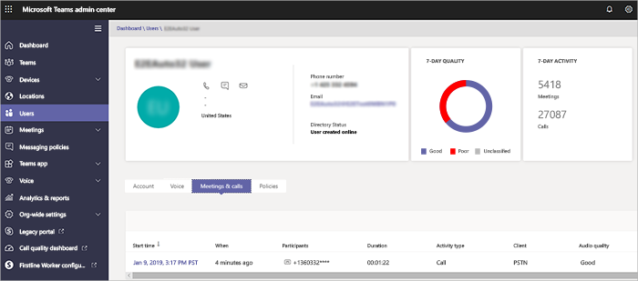

# Utiliser l’analyse des appels pour résoudre les problèmes de qualité des appels

Cet article explique comment utiliser l’analytique des appels pour résoudre les problèmes de qualité d’appel ou de réunion Microsoft Teams pour les utilisateurs individuels si vous avez le rôle d’ingénieur du support technique Teams Administrateur, Teams communications ou Teams.

## Autorisations Call Analytics

Cet article part du principe que vous avez déjà configuré Call Analytics. Si ce n’est pas le cas, lisez [Configurer l’analytique des appels pour Teams](set-up-call-analytics.md).

## Introduction à Call Analytics

Call Analytics affiche des informations détaillées sur Teams appels et réunions pour chaque utilisateur de votre compte Office 365. Il inclut des informations sur les appareils, les réseaux, la connectivité et la qualité des appels (tout cela peut être un facteur de mauvaise qualité des appels ou des réunions). Si vous chargez des informations sur le bâtiment, le site et le locataire, ces informations s’affichent également pour chaque appel et réunion. Utilisez Call Analytics pour comprendre pourquoi un utilisateur a eu une expérience d’appel ou de réunion médiocre.

Call Analytics vous montre chaque étape d’un appel ou d’une réunion, par exemple, d’un participant à un deuxième participant. En analysant ces détails, un administrateur Teams peut isoler les zones problématiques et identifier la cause racine de la mauvaise qualité.

En tant qu’administrateur Teams, vous bénéficiez d’un accès complet à toutes les données Call Analytics pour chaque utilisateur. En outre, vous pouvez attribuer Azure Active Directory rôles au personnel de soutien. Pour en savoir plus sur ces rôles, consultez [Autoriser le support technique et le personnel du support technique](set-up-call-analytics.md#give-permission-to-support-and-helpdesk-staff). Ne manquez pas [ce que font chaque rôle de support Teams ?](#what-does-each-teams-support-role-do) ci-dessous.

## Où trouver l’analytique des appels par utilisateur

Pour afficher toutes les informations et données d’appel d’un utilisateur, accédez au [centre d’administration Teams](https://admin.teams.microsoft.com). Sous **Utilisateurs**, sélectionnez un utilisateur, puis ouvrez l’onglet **Réunions & Appels** sur la page de profil de l’utilisateur. Vous y trouverez tous les appels et réunions pour cet utilisateur au cours des 30 derniers jours.

Pour obtenir des informations supplémentaires sur une session donnée, notamment des statistiques détaillées sur les médias et les réseaux, cliquez sur une session pour afficher les détails.

## Que font chaque rôle de support Teams ?

Le **spécialiste du support des communications Teams** (support de niveau 1) gère les problèmes de qualité des appels de base. Ils n’examinent pas les problèmes liés aux réunions. Au lieu de cela, ils recueillent des informations connexes, puis passent à un ingénieur Teams du support des communications.

**L’ingénieur de support des communications Teams** (support de niveau 2) voit des informations dans des journaux d’appels détaillés qui sont masqués par le spécialiste du support des communications Teams. Le tableau ci-dessous répertorie les informations disponibles pour chaque rôle de support de communication Teams.

Le tableau suivant vous indique les informations par utilisateur disponibles pour chaque rôle de support des communications.

|Activité|Information|Ce que les communications *le spécialiste* du support technique voit|Ce que les communications *l’ingénieur* du support voit|
|---|---|---|---|
|**Appels**|Nom de l’appelant|Seul le nom de l’utilisateur pour lequel l’agent a recherché.|Nom d’utilisateur.|
||Nom du destinataire|S’affiche en tant qu’utilisateur interne ou utilisateur externe.|Nom du destinataire.|
||Numéro de téléphone de l'appelant|Le numéro de téléphone entier, à l’exception des trois derniers chiffres, est masqué par des symboles d’astérisque. Par exemple, 15552823\*\*\*.|Le numéro de téléphone entier, à l’exception des trois derniers chiffres, est masqué par des symboles d’astérisque. Par exemple, 15552823\*\*\*.|
||Numéro de téléphone du destinataire|Le numéro de téléphone entier, à l’exception des trois derniers chiffres, est masqué par des symboles d’astérisque. Par exemple, 15552823\*\*\*.|Le numéro de téléphone entier, à l’exception des trois derniers chiffres, est masqué par des symboles d’astérisque. Par exemple, 15552823\*\*\*.|
||**Détails de l’appel** \> **Onglet Avancé**|Informations non affichées.|Tous les détails affichés, tels que les noms d’appareils, l’adresse IP, le mappage de sous-réseau, etc.|
||**Détails de l’appel** \> **Avancé** \> **Onglet Débogage**|Informations non affichées.|Tous les détails affichés, tels que le suffixe DNS et SSID.|
|**Réunions**|Noms des participants|Seul le nom de l’utilisateur pour lequel l’agent a recherché. Autres participants identifiés comme utilisateur interne ou utilisateur externe.|Tous les noms affichés.|
||Nombre de participants|Nombre de participants.|Nombre de participants.|
||Détails de la session|Détails de session affichés avec des exceptions. Seul le nom de l’utilisateur pour lequel l’agent a recherché s’affiche. Autres participants identifiés comme utilisateur interne ou utilisateur externe. Les trois derniers chiffres du numéro de téléphone masqués par des symboles d’astérisque.|Détails de la session affichés. Noms d’utilisateur et détails de session affichés. Les trois derniers chiffres du numéro de téléphone masqués par des symboles d’astérisque.|
||||

> [!NOTE]
> Les informations contenues dans la section « Autre » de l’onglet Avancé et dans l’onglet Débogage contiennent des données de télémétrie et de diagnostic de service destinées à aider les ingénieurs du support Technique Microsoft. Sans le contexte des données supplémentaires disponibles pour les ingénieurs du support technique, elles peuvent sembler redondantes, inexactes ou déroutantes. Bien que nous le rendions disponible pour les utilisateurs avancés qui recherchent un autre niveau de détail dans la résolution des problèmes d’appel, nous vous déconseillons de porter des jugements basés sur ces données sans le support microsoft.

## Résoudre les problèmes de qualité des appels utilisateur

1. Ouvrez le centre d’administration Teams (<https://admin.teams.microsoft.com>) et connectez-vous avec votre support de communication Teams ou vos informations d’identification d’administrateur Teams.

2. Dans Le **tableau de bord**, dans **Recherche d’utilisateurs**, commencez à taper le nom ou l’adresse SIP de l’utilisateur dont vous souhaitez résoudre les problèmes, ou sélectionnez **Afficher les utilisateurs** pour afficher une liste d’utilisateurs.

3. Sélectionnez l’utilisateur dans la liste.

4. Sélectionnez **Historique des** appels, puis sélectionnez l’appel ou la réunion que vous souhaitez résoudre.

5. Sélectionnez l’onglet **Avancé** , puis recherchez les éléments jaunes et rouges qui indiquent des problèmes de qualité d’appel ou de connexion médiocres.

   Dans les détails de la session pour chaque appel ou réunion, les problèmes mineurs apparaissent en jaune. Si quelque chose est jaune, il est en dehors de la plage normale, et il peut contribuer au problème, mais il est peu probable qu’il soit la cause principale du problème. Si quelque chose est rouge, il s’agit d’un problème important, et c’est probablement la cause principale de la mauvaise qualité des appels pour cette session.

Dans de rares cas, les données de qualité de l’expérience ne sont pas reçues pour les sessions audio. Cela est souvent dû à l’abandon d’un appel ou à l’arrêt de la connexion avec le client. Lorsque cela se produit, l’évaluation de session n’est **pas disponible**.

Pour les sessions audio qui ont des données de qualité d’expérience (QoE), le tableau suivant décrit les principaux problèmes qui qualifient une session de **médiocre**.

|Problème|Domaine|Description|
|---|---|---|
|Configuration des appels|Session|Le code d’erreur Ms-diag 20-29 indique que la configuration de l’appel a échoué. L’utilisateur n’a pas pu rejoindre l’appel ou la réunion.|
|Le réseau audio a classé un appel médiocre|Session|Des problèmes de qualité réseau (tels que la perte de paquets, la gigue, la dégradation NMOS, la rtt ou le rapport caché) ont été rencontrés.|
|L’appareil ne fonctionne pas|Device|Un appareil ne fonctionne pas correctement. Les ratios de non-fonctionnement de l’appareil sont les suivants : 
 DeviceRenderNotFunctioningEventRatio >= 0,005    DeviceCaptureNotFunctioningEventRatio >= 0,005|
||||

## Voir aussi

[Configurer l’analytique des appels par utilisateur](set-up-call-analytics.md)
