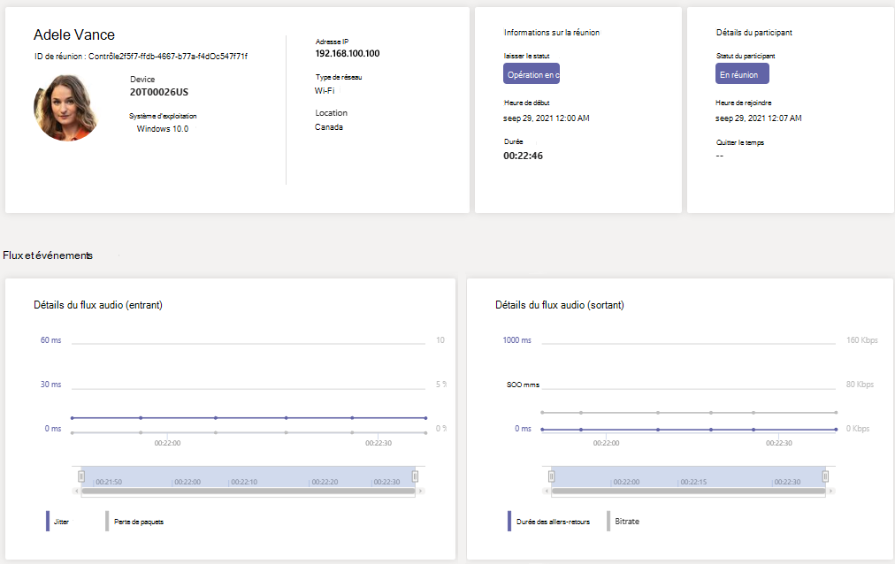

# Utiliser la télémétrie en temps réel pour résoudre les problèmes de qualité des réunions

> [!NOTE]
> Cette fonctionnalité est actuellement en prévisualisation publique jusqu’à la fin de l’année 2021. Après ce délai, le module de communication avancée pour Microsoft Teams sera nécessaire pour chaque utilisateur dont vous souhaitez afficher la télémétrie en temps réel. Pour plus d’informations, consultez [Module complémentaire Communications avancées pour Microsoft Teams](/MicrosoftTeams/teams-add-on-licensing/advanced-communications).

Cet article explique comment utiliser Real-Time Analytics (RTA) pour résoudre des problèmes de qualité Microsoft Teams réunion pour des utilisateurs individuels. Vous pouvez accéder à Real-Time Analytics si vous avez l’un des rôles suivants :

- Administrateur Teams
- Teams Spécialiste du support pour les communications
- Ingénieur du support technique pour les communications Teams

Pour plus d’informations sur Teams rôles d’administrateur, voir Utiliser Microsoft Teams rôles d’administrateur [pour gérer Teams.](/MicrosoftTeams/using-admin-roles)

Real-Time Analytics permet aux administrateurs informatiques d’examiner les réunions programmées de leurs utilisateurs importants et de voir les problèmes audio, vidéo, de partage de contenu et de réseau. En tant qu’administrateur, vous pouvez utiliser cette télémétrie pour examiner ces problèmes pendant les réunions et résoudre les problèmes en temps réel.

## Qu’est-ce Real-Time Analyse de données ?

Aujourd’hui, la résolution des problèmes de réunion individuelle est disponible pour Teams administrateurs via [l’outil d’analyse](use-call-analytics-to-troubleshoot-poor-call-quality.md) des appels une fois la réunion terminée. Real-Time Analytics permet aux administrateurs de résoudre les problèmes des réunions programmées en cours.

Real-Time Analytics affiche des informations détaillées sur Teams réunions pour chaque utilisateur dans votre Office 365 utilisateur, mises à jour en temps réel. Il inclut des informations sur les périphériques, le réseau, la connectivité, l’audio, la vidéo et les problèmes de partage de contenu, qui aideront les administrateurs à résoudre les problèmes de qualité des appels de façon plus efficace.

En tant qu Teams de projet, vous avez un accès total à toutes les données de télémétrie en temps réel pour chaque utilisateur. De plus, vous pouvez attribuer des rôles Azure Active Directory au personnel de support technique. Pour en savoir plus sur ces rôles, voir [Accorder l’autorisation au support technique et au personnel de support technique.](set-up-call-analytics.md#give-permission-to-support-and-helpdesk-staff)

## Où trouver la résolution des problèmes de télémétrie en temps réel par utilisateur

Pour voir toutes les informations et données de réunion d’un utilisateur, rendez-vous dans le [Teams d’administration.](https://admin.teams.microsoft.com) Sous **Gérer les**  >  **utilisateurs,** sélectionnez un utilisateur, puis ouvrez l’onglet & **d’appels** sur la page de profil de l’utilisateur. Sous Réunions **récentes,** vous verrez la liste des réunions que l’utilisateur a participé au cours des 24 dernières heures pour lesquelles la télémétrie en temps réel est *disponible,* y compris les réunions en cours. Si la réunion n’est pas en cours ou ne comprend pas de données de télémétrie en temps réel, elle s’affiche dans **réunions passées.**

Pour obtenir des informations supplémentaires sur les participants d’une réunion en cours, notamment les statistiques sur l’appareil, le réseau et l’audio, recherchez la réunion dans Réunions **récentes** et sélectionnez le lien sous la colonne **Participants.**

Pour examiner la télémétrie d’un utilisateur donné pour une réunion en cours, y compris les informations sur l’appareil, le réseau, l’audio, la vidéo et les détails du partage de contenu, sélectionnez **l’ID** de réunion.

## Plateformes clientes prise en charge pour la télémétrie en temps réel

- Windows
- macOS
- Linux
- Android
- iOS

## Teams appareils avec prise en charge de la télémétrie en temps réel

- MTR - Surface Hub
- MTR - affichage Teams’écran
- MTR - Barre de collaboration
- Appareils IP Téléphone ip

## Limites

- La télémétrie en temps réel est disponible uniquement pour les réunions prévues. Pour les réunions ad hoc telles que Conférence maintenant, PSTN, appels 1:1 et appels de groupe, la télémétrie en temps réel n’est pas disponible.
- La télémétrie en temps réel n’est disponible que pour les présentateurs d’un événement en direct programmé. Il n’est actuellement pas disponible pour les participants à un événement en direct.
- Les données de télémétrie en temps réel sont disponibles pour une réunion sous Réunions **récentes** 24 heures après la fin de la réunion. Au bout de 24 heures, vous ne pouvez plus accéder aux données et la réunion passe aux **réunions passées.** Si une réunion dure plus de 3 heures, la télémétrie en temps réel ne sera disponible que pour les *3 dernières heures.*
- La télémétrie n’est pas disponible en temps réel lorsque vous utilisez des versions antérieures de Teams. Si aucune télémétrie n’est disponible, essayez de mettre à jour votre client.
- Si des participants externes ou des utilisateurs  anonymes rejoignent une réunion, leur nom d’affichage s’affiche comme indisponible pour conserver la confidentialité entre clients.

## Sujets associés

[Configurer l’analyse des appels par utilisateur](set-up-call-analytics.md)

[Utiliser Microsoft Teams rôles d’administrateur pour gérer Teams.](/MicrosoftTeams/using-admin-roles)
