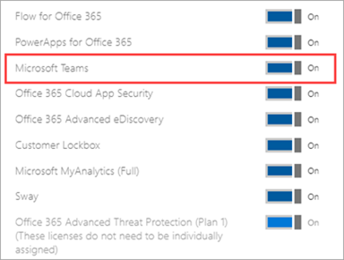

# <a name="manage-user-access-to-teams"></a>Gérer l’accès des utilisateurs à Microsoft Teams

Vous gérez l’accès à Teams au niveau de l’utilisateur en attribuant ou en supprimant une licence de produit Microsoft Teams. À l’exception de la participation anonyme aux réunions Teams, chaque utilisateur de votre organisation doit disposer d’une licence Teams pour pouvoir utiliser Teams. Vous pouvez attribuer une licence Teams aux nouveaux utilisateurs lorsque de nouveaux comptes d’utilisateur sont créés ou à des utilisateurs disposant de comptes existants.

Par défaut, lorsqu’un plan de licences (par exemple, Microsoft 365 Entreprise E3 ou Microsoft 365 Business Premium) est attribué à un utilisateur, une licence Teams est automatiquement attribuée et l’utilisateur est activé pour Teams. Vous pouvez désactiver ou activer Teams pour un utilisateur en supprimant ou en affectant une licence à tout moment.

Utilisez des stratégies de messagerie, gérées à partir du <a href="https://go.microsoft.com/fwlink/p/?linkid=2024339" target="_blank">Centre de Administration Teams</a>, pour contrôler les fonctionnalités de conversation et de messagerie de canal disponibles pour les utilisateurs dans Teams. Vous pouvez utiliser la stratégie par défaut ou créer une ou plusieurs stratégies de messagerie personnalisées pour les membres de votre organisation. Pour en savoir plus, consultez [Gérer les stratégies de messagerie dans Teams](messaging-policies-in-teams.md).
Vous gérez les licences Teams dans le Centre d'administration Microsoft 365 ou à l’aide de PowerShell. Vous devez être administrateur général ou administrateur de gestion des utilisateurs pour gérer les licences.

> [!NOTE]
> Nous vous recommandons d’activer Teams pour tous les utilisateurs afin que les équipes puissent être formées de manière organique pour les projets et d’autres initiatives dynamiques. Même si vous exécutez un pilote, il peut toujours être utile de maintenir Teams activé pour tous les utilisateurs, mais de cibler uniquement les communications vers le groupe pilote d’utilisateurs.

## <a name="using-the-microsoft-365-admin-center"></a>Utilisation de la Centre d'administration Microsoft 365

Les licences au niveau de l’utilisateur Teams sont gérées directement via les interfaces de gestion des utilisateurs Centre d'administration Microsoft 365. Un administrateur peut attribuer des licences à de nouveaux utilisateurs lors de la création de nouveaux comptes d’utilisateur ou à des utilisateurs disposant de comptes existants.

> [!IMPORTANT]
> L’administrateur doit disposer de privilèges d’administrateur général ou d’administrateur de gestion des utilisateurs pour gérer les licences Microsoft Teams.
Utilisez la Centre d'administration Microsoft 365 pour gérer les licences Teams pour des utilisateurs individuels ou de petits ensembles d’utilisateurs à la fois. Vous pouvez gérer les licences Teams sur la page **Licences** (pour jusqu’à 20 utilisateurs à la fois) ou sur la page **Utilisateurs actifs** . La méthode que vous choisissez varie selon que vous souhaitez gérer les licences de produit pour des utilisateurs spécifiques ou gérer les licences utilisateur pour des produits spécifiques.

Si vous devez gérer des licences Teams pour un grand nombre d’utilisateurs, tels que des centaines ou des milliers d’utilisateurs, [utilisez PowerShell](#using-powershell) ou [des licences basées sur des groupes dans Azure Active Directory (Azure AD).](/azure/active-directory/users-groups-roles/licensing-groups-assign) 

### <a name="assign-a-teams-license"></a>Attribuer une licence Teams

Les étapes sont différentes selon que vous utilisez la page **Licences** ou la page **Utilisateurs actifs** .  Pour obtenir des instructions pas à pas, consultez [Affecter des licences aux utilisateurs](/microsoft-365/admin/manage/assign-licenses-to-users).

|&nbsp;|&nbsp;|
|---------|---------|
|    |         |

### <a name="remove-a-teams-license"></a>Supprimer une licence Teams

> [!IMPORTANT]
> La désactivation d’une référence SKU Teams prend environ 24 heures.

Lorsque vous supprimez une licence Teams d’un utilisateur, Teams est désactivé pour cet utilisateur et il ne voit plus Teams dans le lanceur d’applications ou la page d’accueil. Pour obtenir des instructions détaillées, consultez [La désaffectation des licences des utilisateurs](/microsoft-365/admin/manage/remove-licenses-from-users).

|&nbsp;|&nbsp;|
|---------|---------|
|    |         |

## <a name="using-powershell"></a>Utiliser PowerShell

Utilisez PowerShell pour gérer les licences Teams pour les utilisateurs en bloc. Vous activez et désactivez Teams via PowerShell de la même façon que pour toute autre licence de plan de service. Vous aurez besoin des identificateurs des plans de service pour Teams, qui sont les suivants :

- Microsoft Teams : TEAMS1
- Microsoft Teams pour GCC : TEAMS_GOV
- Microsoft Teams pour DoD : TEAMS_DOD

### <a name="assign-teams-licenses-in-bulk"></a>Attribuer des licences Teams en bloc

Pour obtenir des instructions détaillées, consultez [Affecter des licences à des comptes d’utilisateur avec PowerShell](/office365/enterprise/powershell/assign-licenses-to-user-accounts-with-office-365-powershell).

### <a name="remove-teams-licenses-in-bulk"></a>Supprimer des licences Teams en bloc

Pour obtenir des instructions détaillées, consultez [Désactiver l’accès aux services avec PowerShell](/office365/enterprise/powershell/disable-access-to-services-with-office-365-powershell) et [désactiver l’accès aux services lors de l’attribution de licences utilisateur](/office365/enterprise/powershell/disable-access-to-services-while-assigning-user-licenses).

#### <a name="example"></a>Exemple 

Voici un exemple d’utilisation des applets de commande [New-MsolLicenseOptions](/powershell/module/msonline/new-msollicenseoptions) et [Set-MsolUserLicense](/powershell/module/msonline/set-msoluserlicense) pour désactiver Teams pour les utilisateurs disposant d’un plan de licence spécifique. Par exemple, suivez ces étapes pour désactiver d’abord Teams pour tous les utilisateurs qui ont un plan de licence particulier. Activez ensuite Teams pour chaque utilisateur individuel qui doit avoir accès à Teams.

> [!IMPORTANT]
> L’applet [de commande New-MsolLicenseOptions](/powershell/module/msonline/new-msollicenseoptions) active tous les services précédemment désactivés, sauf si elles sont explicitement identifiées dans votre script personnalisé. Par exemple, si vous souhaitez laisser Exchange et Sway désactivés tout en désactivant Teams, vous devez l’inclure dans le script, sinon Exchange et Sway seront activés pour les utilisateurs que vous avez identifiés.

Exécutez la commande suivante pour afficher tous les plans de licence disponibles dans votre organisation. Pour en savoir plus, consultez [Afficher les licences et les services avec PowerShell](/office365/enterprise/powershell/view-licenses-and-services-with-office-365-powershell).


```powershell
Get-MsolAccountSku
```

Exécutez les commandes suivantes, où \<CompanyName:License> se trouvent le nom de votre organisation et l’identificateur du plan de licence que vous avez récupéré à l’étape précédente. Par exemple, ContosoSchool:ENTERPRISEPACK_STUDENT.

```powershell
$acctSKU="<CompanyName:License>
$x = New-MsolLicenseOptions -AccountSkuId $acctSKU -DisabledPlans "TEAMS1"
```

Exécutez la commande suivante pour désactiver Teams pour tous les utilisateurs disposant d’une licence active pour le plan de licences.

```powershell
Get-MsolUser | Where-Object {$_.licenses[0].AccountSku.SkuPartNumber -eq  ($acctSKU).Substring($acctSKU.IndexOf(":")+1,  $acctSKU.Length-$acctSKU.IndexOf(":")-1) -and $_.IsLicensed -eq $True} |  Set-MsolUserLicense -LicenseOptions $x
```

## <a name="related-topics"></a>Rubriques connexes

- [Licences de module complémentaire Teams](teams-add-on-licensing/microsoft-teams-add-on-licensing.md)
- [Attribuer des licences de module complémentaire Teams](teams-add-on-licensing/assign-teams-add-on-licenses.md)
- [Afficher les licences et les services avec PowerShell](/office365/enterprise/powershell/view-licenses-and-services-with-office-365-powershell)
- [Noms de produits et identificateurs de plans de service pour la gestion des licences](/azure/active-directory/users-groups-roles/licensing-service-plan-reference)
- [Informations de référence sur la référence SKU Éducation](sku-reference-edu.md)
