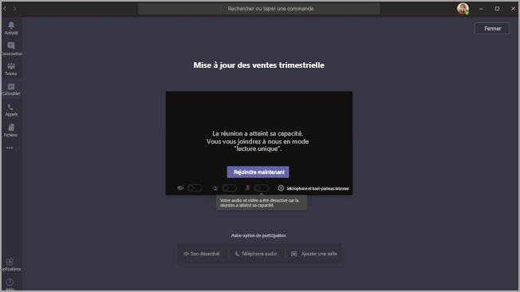

# <a name="teams-view-only-meeting-experience"></a>Expérience de réunion en lecture seule de Teams

> [!Note]
> Les diffusions en lecture seule sont disponibles dans Microsoft 365 E3/E5 et Microsoft 365 A3/A5. Cette fonctionnalité sera activée le 1er mars 2021 avec le mode par défaut désactivé. Le déploiement de la fonctionnalité du cloud de la communauté du secteur public Microsoft 365 (GCC) commencera à la fin du mois de mars 2021. Le déploiement du cloud de la communauté du secteur public de haut niveau (GCCH) et du Département de la Défense (DoD) s’effectuera à une date ultérieure. Vous devez modifier la stratégie par défaut après cette date si vous voulez que la fonctionnalité fonctionne par défaut. Utiliser PowerShell pour activer la valeur `Set-CsTeamsMeetingPolicy -Identity Global -StreamingAttendeeMode Enabled` de la stratégie.

> [!Note]
> Si votre réunion atteint sa capacité, Teams s’adaptera sans problème à une expérience de diffusion en lecture seule de 10 000 personnes. De plus, pendant cette période de travail à distance accru, tirez parti de diffusions encore plus importantes de 20 000 personnes jusqu’à la fin de cette année. Actuellement, les webinaires ne permettent pas une diffusion en mode "vue seulement".

Microsoft Teams permet à 10 000 participants au plus de prendre part à une réunion Teams. Une fois la capacité de la réunion principale atteinte(c'est-à-dire lorsque 1000 utilisateurs entrent dans une réunion), d’autres participants y prendront part avec une expérience de lecture seule.

Les participants qui rejoignent en premier la réunion, avant que la capacité de la réunion principale soit atteinte, pourront obtenir l’expérience de réunion complète de Teams. Ils peuvent partager des fichiers audio et vidéo, voir des vidéos partagées et participer à une conversation de réunion.

Les participants qui rejoignent la réunion après la limite de la capacité de la réunion principale, ont une expérience en lecture seule.

Les participants pourront participer à l'expérience de visualisation uniquement sur le bureau, le web et le mobile Teams (Android et iOS).

> [!Note]
> La capacité limite actuelle de la "réunion principale", ou en d'autres termes, le nombre d'utilisateurs totalement interactifs, est de 1000 et comprend le CCG et les webinaires.

## <a name="teams-view-only-experience-controls"></a>Contrôle de l'expérience de lecture seule dans Teams

Vous activez l'expérience de lecture seule uniquement à l'aide de la [`Set-CsTeamsMeetingPolicy`](/powershell/module/skype/set-csteamsmeetingpolicy?view=skype-ps) cmdlet du module [PowerShell SkypeForBusiness](/powershell/module/skype/?view=skype-ps) ou au moins de la version 2.0.0 du module [MicrosoftTeams](https://www.powershellgallery.com/packages/MicrosoftTeams).

Pour utiliser le module `MicrosoftTeams` recommandé :

```PowerShell
Install-Module -Name "MicrosoftTeams" -MinimumVersion 2.0.0
Connect-MicrosoftTeams
```

Pour activer l'expérience de l'affichage seul, vous pouvez utiliser l'extrait PowerShell suivant :

```PowerShell
Set-CsTeamsMeetingPolicy -Identity Global -StreamingAttendeeMode Enabled
```

Pour désactiver l'expérience d'affichage seul, vous pouvez également utiliser PowerShell.

```PowerShell
Set-CsTeamsMeetingPolicy -Identity Global -StreamingAttendeeMode Disabled
```

Dans le futur, les administrateurs pourront également désactiver l’expérience lecture seule dans le centre d’administration Teams.

## <a name="impact-to-users"></a>Conséquences sur les utilisateurs

L’expérience d’un utilisateur varie en fonction de plusieurs facteurs.

Une fois la capacité de la réunion principale atteinte, le participant ne peut pas prendre pas à la réunion si l’un de ces cas est avéré :

- Un administrateur a désactivé l'expérience de lecture seule dans Teams pour l'organisateur ou pour l'ensemble du locataire.
- Le participant qui n'a qu'une lecture seule ne peut pas contourner la salle d'attente. Par exemple, si l'organisateur d'une réunion choisit que seules les **personnes de mon organisation** contournent la salle d'attente, et qu'un participant extérieur à l'organisation tente de s'y joindre en tant que participant en lecture seule uniquement, il ne pourra pas le faire.

Une fois la capacité de la réunion principale atteinte, l’organisateur et les présentateurs de la réunion voient une bannière les informant que les nouveaux participants prendront part en lecture seule.

  

Une fois la capacité de la réunion principale atteinte, les participants sont informés à l’écran de participation préalable qu’ils prennent part en mode lecture seule.

  

S’il y a de l’espace, l’utilisateur pourra toujours participer à la réunion principale. Si la réunion principale atteint sa capacité et qu’un ou plusieurs participants quittent la réunion principale, il y aura encore de la place à la réunion principale. Les participants qui prennent part (ou qui participent à nouveau) à la réunion, participeront à la réunion principale jusqu’à la limite de sa capacité. Les participants en mode lecture seule ne peuvent pas rejoindre automatiquement la réunion principale et ne peuvent pas le faire manuellement.

Si les rôles de présentateur et d'invité ont été définis et qu'un présentateur tente de se joindre à une réunion après que la réunion principale a atteint sa capacité, il se joindra à la réunion en tant qu'invité en lecture seule uniquement et sera soumis aux mêmes limitations que les autres participants en lecture seule uniquement. Le soutien visant à garantir que tous les présentateurs se joignent à la réunion principale sera mis en place ultérieurement. L'organisateur se verra toujours garantir un espace dans la réunion principale.

## <a name="impact-to-meeting-presenters-and-organizers"></a>Impact sur les présentateurs et les organisateurs de réunion

Les limitations pour les présentateurs de réunion sont :

- Vous n’avez aucune information sur le participant en lecture seule. La découverte électronique n’est pas prise en charge pour les participants en lecture seule.
- Les utilisateurs de la réunion principale ne peuvent pas voir les participants en lecture seule uniquement.
- Vous ne pouvez pas supprimer un participant en lecture seule de la réunion.

> [!Note]
> Le nombre de participants reflète uniquement les participants à la réunion principale, et non les participants dans la salle de lecture seule. Par conséquent, les présentateurs ne peuvent pas obtenir le nombre exact de personnes qui ont l’expérience lecture seule.

## <a name="experience-for-view-only-attendees"></a>Expérience des participants en lecture seule

L’expérience lecture seule de Teams permet aux participants de :

- Écouter les participants à la réunion principale Teams.
- Consulter le flux vidéo de l’intervenant actif (si l’intervenant  actif partage une vidéo).
- Consulter le contenu partagé à l’aide de la fonctionnalité Partager le bureau. ou l’écran

Le participant en lecture seule ne pourra pas utiliser ces options dans les réunions :

- Participer à la réunion si le participant n’est pas autorisé à contourner la salle d'attente en fonction des stratégies ou options de salle d'attente définies.
- Rejoindre la salle de lecture seule à l’aide de la conférence audio.
- Rejoindre la salle de lecture seule à l’aide du système de salle Microsoft Teams ou des services Cloud Video Interop (CVI).
- Partager leur contenu audio ou vidéo.
- Consulter ou participer à la conversation de réunion.
- Consulter le flux vidéo des participants à la réunion, sauf si le participant est l’intervenant actif.
- Afficher les fichiers PowerPoint qui sont partagés à l'aide de la fonctionnalité PowerPoint Live ou des partages d'applications individuelles (autres que le partage de bureau ou d'écran)
- Lever la main en réunion
- Envoyer ou voir des réactions
- Interagir avec toute application 3P intégrée à la réunion Teams, y compris les sondages.
- Accès à l’enregistrement de réunion.

## <a name="view-only-feature-limitations"></a>Limitations de la fonctionnalité lecture seule

- Les participants en lecture seule ne pourront voir les sous-titres en direct que sur le bureau et sur le Web. Seuls les sous-titres en anglais sont pris en charge pour l’instant.
- Les participants en lecture seule ne peuvent pas s'inscrire aux webinaires.
- Les participants en lecture seule sont pris en charge par la technologie de diffusion en continu.
- Les participants en lecture seule ne sont pas inclus dans le rapport de participation.
- Les participants en lecture seule ont une expérience vidéo unique. Ils peuvent voir l’intervenant actif ou le contenu partagé, mais pas les deux.
- Pour le moment, les dispositions de la **Galerie**, la **Grade galerie**, ou du **Mode Ensemble** ne sont pas prises en charge pour les participants en lecture seule.
- Les participants en mode affichage uniquement sont uniquement pris en charge par les stratégies de lobby suivantes : « Personnes dans mon organisation », « Personnes dans mon organisation et les invités », « Personnes dans mon organisation, les organisations approuvées et les invités » et « Tout le monde ». Si vous utilisez une politique de salle d'attente qui ne prend pas en charge les participants en mode lecture seule, ces derniers seront rejetés de la réunion. 
- Les participants en lecture seule n’ont pas la même latence qu’un participant ordinaire. <sup>1</sup>

  <sup>1</sup> participants en lecture seule ont un retard audio et vidéo de 30 secondes pendant la réunion.  
