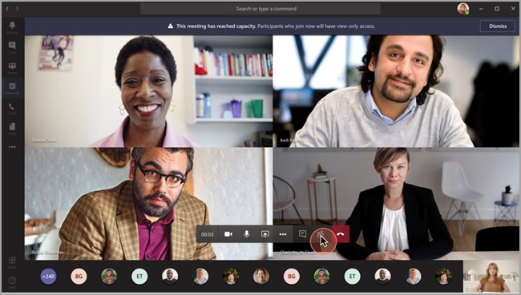

# <a name="teams-view-only-meeting-experience"></a><span data-ttu-id="05bd2-103">Expérience de réunion en affichage seul dans Teams</span><span class="sxs-lookup"><span data-stu-id="05bd2-103">Teams view-only meeting experience</span></span>

> [!Note]
> <span data-ttu-id="05bd2-104">Les diffusions en affichage seul sont disponibles dans Microsoft 365 E3/E5 et Microsoft 365 A3/A5.</span><span class="sxs-lookup"><span data-stu-id="05bd2-104">View-only broadcasts is available in Microsoft 365 E3/E5 and Microsoft 365 A3/A5.</span></span> <span data-ttu-id="05bd2-105">Cette fonctionnalité sera activée par défaut le 1er mars 2021.</span><span class="sxs-lookup"><span data-stu-id="05bd2-105">This feature will be enabled March 1, 2021 as default OFF.</span></span> <span data-ttu-id="05bd2-106">La fonctionnalité de Microsoft 365 Government Community Cloud (GCC) sera mise en place à la fin du mois de mars 2021.</span><span class="sxs-lookup"><span data-stu-id="05bd2-106">The feature in Microsoft 365 Government Community Cloud (GCC) will begin to roll out at the end of March 2021.</span></span> <span data-ttu-id="05bd2-107">GccH (Government Community Cloud High) et Department of Defense (DoD) seront publiés ultérieurement.</span><span class="sxs-lookup"><span data-stu-id="05bd2-107">Government Community Cloud High (GCCH) and Department of Defense (DoD) will roll out at a later date.</span></span> <span data-ttu-id="05bd2-108">Vous devez modifier la stratégie par défaut après cette date si vous souhaitez que la fonctionnalité par défaut soit sous l’option.</span><span class="sxs-lookup"><span data-stu-id="05bd2-108">You must change the default policy after that date if you want to have the feature be default ON.</span></span> <span data-ttu-id="05bd2-109">Utilisez PowerShell pour activer la `Set-CsTeamsMeetingPolicy -Identity Global -StreamingAttendeeMode Enabled` stratégie.</span><span class="sxs-lookup"><span data-stu-id="05bd2-109">Use PowerShell to enable the policy `Set-CsTeamsMeetingPolicy -Identity Global -StreamingAttendeeMode Enabled`.</span></span>

> [!Note]
> <span data-ttu-id="05bd2-110">Si la capacité de réunion ou de webinaire atteint sa capacité, Teams s’adaptera sans problème à une expérience de diffusion en affichage seul de 10 000 personnes.</span><span class="sxs-lookup"><span data-stu-id="05bd2-110">If your meeting or webinar hits capacity, Teams will seamlessly scale to accommodate a 10,000-person view-only broadcast experience.</span></span> <span data-ttu-id="05bd2-111">De plus, à cette période de travail à distance accrue, tirez parti de plus de 20 000 diffusions encore plus grandes jusqu’à la fin de cette année.</span><span class="sxs-lookup"><span data-stu-id="05bd2-111">Plus, during this time of increased remote work, take advantage of even larger 20,000-person broadcasts through the end of this year.</span></span>

<span data-ttu-id="05bd2-112">Microsoft Teams permet à jusqu’à 10 000 participants de participer à une réunion Teams.</span><span class="sxs-lookup"><span data-stu-id="05bd2-112">Microsoft Teams allows up to 10,000 attendees to join a Teams meeting.</span></span> <span data-ttu-id="05bd2-113">Une fois la capacité de la réunion principale atteinte, les participants supplémentaires la rejoignent avec une expérience de vue seule.</span><span class="sxs-lookup"><span data-stu-id="05bd2-113">After the capacity of the main meeting has been reached, additional attendees will join with a view-only experience.</span></span>

<span data-ttu-id="05bd2-114">Les participants qui rejoignent la réunion en premier, jusqu’à la capacité de la réunion, auront accès à l’expérience complète de la réunion Teams.</span><span class="sxs-lookup"><span data-stu-id="05bd2-114">Attendees who join the meeting first, up to the capacity of the meeting, will get the full Teams meeting experience.</span></span> <span data-ttu-id="05bd2-115">Ils peuvent partager des fichiers audio et vidéo, voir des vidéos partagées et participer à une conversation de réunion.</span><span class="sxs-lookup"><span data-stu-id="05bd2-115">They can share audio and video, see shared videos, and participate in meeting chat.</span></span>

<span data-ttu-id="05bd2-116">Les participants qui rejoignent la réunion une fois la capacité principale de la réunion atteinte auront une expérience en affichage seul.</span><span class="sxs-lookup"><span data-stu-id="05bd2-116">Attendees who join after the main meeting capacity has been reached will have a view-only experience.</span></span>

<span data-ttu-id="05bd2-117">Nous avons un support mobile Android et iOS complet pour qu’un participant participe.</span><span class="sxs-lookup"><span data-stu-id="05bd2-117">We have full Android and iOS mobile support for an attendee to join.</span></span>

> [!Note]
> <span data-ttu-id="05bd2-118">La limite actuelle du nombre de personnes qui peuvent discuter et appeler pour une réunion est de 300 dans WW et 250 dans GCC, GCC High et DoD.</span><span class="sxs-lookup"><span data-stu-id="05bd2-118">The current limit for the number of people who can chat and call in to a meeting is 300 in WW and 250 in GCC, GCC High, and DoD.</span></span>

<span data-ttu-id="05bd2-119">L’expérience en affichage seul est désactivée par défaut pour tout organisateur dispose de la référence SKU E3/E5/A3/A5.</span><span class="sxs-lookup"><span data-stu-id="05bd2-119">The view-only experience is disabled by default for any organizer who has E3/E5/A3/A5 SKU.</span></span> <span data-ttu-id="05bd2-120">Aucune autre configuration ou configuration n’est requise.</span><span class="sxs-lookup"><span data-stu-id="05bd2-120">No further configuration or setup is required.</span></span>

## <a name="disable-teams-view-only-experience"></a><span data-ttu-id="05bd2-121">Désactiver l’affichage seul dans Teams</span><span class="sxs-lookup"><span data-stu-id="05bd2-121">Disable Teams view-only experience</span></span>

<span data-ttu-id="05bd2-122">Les administrateurs peuvent désactiver l’expérience d’affichage seul à l’aide de PowerShell.</span><span class="sxs-lookup"><span data-stu-id="05bd2-122">Administrators can disable the view-only experience using PowerShell.</span></span>

```PowerShell
Set-CsTeamsMeetingPolicy -Identity Global -StreamingAttendeeMode Disabled
```

<span data-ttu-id="05bd2-123">À l’avenir, les administrateurs pourront également désactiver l’expérience d’affichage seul dans le Centre d’administration Teams.</span><span class="sxs-lookup"><span data-stu-id="05bd2-123">In the future, it will also be possible for administrators to disable the view-only experience in the Teams admin center.</span></span>

## <a name="impact-to-users"></a><span data-ttu-id="05bd2-124">Impact sur les utilisateurs</span><span class="sxs-lookup"><span data-stu-id="05bd2-124">Impact to users</span></span>

<span data-ttu-id="05bd2-125">L’expérience d’un utilisateur varie en fonction de plusieurs facteurs.</span><span class="sxs-lookup"><span data-stu-id="05bd2-125">A user's experience will vary depending on several factors.</span></span>

<span data-ttu-id="05bd2-126">Une fois la capacité de la réunion principale atteinte, un participant ne pourra pas participer à la réunion si l’une des raisons suivantes est vraie :</span><span class="sxs-lookup"><span data-stu-id="05bd2-126">When the capacity of the main meeting has been reached, an attendee will be unable to join the meeting if any of the following are true:</span></span>

- <span data-ttu-id="05bd2-127">Un administrateur a désactivé l’expérience teams en affichage seul.</span><span class="sxs-lookup"><span data-stu-id="05bd2-127">An administrator has disabled the Teams view-only experience.</span></span>
- <span data-ttu-id="05bd2-128">Le participant n’est pas autorisé à contourner la salle d’accueil.</span><span class="sxs-lookup"><span data-stu-id="05bd2-128">The attendee doesn't have permission to bypass the lobby.</span></span>

<span data-ttu-id="05bd2-129">Une fois la capacité de la réunion principale atteinte, l’organisateur et les présentateurs de la réunion voient une bannière les informant que la capacité de la réunion a été atteinte et que les nouveaux participants rejoindront un participant en affichage seul.</span><span class="sxs-lookup"><span data-stu-id="05bd2-129">When the capacity of the main meeting has been reached, the meeting organizer and presenters will see a banner informing them that the meeting capacity has been reached and that new attendees will join a view-only attendee.</span></span>

  

<span data-ttu-id="05bd2-131">Une fois la capacité de la réunion principale atteinte, les participants à la réunion seront informés sur l’écran de pré-participation qu’ils la rejoignent en mode affichage seul.</span><span class="sxs-lookup"><span data-stu-id="05bd2-131">When the capacity of the main meeting has been reached, meeting attendees will be informed on the pre-join screen that they're joining in view-only mode.</span></span>

  

<span data-ttu-id="05bd2-133">S’il y a de l’espace, l’utilisateur rejoint toujours la réunion principale.</span><span class="sxs-lookup"><span data-stu-id="05bd2-133">If there's space, a user will always join the main meeting.</span></span> <span data-ttu-id="05bd2-134">Si la réunion principale atteint sa capacité et qu’un ou plusieurs participants quittent la réunion principale, la réunion principale a une capacité disponible.</span><span class="sxs-lookup"><span data-stu-id="05bd2-134">If the main meeting reaches capacity, and one or more attendees leave the main meeting, the main meeting has available capacity.</span></span> <span data-ttu-id="05bd2-135">Les participants qui rejoignent (ou rejoignent) la réunion rejoindront la réunion principale jusqu’à ce qu’elle atteigne à nouveau sa capacité.</span><span class="sxs-lookup"><span data-stu-id="05bd2-135">Attendees who join (or rejoin) the meeting will join the main meeting until it reaches capacity again.</span></span> <span data-ttu-id="05bd2-136">Les participants à l’expérience en affichage seul ne sont pas automatiquement promus à la réunion principale et ne peuvent pas actuellement être promus manuellement à la réunion principale.</span><span class="sxs-lookup"><span data-stu-id="05bd2-136">Attendees who are in the view-only experience won't automatically be promoted to the main meeting and can't currently be manually promoted to the main meeting.</span></span>

<span data-ttu-id="05bd2-137">Si les rôles de présentateur/participant n’ont pas été définies, les espaces de la réunion principale sont remplis sur la base du premier arrivé, premier servi.</span><span class="sxs-lookup"><span data-stu-id="05bd2-137">If presenter/attendee roles haven't been set, spaces in the main meeting are filled on a first-come, first-served basis.</span></span> <span data-ttu-id="05bd2-138">Une fois la capacité de la réunion atteinte, tous les autres utilisateurs la rejoignent avec une expérience en affichage seul.</span><span class="sxs-lookup"><span data-stu-id="05bd2-138">Once the meeting capacity has been reached, all other users will join with a view-only experience.</span></span>

## <a name="impact-to-meeting-presenters"></a><span data-ttu-id="05bd2-139">Impact sur les présentateurs de réunion</span><span class="sxs-lookup"><span data-stu-id="05bd2-139">Impact to meeting presenters</span></span>

<span data-ttu-id="05bd2-140">Les limitations pour les présentateurs de réunion sont les suivantes :</span><span class="sxs-lookup"><span data-stu-id="05bd2-140">Limitations for meeting presenters include:</span></span>

- <span data-ttu-id="05bd2-141">Vous n’aurez aucune information sur le participant en affichage seul.</span><span class="sxs-lookup"><span data-stu-id="05bd2-141">You'll have no information about the view-only attendee.</span></span> <span data-ttu-id="05bd2-142">La découverte électronique n’est pas prise en charge pour les participants en affichage seul.</span><span class="sxs-lookup"><span data-stu-id="05bd2-142">We don't support E-discovery for view-only attendees.</span></span>
- <span data-ttu-id="05bd2-143">Les utilisateurs ne peuvent pas voir les participants en affichage seul.</span><span class="sxs-lookup"><span data-stu-id="05bd2-143">Users can't see the view-only attendees.</span></span>
- <span data-ttu-id="05bd2-144">Vous ne pouvez pas supprimer un participant en affichage seul de la réunion.</span><span class="sxs-lookup"><span data-stu-id="05bd2-144">You can't remove a view-only attendee from the meeting.</span></span>

> [!Note]
> <span data-ttu-id="05bd2-145">Le nombre de participants tient compte uniquement des participants à la réunion et non des personnes présentes dans la salle en affichage seul.</span><span class="sxs-lookup"><span data-stu-id="05bd2-145">Attendee count will only reflect the people in the meeting and not the people in the view-only room.</span></span> <span data-ttu-id="05bd2-146">Par conséquent, les présentateurs ne peuvent pas obtenir le nombre exact des personnes présentes dans l’expérience de affichage seul.</span><span class="sxs-lookup"><span data-stu-id="05bd2-146">Therefore, presenters can't get an exact count of who is in the view-only experience.</span></span>

## <a name="experience-for-view-only-attendees"></a><span data-ttu-id="05bd2-147">Expérience pour les participants en affichage seul</span><span class="sxs-lookup"><span data-stu-id="05bd2-147">Experience for view-only attendees</span></span>

<span data-ttu-id="05bd2-148">L’expérience Teams en affichage seul permet aux participants d':</span><span class="sxs-lookup"><span data-stu-id="05bd2-148">The Teams view-only experience allows attendees to:</span></span>

- <span data-ttu-id="05bd2-149">Écoutez les participants à la réunion Teams principale.</span><span class="sxs-lookup"><span data-stu-id="05bd2-149">Listen to the participants in the main Teams meeting.</span></span>
- <span data-ttu-id="05bd2-150">Consultez le flux vidéo du haut-parleur actif (si celui-ci partage la vidéo).</span><span class="sxs-lookup"><span data-stu-id="05bd2-150">See the video feed for the active speaker (if the active speaker is sharing video).</span></span>
- <span data-ttu-id="05bd2-151">Voir le contenu partagé à l’aide de la fonctionnalité de partage du Bureau.</span><span class="sxs-lookup"><span data-stu-id="05bd2-151">See content being shared using the share desktop functionality.</span></span>

<span data-ttu-id="05bd2-152">Le participant en affichage seul ne pourra pas découvrir les options suivantes dans les réunions :</span><span class="sxs-lookup"><span data-stu-id="05bd2-152">The view-only attendee won't be able to experience the following options in meetings:</span></span>

- <span data-ttu-id="05bd2-153">Participez à la réunion si le participant n’est pas autorisé à contourner la salle d’accueil en fonction des stratégies ou options définies en matière de salle d’accueil.</span><span class="sxs-lookup"><span data-stu-id="05bd2-153">Join the meeting if the attendee doesn't have permission to bypass the lobby based on set lobby policies or options.</span></span>
- <span data-ttu-id="05bd2-154">Rejoignez la salle en affichage seul à l’aide de l’audioconférence.</span><span class="sxs-lookup"><span data-stu-id="05bd2-154">Join the view-only room using Audio Conferencing.</span></span>
- <span data-ttu-id="05bd2-155">Rejoignez la salle en affichage seul à l’aide du système de salle Microsoft Teams ou des services Cloud Video Interop (CVI).</span><span class="sxs-lookup"><span data-stu-id="05bd2-155">Join the view-only room using Microsoft Teams Room system or using Cloud Video Interop (CVI) services.</span></span>
- <span data-ttu-id="05bd2-156">Partagez l’audio ou la vidéo.</span><span class="sxs-lookup"><span data-stu-id="05bd2-156">Share their audio or video.</span></span>
- <span data-ttu-id="05bd2-157">Voir ou participer à la conversation de réunion.</span><span class="sxs-lookup"><span data-stu-id="05bd2-157">See or participate in the meeting chat.</span></span>
- <span data-ttu-id="05bd2-158">Consultez le flux vidéo des participants à la réunion, sauf s’il s’agit du haut-parleur actif.</span><span class="sxs-lookup"><span data-stu-id="05bd2-158">See the video feed of meeting participants unless the participant is the active speaker.</span></span>
- <span data-ttu-id="05bd2-159">Consultez les fichiers PowerPoint partagés à l’aide de la fonctionnalité de partage native de PowerPoint ou des partages d’application individuels (autres que le partage de bureau).</span><span class="sxs-lookup"><span data-stu-id="05bd2-159">See PowerPoint files that are shared using the native share PowerPoint functionality or individual application shares (other than desktop sharing).</span></span>

## <a name="view-only-feature-limitations"></a><span data-ttu-id="05bd2-160">Limitations des fonctionnalités en affichage seul</span><span class="sxs-lookup"><span data-stu-id="05bd2-160">View-only feature limitations</span></span>

- <span data-ttu-id="05bd2-161">Les participants en affichage seul voient toujours les sous-titres en direct, quel que soit le paramètre de sous-titres en direct pour cette réunion.</span><span class="sxs-lookup"><span data-stu-id="05bd2-161">View-only attendees will always see live captions, regardless of the live-captions setting for that meeting.</span></span> <span data-ttu-id="05bd2-162">Seules les légendes anglaises sont actuellement pris en charge.</span><span class="sxs-lookup"><span data-stu-id="05bd2-162">Only English Captions are supported at this time.</span></span>
- <span data-ttu-id="05bd2-163">Les participants en affichage seul seront pris en charge par la technologie de diffusion en continu.</span><span class="sxs-lookup"><span data-stu-id="05bd2-163">View-only attendees will be supported by streaming technology.</span></span>
- <span data-ttu-id="05bd2-164">Les participants en affichage seul ne seront pas inclus dans le rapport de présence.</span><span class="sxs-lookup"><span data-stu-id="05bd2-164">View-only attendees won't be included in the attendance report.</span></span>
- <span data-ttu-id="05bd2-165">Les participants en affichage seul n’auront qu’une expérience vidéo.</span><span class="sxs-lookup"><span data-stu-id="05bd2-165">View-only attendees will have a single video experience.</span></span> <span data-ttu-id="05bd2-166">Ils peuvent voir le haut-parleur actif ou le contenu partagé, mais pas les deux.</span><span class="sxs-lookup"><span data-stu-id="05bd2-166">They can see either the active speaker or the content being shared, but not both.</span></span>
- <span data-ttu-id="05bd2-167">Les dispositions **Galerie,** Grande galerie ou **Ensemble** ne sont pas prise en charge pour les participants en mode Affichage seul pour le moment.</span><span class="sxs-lookup"><span data-stu-id="05bd2-167">We don't currently support **Gallery**, **Large gallery**, or **Together mode** layouts for view-only attendees.</span></span>  
- <span data-ttu-id="05bd2-168">Les participants en affichage seul n’auront pas la même latence qu’un participant ordinaire.</span><span class="sxs-lookup"><span data-stu-id="05bd2-168">View-only attendees won't have the same latency as a regular attendee.</span></span> <span data-ttu-id="05bd2-169"><sup>1</sup></span><span class="sxs-lookup"><span data-stu-id="05bd2-169"><sup>1</sup></span></span>

  <span data-ttu-id="05bd2-170"><sup>1</sup> Participants en affichage seul seront à un délai audio et vidéo de 30 secondes dans la réunion.</span><span class="sxs-lookup"><span data-stu-id="05bd2-170"><sup>1</sup> View-only attendees will be at a 30-second video and audio delay in the meeting.</span></span>  
