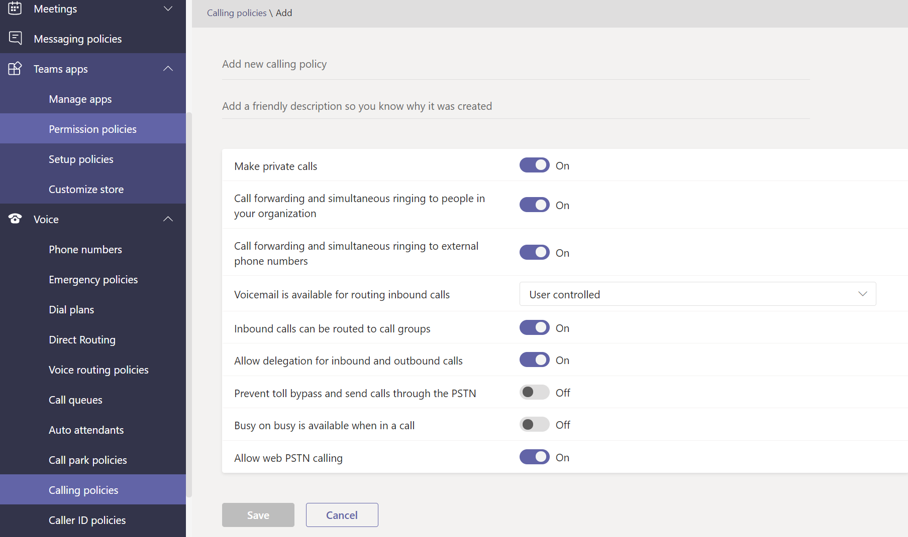

# Gérer les stratégies de voix et d’appel Microsoft TeamsManage voice and calling policies in Microsoft Teams

Les stratégies de voix et d’appel sont utilisées pour contrôler la voix et les appels Microsoft Teams.Voice and calling policies are used to control voice and calling in Microsoft Teams.

## Stratégies d’appel d’urgenceEmergency calling policies

Les stratégies [d’appel d’urgence](manage-emergency-calling-policies.md) vous permet de configurer ce qui se passe lorsqu’un utilisateur de votre organisation effectue un appel d’urgence.You use [emergency calling policies](manage-emergency-calling-policies.md) to configure what happens when a user in your organization makes an emergency call. Ces stratégies sont gérées dans le Centre Teams’administration ou à l’aide Windows PowerShell.These policies are managed in the Teams admin center or using Windows PowerShell.

## Stratégies de routage d’appel d’urgenceEmergency call routing policies

Si votre organisation **Système téléphonique** déployé un routage direct, vous pouvez utiliser des stratégies de [routage](manage-emergency-call-routing-policies.md) des appels d’urgence pour déterminer où les appels d’urgence sont acheminés, si les services d’urgence améliorés sont activés et les numéros utilisés pour les services d’urgence.If your organization has deployed **Phone System Direct Routing**, you can use [emergency call routing policies](manage-emergency-call-routing-policies.md) to determine where emergency calls are routed, whether enhanced emergency services are enabled, and which numbers are used for emergency services. Ces stratégies sont gérées à l’aide de PowerShell ou dans le Microsoft Teams d’administration.These policies are managed using PowerShell or in the Microsoft Teams admin center.

## Stratégies d’ID d’appelantCaller ID policies

[Les stratégies d’ID d’appelant](caller-id-policies.md) sont utilisées pour modifier ou bloquer l’ID d’appelant.[Caller ID policies](caller-id-policies.md) are used to change or block caller ID.

## Stratégies de routage voixVoice routing policies

Une [stratégie de routage vocal](manage-voice-routing-policies.md) est un conteneur pour les enregistrements d’utilisation de réseau téléphonique commuté (PSTN).A [voice routing policy](manage-voice-routing-policies.md) is a container for Public Switched Telephone Network (PSTN) usage records. Vous pouvez utiliser ces stratégies si votre organisation a déployé Système téléphonique **routage direct.**You can use these policies if your organization has deployed **Phone System Direct Routing**. Les stratégies de routage voix peuvent être gérées avec PowerShell ou dans le Teams d’administration.Voice routing policies can be managed with PowerShell or in the Teams admin center.

## Stratégies d’appelCalling policies

 Les stratégies d’appel contrôlent les fonctionnalités d’appel et de forwardage disponibles pour les utilisateurs, notamment la décision d’un utilisateur de passer des appels privés, d’envoyer des appels à des groupes d’appels et de router les appels vers la messagerie vocale.[Calling policies](teams-calling-policy.md) control which calling and call forwarding features are available to users including whether a user can make private calls, send calls to call groups, and route calls to voicemail.

## Stratégies de parc et de récupération des appelsCall park and retrieve policies

[Le parc d’appel et la récupération](call-park-and-retrieve.md) permettent aux utilisateurs de mettre d’autres utilisateurs en attente et de permettre à ce même utilisateur ou à quelqu’un d’autre de continuer l’appel.[Call park and retrieve](call-park-and-retrieve.md) lets users put other users on hold and enables the same user or someone else to continue the call.

## Créer et gérer les plans de numérotationCreate and manage dial plans

[Les plans de numérotation](create-and-manage-dial-plans.md) traduisent les numéros de téléphone à composer pour l’autorisation d’appel et le routage.[Dial plans](create-and-manage-dial-plans.md) translate dialed phone numbers for call authorization and routing. Vous pouvez créer et gérer des plans de numérotation via PowerShell ou dans le Microsoft Teams d’administration.You can create and manage dial plans through PowerShell or in the Microsoft Teams admin center.

## Sujets associésRelated topics

* [Gérer les stratégies d’appels d’urgence Microsoft TeamsManage emergency calling policies in Microsoft Teams](manage-emergency-calling-policies.md)
* [Gérer les stratégies de routage d’appel d’urgenceManage emergency call routing policies](manage-emergency-call-routing-policies.md)
* [Gérer les stratégies d’ID d’appelant dans Microsoft TeamsManage caller ID policies in Microsoft Teams](caller-id-policies.md)
* [Gérer les stratégies de routage vocalManage voice routing policies](manage-voice-routing-policies.md)
* [Stratégies de conservation dans Microsoft TeamsCalling policies in Microsoft Teams](teams-calling-policy.md)
* [Parcage et récupération d’appel dans Microsoft TeamsCall park and retrieve in Microsoft Teams](call-park-and-retrieve.md)
* [Créer et gérer les plans de numérotationCreate and manage dial plans](create-and-manage-dial-plans.md)
* [Gérer les Teams des stratégiesManage Teams with policies](manage-teams-with-policies.md)
