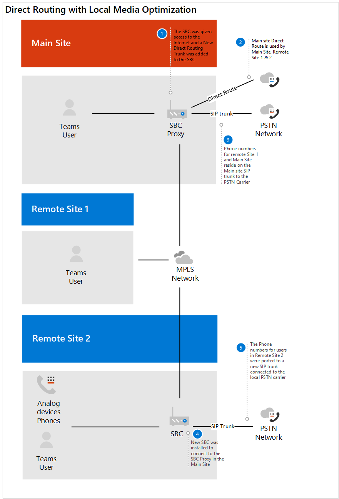

# Étude de cas contoso : système téléphonique

En fonction de l’emplacement géographique et d’autres facteurs, contoso avait des bureaux utilisant les solutions de téléphonie suivantes :

- Type de site A : voix Skype entreprise

- Type de site B : systèmes de téléphonie traditionnels traditionnels

- Type de site C : combinaison de Skype entreprise voix et de systèmes de téléphonie traditionnels.

Pour implémenter une solution du système Microsoft Phone pour l’ensemble de votre organisation, contoso devait déterminer &mdash; pour chaque type &mdash; de site les options suivantes qui seraient utilisées avec le système téléphonique pour se connecter au réseau téléphonique public commuté (RTC) :

- Système téléphonique avec un plan d’appels 

- Système téléphonique avec son propre opérateur PSTN via le routage direct 

- Système téléphonique avec un plan d’appels et un système téléphonique avec son propre opérateur PSTN via le routage direct
 
Pour déterminer la solution adaptée à son organisation, Contoso a utilisé les [solutions de téléphonie de Microsoft](https://docs.microsoft.com/SkypeForBusiness/hybrid/msft-telephony-solutions) et les appels de session 2019 [dans Microsoft teams](https://myignite.techcommunity.microsoft.com/sessions/83170?source=sessions).  

## Type de site A : voix Skype entreprise 

Contoso Skype entreprise voix entreprise a été configuré comme Hub et spoke. Il s’agissait d’un emplacement central qui gérait la passerelle RTC dans la région qui avait fourni la connexion au RTC pour les utilisateurs de voix Skype entreprise dans le pays. Souvent, ces bureaux ne disposant pas d’une sortie Internet. Les numéros de ces utilisateurs qui se trouvent sur le Trunk SIP connecté à un SBC existant. 

Pour déterminer si le SBC déjà déployé est certifié pour le routage direct et le contournement du média, Contoso a vérifié la [liste des contrôleurs de bordure de session certifiés pour le routage direct](direct-routing-border-controllers.md).  

Les habitudes de numérotation de l’utilisateur ont été de composer un utilisateur sur le système de téléphonie hérité en utilisant une extension, même si un client Skype entreprise est disponible pour le son d’égal à égal. 

Contoso a émis ses décisions sur les questions suivantes :

- F. Avons-nous besoin de conserver les fonctionnalités fournies par notre déploiement local ? 
  Un. Non 

- F. Avons-nous besoin d’interopérer avec des systèmes PBX tiers et d’autres équipements de téléphonie ? 
  Un. Non 

- F. Ai-je besoin de conserver notre opérateur tiers actuel ?  A. Oui (pays réglementés) et non 

- F. Avons-nous besoin d’obtenir le ROI d’un déploiement SBCs ?  A. Oui et non  

- F. Est-ce que les forfaits d’appels RTC Microsoft sont disponibles dans cette région ?  A. Oui et non 

En fonction des réponses à leurs questions, Contoso a décidé d’effectuer les opérations suivantes :

- Déplacer les utilisateurs qui se trouvent dans une région où les plans d’appel RTC sont disponibles pour le système téléphonique avec des plans d’appels. 

- Déplacez les utilisateurs qui ne sont pas situés dans une région où les plans d’appel RTC sont disponibles, et les utilisateurs qui se trouvent sur un site pour lesquels le ROI sur l’SBCs doivent avoir été satisfaits, et les utilisateurs résidant dans un pays disposant de réglementations de téléphonie pour le système téléphonique avec le routage direct. 

Le diagramme suivant montre le déploiement initial de Skype entreprise et la façon dont ce déploiement a été migré vers les plans d’appel Microsoft et le routage directe :

## Type de site B : systèmes de téléphonie traditionnels traditionnels

Contoso possédait de nombreux bureaux ayant recours à des systèmes de téléphonie hérités. Il existait un sous-ensemble d’utilisateurs qui disposaient d’un numéro de téléphone 1.64, tandis que les autres n’avaient qu’une extension. Ces numéros sont stockés sur le Trunk TDM de la passerelle PSTN. La numérotation intra-site a été configurée en tirant parti d’un code de site devant l’extension afin de déterminer l’emplacement de routage de l’appel. Les habitudes de numérotation des utilisateurs pouvaient composer le numéro par poste.   

Contoso a émis ses décisions sur les questions suivantes :

- F. Avons-nous besoin de conserver les fonctionnalités fournies par notre déploiement local ? 
  Un. Non 

- F. Avons-nous besoin d’interopérer avec des systèmes PBX tiers et d’autres équipements de téléphonie ?  A. Oui

- F. Ai-je besoin de conserver notre opérateur tiers actuel ?  A. non 

- F. Est-ce que le plan d’appels de Microsoft RTC est disponible dans notre région ?  A. Oui et non 

En fonction des réponses à leurs questions, Contoso a décidé d’effectuer les opérations suivantes : 

- Déplacer les utilisateurs qui se trouvent dans une région où les plans d’appel RTC sont disponibles pour le système téléphonique avec des plans d’appels. 

- Déplacer les utilisateurs qui ne se trouvent pas dans une région où les plans d’appel RTC sont accessibles au système téléphonique avec le routage direct. 

- Maintenir une connexion RTC aux appareils analogiques cruciaux de votre entreprise.

Les schémas suivants montrent le déploiement d’origine du système hérité avec les sites distants et la migration vers un déploiement de routage direct avec l’optimisation de média locale :

**Original legacy deployment**  
 Déploiement 

**Déploiement avec le routage direct**

 
## Type de site C : combinaison de Skype entreprise voix et de systèmes de téléphonie traditionnels.

Les numéros d’utilisateurs vocaux de contoso entreprise pour les entreprises sont stockés sur le Trunk SIP sur l’SBC à partir du transporteur. Les numéros des systèmes de téléphonie traditionnels résident sur le Trunk de TDM de la passerelle RTC.   

Contoso a émis ses décisions sur les questions suivantes :

- F. Avons-nous besoin de conserver les fonctionnalités fournies par notre déploiement local ? 
  Un. Non 

- F. Avons-nous besoin d’interopérer avec des systèmes PBX tiers et d’autres équipements de téléphonie ?  A. non 

- F. Ai-je besoin de conserver notre opérateur tiers actuel ?  A. non 

- F. Avons-nous besoin d’obtenir le ROI d’un déploiement SBCs ?  A. Oui et non  

- F. Est-ce que le plan d’appels RTC de Microsoft est disponible dans cette région ?  A. non 

En fonction des réponses à leurs questions, Contoso a déterminé les éléments suivants : 

- Pour les utilisateurs de la téléphonie héritée qui seront activés pour le routage direct, Contoso a porté les numéros de l’Trunk de TDM sur le Trunk SIP pour l’SBC, car l’SBC est certifié pour le routage direct. 

- Pour permettre la prise en charge d’un sous-ensemble d’utilisateurs déplacés vers un système téléphonique et permettre le routage continu via le système hérité, le système de téléphonie hérité a été configuré comme tronçon suivant de l’SBC.   

- Par ailleurs, pour encourager le changement de comportement des utilisateurs et supprimer la dépendance à la numérotation entre les extensions intra-et intra-site, Contoso a fourni des recommandations pour l’utilisation de teams pour tous les appels internes.  

Les schémas suivants illustrent le déploiement d’origine du système de téléphonie et de la voix de Skype entreprise, et la migration vers un déploiement mixte utilisant le routage direct :

**Original mixed deployment** 
 Déploiement 

**Déploiement mixte avec le routage direct** 
 

## Forfaits d’appel

Pour déterminer la configuration requise pour les offres d’appels, Contoso a examiné les [décisions de déploiement principales du plan d’appel](calling-plan-landing-page.md#core-deployment-decisions). Les décisions qui en résultent ont été prises : 

- F. Mes utilisateurs doivent-ils utiliser les appels internationaux ?  A. Oui 

- F. Mes utilisateurs ont-ils chacun un numéro de téléphone à l’intérieur direct ?  A. non aujourd’hui. Tous les utilisateurs activés reçoivent un message. 

- F. Souhaitez-vous masquer ou désactiver l’identification de l’appelant ?  A. l’identification de l’appelant pour un utilisateur est masquée par le numéro local de contoso. 

## Routage direct

Contoso a suivi ses appels pour rester à jour sur les fonctionnalités de 365 d’Office, notamment celles disponibles avec le système téléphonique et le routage direct. Le leadership technique et les architectes ont utilisé les recommandations fournies lors de la 2019 de l’enflamme pour en déterminer la direction.  Sessions principales utilisées : 

- [Planifier le succès du routage direct de Microsoft teams](https://myignite.techcommunity.microsoft.com/sessions/80381?source=sessions)

- [Mises à jour du routage direct](https://myignite.techcommunity.microsoft.com/sessions/80381?source=sessions)

## Configuration

### Sites d’offres d’appels

Pour obtenir des licences et affecter des numéros de téléphone aux utilisateurs, Contoso a suivi les étapes décrites dans la rubrique [configurer les offres d’appels](set-up-calling-plans.md). 

En raison du nombre d’utilisateurs auxquels des numéros de téléphone ont besoin, Contoso a décidé d’utiliser PowerShell pour attribuer les numéros de téléphone. Pour plus d’informations sur l’attribution de nombres à l’aide &mdash; de PowerShell, en plus d’autres paramètres, &mdash; Contoso a utilisé la [vue d’ensemble de PowerShell teams](teams-powershell-overview.md).  

### Sites de routage direct

Pour connecter l’infrastructure téléphonique locale de contoso à Microsoft Teams, l’administrateur de Contoso a suivi les étapes décrites dans [configurer le routage direct](direct-routing-configure.md) et examiné le [routage direct de la vidéo dans Microsoft teams](https://www.youtube.com/watch?v=1ASftX_Msb8&index=10&list=PLaSOUojkSiGnKuE30ckcjnDVkMNqDv0Vl) pour obtenir des instructions.  Contoso a également fait référence à la documentation de déploiement de routage directe par le fournisseur de SBC certifié. 

Lorsque le routage direct a été configuré entre le système SBC et le système Microsoft Phone, il était nécessaire pour Contoso de tester la configuration. Pour ce faire, les administrateurs contoso ont utilisé le client de testeur SIP évoqué dans les [mises à jour de la session de routage direct](https://myignite.techcommunity.microsoft.com/sessions/83178?source=sessions)de l’appareil 2019. Le script client du testeur SIP et la documentation ont été téléchargés à partir du script PowerShell pour tester les connexions de la manette de session de routage direct.   

### Optimisation des éléments multimédias locaux

Contoso a appris à tirer parti de l’optimisation des contenus multimédias locaux dans les différentes régions du monde. Les scénarios pris en charge pour Contoso sont décrits dans [optimisation des médias locaux pour le routage direct](direct-routing-media-optimization.md). La configuration de l’optimisation de média locale s’est effectuée en suivant les instructions de la part du fournisseur de SBC et de Microsoft. Les étapes de configuration de l’optimisation de média locale sont les suivantes : 

- Configurer les sites utilisateur et SBC 

- Configurer l’SBC conformément à la spécification du fournisseur SBC 

- Ajouter des adresses IP de confiance externes à chaque site utilisé pour l’optimisation de médias locaux    

- Définissez la topologie du réseau. 

- Définir la topologie du réseau virtuel 

- Déterminer le mode : toujours contournement ou uniquement pour les utilisateurs locaux 

## Considérations en matière de réseau

Contoso disposait de nombreux utilisateurs qui devaient travailler à distance pour une période prolongée après leur activation pour le système téléphonique. Les utilisateurs ont utilisé VPN pour accéder à certaines applications métier. Sur un réseau privé virtuel (VPN), les utilisateurs du système téléphonique ont rencontré une diminution de la qualité des appels. 

Pour résoudre le problème de qualité, il est possible d’implémenter une connexion VPN fractionnée par Contoso, qui permettait au trafic d’Office 365 de traverser Internet pendant que la connexion aux applications internes restait sur le VPN. Pour mettre en œuvre une connexion VPN fractionnée, Contoso a suivi les recommandations de mise en œuvre de l' [encapsulation par VPN Split pour Office 365](https://docs.microsoft.com/office365/enterprise/office-365-vpn-implement-split-tunnel).  

 

